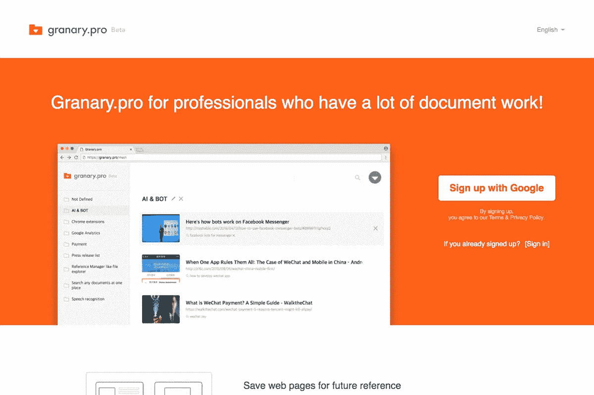

# 我为什么创建粮仓. pro

> 原文：<https://medium.com/hackernoon/why-i-created-granary-pro-86e8dfac9970>

Granary.pro home page

## *为了减轻我所经历的不便*

作为一名产品开发人员，我用过书签、Evernote、Pocket 等。管理我在网上找到的网页链接。然而，由于服务一直不方便，[www . canary . pro](http://www.granary.pro)是我自己做的。

## 有什么比口袋更好？

Pocket 只是存储网页链接，但是粮仓. pro

1.  按文件夹管理相关链接
2.  自动提取并保存搜索关键词而不是标签，
3.  通过搜索，你可以看到储存在粮仓. pro 中的最受欢迎的网页。因此，这可以让你很容易地看到其他开发者对相同的搜索关键词感兴趣的内容以及你错过的内容。

## 联系我们

如果您对粮仓. pro 有任何疑问，请联系[ask @粮仓. pro](mailto:ask@granary.pro) 。

> [黑客中午](http://bit.ly/Hackernoon)是黑客如何开始他们的下午。我们是 [@AMI](http://bit.ly/atAMIatAMI) 家庭的一员。我们现在[接受投稿](http://bit.ly/hackernoonsubmission)并乐意[讨论广告&赞助](mailto:partners@amipublications.com)机会。
> 
> 如果你喜欢这个故事，我们推荐你阅读我们的[最新科技故事](http://bit.ly/hackernoonlatestt)和[趋势科技故事](https://hackernoon.com/trending)。直到下一次，不要把世界的现实想当然！

