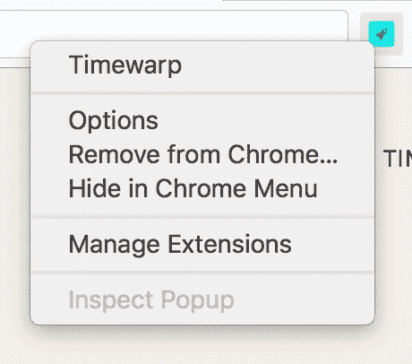

# 为什么我创建了 Timewarp (Chrome 扩展)

> 原文：<https://medium.com/hackernoon/why-i-created-timewarp-chrome-extension-f89f2b7b6cfe>

# TL；速度三角形定位法(dead reckoning)

Timewarp 是我创建的免费谷歌 Chrome 扩展，可以帮助你在需要的时候保持高效。如果你想追踪你如何在电脑上使用应用程序和网站，请查看[的更新时间](https://www.rescuetime.com/rp/takeonepiece)。如果你想屏蔽移动设备上令人分心的网站，请点击 [Freedom](https://freedom.refersion.com/c/aa520) 。

# 问题是

2013 年春末我工作压力很大。我不记得是什么引起了我的压力，但我注意到自己每 5 分钟检查一次脸书，看不到新的帖子，关闭标签，然后重复。我意识到我的注意力持续时间比以往任何时候都短。显然出了问题。

现在我知道我被检查我的订阅的“可变奖励”所“吸引”，在读了 Nir Eyal 的书[“吸引”](http://amzn.to/2esxXJM)之后。在有压力的时候，期待有趣内容时释放的多巴胺给了我满足感，所以我一次又一次地回去，即使没有新内容。事实证明，脸书比任何人都擅长打造养成习惯的产品，我使用它不仅仅是因为它的实用性。这成了一种习惯。我很恐慌，因为继续这种趋势意味着我将一事无成。

“如果我从现在开始尝试访问脸书时，出现一个提示来阻止这种有问题的行为，该怎么办？”我想，“一定有什么东西已经在做这个了。”所以我谷歌了一下。

我发现了一个 Chrome 扩展，叫做“StayFocusd”。它很强大，很多人喜欢它，但作为一个 UX 迷，我觉得它的用户界面比必要的更复杂。它 80%的效用来自于它 5%的特性。我真正想要的是**屏蔽一些我每天访问的与工作无关的网站**。在我看来，任何生产力工具最不应该做的事情就是浪费用户的时间，让用户很难弄清楚如何使用它，或者给用户提供无助于他们实现目标的信息。

我也希望阻塞机制可以更令人愉快。我的直觉告诉我**积极的增援**将在这种情况下创造奇迹，而不是让“违规者”对访问他们喜欢的网站感到内疚。我设想了一种实用工具，可以应用脸书倡导的相同的习惯形成技术，但由用户支配。这只是一个更强大的策略。

所以我在 3 周的空闲时间里创建了 [Timewarp](https://chrome.google.com/webstore/detail/timewarp/mmmhadpnjmokjbmgamifipkjddhlfkhi) ，并且我自己每周都在使用它。截至目前，已经有 16000 名用户安装了 Timewarp。

# 时间扭曲是如何工作的？

安装 Timewarp 后，需要在“选项”页面创建“虫洞”，这是对规则的隐喻。

Right click on the rocket icon to access “Options” page

你可以创建三种“虫洞”:

## 再直接的

这是我最喜欢的一种虫洞。它不仅让我免于分心，还帮助我建立新的良好习惯。比如我在 Coursera 上报了一个课程，但是我还没有养成每天查看课程页面的习惯。

通过创建一个从“facebook.com”到“coursera.org”的重定向虫洞，每次我试图去脸书，都会被带到 coursera。这个简单的技巧让我可以利用我想要摆脱的瘾，并且每天毫不费力地查看我的课程页面。这就是为什么我把这个延伸命名为“时间扭曲”——逃离习惯性的“黑洞”，同时到达一个多产的宇宙。多酷啊！

你也可以设置每天允许自己在一个网站上花多少时间，只有当你用完每天的限额时，重定向才会被激活。

## 引用

我也经常引用虫洞。我不时会看到我读过的书中的名言。我会把它们写下来，经常阅读，这样它们就能很快融入我的脑海，成为我的一部分。这是我最近读的一本名为[“压力下的成功”](http://amzn.to/2eRdk5b)的书中的一段话。

> “找到自我的最佳方式是在为他人服务中迷失自我”

我认为这是提醒自己保持自我的一个有用的提示，所以我为 YouTube 创建了一个引用虫洞。所以现在当我在 Chrome 的地址栏输入“youtube.com”并点击回车时，我看到的是引用，而不是互联网上最新的猫视频集。尽管如此，我还是会在睡觉前沉迷于小猫的视频。

## 计时器

现在有一些网站只是稍微让我分心，比如媒体和黑客新闻。对于这些类型的网站，我会创建计时器虫洞，这样它会显示我今天在上面花了多少时间，这样我就能了解它们对我工作效率的影响。

**一旦你创建了虫洞，点击火箭图标激活时间扭曲！**如果您需要访问脸书回复重要信息，只需再次点击图标即可卸载。完成后，再点击一次即可打开。当你需要完成任务时，Timewarp 永远不会碍事！

# 时间扭曲的三个原则

我创造时空扭曲时牢记了三个原则:

*   它应该易于使用，令人愉快
*   它不应该分散用户的虚荣心
*   它应该让人感觉良好，有能力

虽然这些原则看起来微不足道，但它们确实很难坚持。添加一个使 UI 膨胀但没有增加实际价值的好特性太容易了。例如，我倾向于添加详细的时间跟踪，因为它会很“酷”，但我宁愿人们走 10 分钟，而不是坐着盯着指标。一些用户热切地想要一种方法来封锁整个互联网，并使解除封锁变得很麻烦，但我不得不说不，因为时间扭曲的有效性是其用户意志力的函数。如果人们愿意远离一个网站，一个简单的提醒就可以了。如果他们出于任何原因真的需要访问它，没有什么应该或可以阻止他们。

# 其他工具

虽然我的意图是让 Timewarp 尽可能小，但我确实有一些令人兴奋的计划来在接下来的几个月里改进它，以便它可以为更多的人服务。然而，Timewarp 可能永远不会成为一个独立的应用程序，也不会跨平台地在 iOS、Android、Mac 和 Windows 上运行。这里有其他工具可以补充或替代时间扭曲。我相信，我们都希望重新获得我们最宝贵的资源:时间。

## 重新计算时间

当我使用 Mac 电脑时，我使用 [RescueTime](https://www.rescuetime.com/rp/takeonepiece) 和陀螺仪来跟踪我的工作效率。“如果你不能衡量它，你就不能管理它。”我真的对时间的重新安排印象深刻。它聪明地根据你的工作将你花在不同网站上的时间分为有效率的和分散注意力的。我是一名软件工程师，所以查看电子邮件和使用即时通讯工具会让人分心。但是如果你在销售或客户支持部门，当你发邮件和聊天的时候，你的工作效率可能会提高。RescueTime 使这变得简单，并且每周生成一份易于处理的生产率报告。

## 自由

我在 StayFocusd 的网站上找到了关于[自由](https://freedom.refersion.com/c/aa520)的信息。我下载了这款应用，它在 Safari 打开时会屏蔽社交网站。不过，这似乎并没有阻止社交应用程序访问互联网。但如果在移动设备上浏览对你来说是个问题，去看看也无妨。

## [静止聚焦](https://chrome.google.com/webstore/detail/stayfocusd/laankejkbhbdhmipfmgcngdelahlfoji?hl=en)

如上所述，这是一个功能丰富的干扰拦截器。

## [地块位置](https://chrome.google.com/webstore/detail/block-site/eiimnmioipafcokbfikbljfdeojpcgbh?hl=en)

另一个有用的网站拦截器，兼作家长控制。

> 披露:链接到“上钩”、“压力下的成功”、“重新安排时间”和“自由”是附属链接。
> 
> 如果你认为这篇文章能帮助到你的朋友，请推荐这篇文章！

> [黑客中午](http://bit.ly/Hackernoon)是黑客如何开始他们的下午。我们是 [@AMI](http://bit.ly/atAMIatAMI) 家庭的一员。我们现在[接受投稿](http://bit.ly/hackernoonsubmission)并乐意[讨论广告&赞助](mailto:partners@amipublications.com)机会。
> 
> 如果你喜欢这个故事，我们推荐你阅读我们的[最新科技故事](http://bit.ly/hackernoonlatestt)和[趋势科技故事](https://hackernoon.com/trending)。直到下一次，不要把世界的现实想当然！

