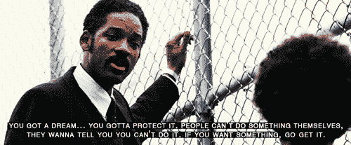
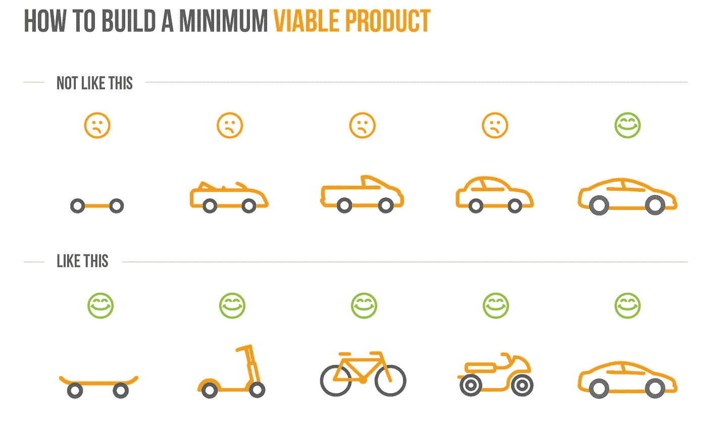

# 我讨厌有人说我的创业公司愚蠢…

> 原文：<https://medium.com/hackernoon/why-i-hated-when-someone-said-my-startup-is-stupid-7d33811da15>

## 但是我现在对其他人也这样做。

[http://www.wallpaperup.com/68502/The_Pursuit_of_Happiness_Will_Smith_Face.html](http://www.wallpaperup.com/68502/The_Pursuit_of_Happiness_Will_Smith_Face.html)

**不是一次，不是两次，而是无数次有人告诉我，我创建的初创公司愚蠢得可笑。每次，有人在同一个句子里说‘你的创业公司’和‘愚蠢’这两个词，我都想揍他/她的脸。对话通常是这样的-**

“嘿，我们正在建造一些东西。想知道您对此的想法……”

“当然，说吧。你是做什么的？”

<insert some="" sentences="" about="" making="" the="" world="" a="" better="" place="" and="" putting="" dent="" in="" universe="">“</insert>

“那太愚蠢了。”

**心碎**

一开始，我会拉着我的脸离开。这个故事重复了几次后，我开始问更多的问题，主要是出于沮丧。

“你为什么这么想？”我会问的。

我会得到以下答案之一。

“因为这个没有市场。”

因为如果我正在使用当前的最佳替代方案，我不会仅仅为了这一附加功能而放弃它

"因为<insert a="" large="" company="" name="" here="">可能会在他们已经成功的产品中加入这个功能."</insert>

“因为它太超前了。”

对于每一个原因，我都有答案。

没有市场？我们会创造一个。

你不会移民吗？我们会提供折扣。

可能是别人建的？我们是大卫，我们将摧毁巨人。

太超前了？世界会赶上我们的。

就像每一个投入了大量汗水、金钱和时间的初创公司创始人一样，我像一头保护幼崽的母狮一样坚定不移。有一次我问他们，“难道你们没有意识到我为建造这个付出了多少努力吗？”

这个人回答说:“我知道。但我一点也不在乎。你浪费你的努力建造这堆狗屎是愚蠢的。”(这些是我被告知的原话。)

但是我仍然没有忘记这个—

对他们来说，我是愚蠢的，对我来说，他们是。这就是我认识到的愚蠢的有趣之处。我认为他们是按照这个世界的规则行事的懦夫，甚至没有超越这些规则的想法。

> 我认为这些人已经被这个世界压弯了。我是被所有人忽略的失败者。

我已经是一个胜利者了。毕竟，我的故事就像书籍和电影中的英雄故事一样开始了。因此，我的故事也必须像一个英雄的故事那样结束——通过胜利。

直到我被问了一个问题。

“好吧，这并不是说我不会错。我可能是。你用这东西赚了多少钱？”

妈的。这是我一直逃避的一个问题。我几乎能感觉到我的心脏停止了跳动。我嘴唇颤抖地说，“嗯……你知道……我们现在是预收……但我们会在下一轮筹集资金……然后把它干掉。”

我知道我的答案是错的，但只有在说出来之后，我才意识到。另一个家伙只是对我笑了笑，让我满脑子的问题挥之不去。

快进到今天。我们无法创造新的市场，因为折扣而迁移的人们在我们停止折扣后马上返回，歌利亚粉碎了大卫，我们在世界赶上我们之前就耗尽了资金。

我们每次都应该被认为是愚蠢的。花在那些不值得做的事情上的时间没有完全白费——我们从中吸取了一些教训。

## 1.不要因为能造就造。

我自豪地告诉全世界，我从 11 岁就开始编程了。我不再有同样的感觉。我意识到我从 11 岁起就开始写代码。要成功建立一家公司，我需要学习的东西太多了。

> 编码不是一切。

我过去常常在我喜欢使用的产品中寻找改进的范围，然后构建整个产品+升级。为什么？因为我能做到。我创造东西是因为我可以。那曾经是我建造我所建造的东西的理由。不过，不再是了。

这是我艰难地学到的最好的一课。它将永远伴随着我。

## 2.六个月以上不要做预收入(或预用户)。

成为预营收意味着你更喜欢增长，但我们用它作为缺乏用户的糖衣。忘记指数增长；我们的只是一条在两位数之间摇摆的之字形线。

几个月过去了，但我们的之字形路线仍然是曲折的。如果你已经有超过六个月的预收益和预增长，你不知道下一步该做什么，那么最好的办法就是关闭它，节省你的时间。

如果你有更多的实验在排队，不要停下来。

## 3.建造一些完全不同的东西。

人性是用增量产品完成的。你喜欢一个产品，但是发现它缺少一个功能吗？不要用缺失的功能重新构建整个产品。复制产品的努力是不值得的。

相反，构建特定的功能并将其打包成产品。

> 你的产品的第一个版本不能像你的产品的最后一个版本一样。

这是创业世界中重复次数最多的智慧，但它仍然被我们大多数人低估了——尤其是第一次创业的人。

总是不停地问:“这个特性的加入会不会让任何人从当前产品迁移到我的产品？”

## 4.不要为所有人构建。

在我们产品的第一个版本中，有超过八个主要特性。如果你问开始赚钱的版本有多少功能，我的答案是一个。

我对功能的信念是“越多越好”很快我了解到更多的特性使得定义我们的产品变得更加困难。如果有一个功能，销售宣传会是，“它能做到这一点。”对于多种功能，销售口号是，“它做这个，这个，这个和这个。还有，如果你愿意，你可以做这个，这个和这个。”

> 每一个特写都冲淡了故事。建立足够的故事，但仅此而已。

这些是建造错误的东西给我的教训。(如果我从中学到了什么，它们还会被称为“错误的事情”吗？)我还记得，当有人说我的产品愚蠢时，我真想揍他们的脸。我当然很受伤，因为这些产品是我亲手打造的。但是我不应该因为做了他们不想要的东西而期待掌声。

我可以争辩说，他们在批评时本可以有一点礼貌，但我不会。我明白了，找到自己道路的人总是忙着在这条道路上奔跑。他们不会总是有时间以你想学的方式教你课程。世界不是教室。此外，即使他们试图说服我为什么我错了，他们也是在浪费时间。我仍然会努力证明他们是错的。

当我[找到我的道路](https://unmade.email)时，我试图向其他人解释为什么他们把努力放在了错误的地方。我被告知我在那个时代说过的同样的话，“你不会明白的。你只是想得太少了。”

> 我总是微笑着面对生活的悖论。

—

***关于作者***

*莫希特·马莫里亚是每周时事通讯的策展人，*[***un made***](https://unmade.email)*，将一个来自未来的想法传递到你的收件箱里。如果你还没有找到正确的道路，你可能会喜欢它。*

## 如果你喜欢这个故事，请💚推荐分享帮别人找！欢迎在下方留言评论！