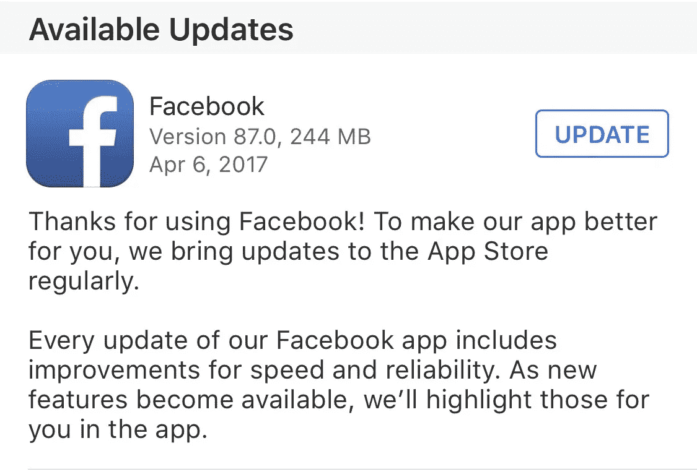
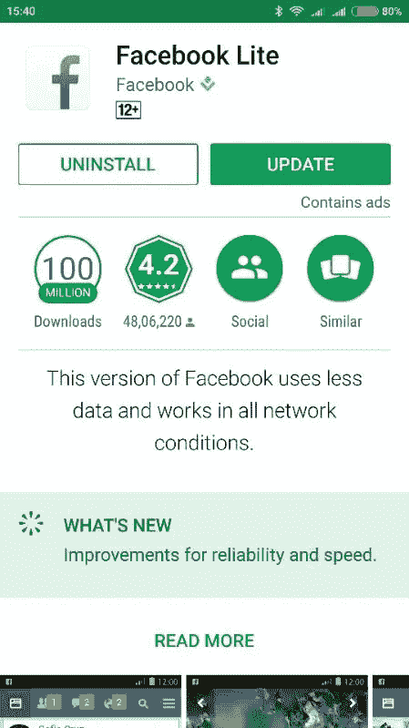
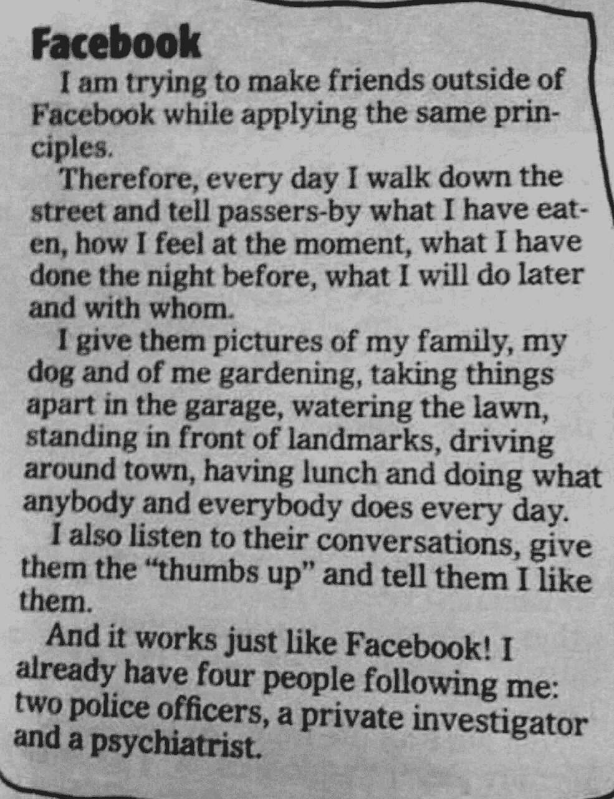
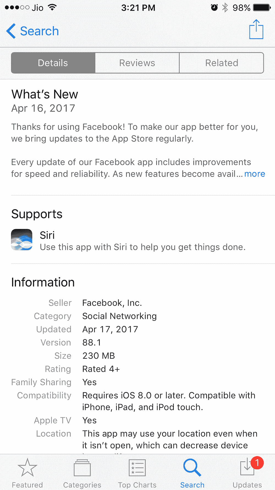
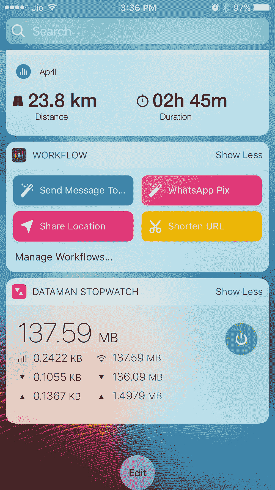

# 为什么我把脸书踢出我的手机

> 原文：<https://medium.com/hackernoon/why-i-kicked-facebook-off-my-phone-a254c5b410bc>

大约一周前，我更新了手机上的脸书应用。就在第二天，它带着新的更新回来了。我也更新了，没有评论。大约一周后，一个 240MB 的新更新出现了。

当我准备再次点击更新按钮时，我停了下来。脸书的这些人是怎么回事？他们以为我是数据做的吗？

无限宽带计划(wifi)在印度确实存在。事实上，一旦你达到某个极限，它就会被节流。我之前与 BSNL 的计划是每月 30GB，一旦超过，我的 4mbps 连接将被节流到 256kps 的蜗牛般的速度。去年，我换成了 ACT who，每月提供 75Gb，速度大约为 8mbps，75GB 后的速度为 512kpbs。但旧习难改，我仍然不喜欢数据饥渴的应用和应用更新的想法。

又不是其他 app 没有重磅更新。事实上，苹果自己的应用程序，如 Pages，有更多更新。但这种情况很少发生，可能一年发生几次，通常与主要的 iOS 更新有关。

这是怎么回事？

不太了解 app 更新。但我猜它的工作方式很像 iOS 更新。修补 bug 的小更新。大的一个完整的应用程序检查。这就是为什么许多应用程序倾向于较小的更新。那么，是什么让像 facebook 这样的应用程序一直在对它们的应用程序进行全面检查呢？

脸书声称每次更新都提高了速度和可靠性。这可能是真的，但它显示出对用户缺乏敏感性。脸书又不是不知道数据在印度是个问题。事实上，他们为 Android 手机推出了一个特别的脸书轻型版本，名为脸书 Lite just for India，在我的 Android (Mi4i)上只有 1.8MB。

为什么不为 iOS 开发一个脸书 Lite 应用程序呢？他们相信 iPhone 用户不那么担心数据吗？

脸书只是懒惰吗？

或者是傲慢自大，认为用户非常喜欢脸书，不会介意下载几百万次？

也可能只是生意好。进行小的更新可能比发布整个应用程序更耗时。众所周知，时间就是金钱，脸书希望成为世界上第一个万亿美元的公司。

简而言之，脸书并不担心浪费我的数据，可能是因为我才是付钱的人。

在这一点上，我突然意识到也许脸书是对的。也许典型的脸书用户不是那种每周或两周担心几百兆字节的人。这个人有更大的担忧，这张朋友寄来的剪报让我们更好地了解了他们的担忧。

这也很好地解释了为什么我不太喜欢 Facebooker，也没有在上面贴过我十多年来的个人照片。事实上，我在脸书的个人资料已经有十年了，我在脸书的电话号码也是旧的。

不是说我真的在愚弄脸书。这些鬼鬼祟祟的家伙偷偷把我的脸书账户和我的 WhatsApp 账户连接起来，把我手机里的所有联系人都转移到了脸书，同时假装不知道我现在的电话号码。

那我为什么会在脸书？一部分是为了脸书团体，这些团体在组织反对那些信奉分而治之原则的组织的运动中非常有用，另一部分是为了检查那些像病毒一样传播的东西。

这时候我的 tubelight 终于亮了。我突然意识到，由于我不是典型的重度脸书用户，我并不真的需要这个应用程序。如果需要的话，我可以随时在浏览器上查看脸书，大概一周一次。

这款应用可能会消失。说到做到。

再见，脸书。您的 244MB 更新将不会被错过。

*更新****:***[*STéphane Tsacas*](https://medium.com/u/de563c9a312?source=post_page-----a254c5b410bc--------------------------------)*指出，一个更新的实际下载量可能会比列出的少很多。这里的解释是***。为了证实这一点，我下载了脸书的应用程序，并跟踪了下载量。列出的下载大小是 230MB，而实际下载是 138 MB。(见下文)。更新很可能也会出现类似的结果。假设的确是一切之母…我为误导我的读者道歉。**

**********

> *[黑客中午](http://bit.ly/Hackernoon)是黑客如何开始他们的下午。我们是 T21 家庭的一员。我们现在[接受投稿](http://bit.ly/hackernoonsubmission)并乐意[讨论广告&赞助](mailto:partners@amipublications.com)机会。*
> 
> *如果你喜欢这个故事，我们推荐你阅读我们的[最新科技故事](http://bit.ly/hackernoonlatestt)和[趋势科技故事](https://hackernoon.com/trending)。直到下一次，不要把世界的现实想当然！*

**