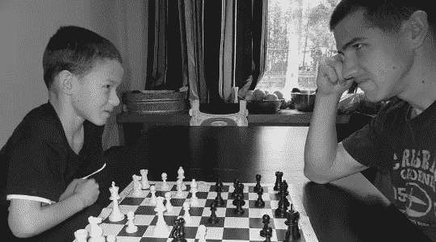
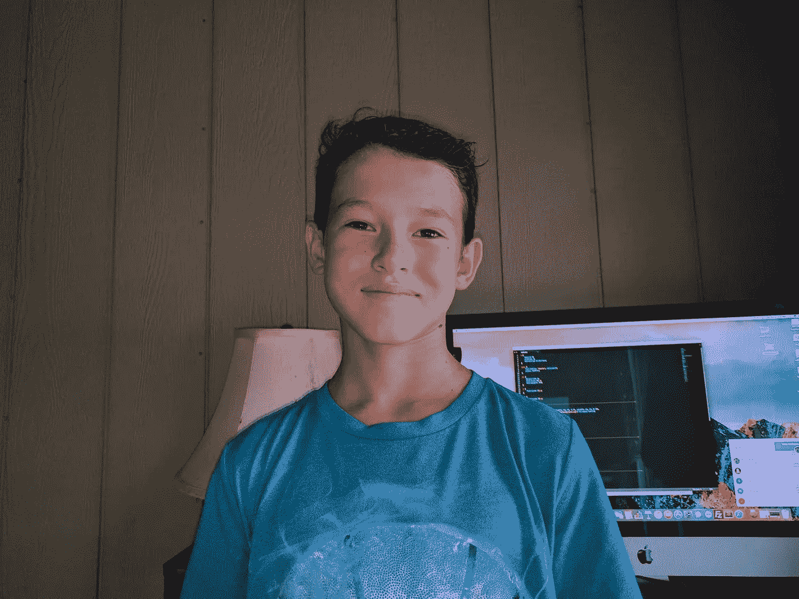

# 为什么我 12 岁就喜欢编码

> 原文：<https://medium.com/hackernoon/why-i-like-coding-as-a-12-year-old-cdb19e87d57f>

Me surfing at our local surf spot.

大家好，我是摩西，这是我的第一篇博客。我写这篇文章是为了给你我对编程的看法，并分享一点我自己的情况。

# **象棋如何帮助我**

当我爸爸长大的时候，他整个小学都在下棋，甚至在他六年级的时候在俄勒冈州拿了第二名。我 6 岁时，他教我下棋。我真的很喜欢下棋，因为这是一种解决问题的方式。每当我和我爸爸下棋时，他总是赢我，所以有一次他告诉我，当我最终赢了他时，他会给我五十美元。所以我开始和微软的国际象棋大师对弈，每次对弈都开始慢慢变好。最终我战胜了四级，之后我用了八十五局才战胜了五级！我坚持玩，每天挑战我爸一局。我爸爸说他开始放松警惕了，所以他改了一下，这样我就只能在周一去领奖了。

Me playing chess against my dad.

2013 年 2 月 25 日星期一，我终于在一场游戏中打败了我爸，并在这个过程中把**五十块钱**放进了我的钱包！国际象棋让我练习解决问题，不犯明显的错误，并且努力工作会有回报。这个游戏也给了我信心，只要足够努力，我可以学到任何东西。这也很有趣。

# **我是如何开始编码的**

在我一生中的大部分时间里，我总是喜欢做东西并看着它们工作。所以当我大概 8 岁的时候，我爸爸告诉了我一些叫做编码的东西。什么是编码，我心想。他说，这是你用代码与计算机对话并告诉它做什么的地方。这让我非常感兴趣，电脑会听一个 8 岁的孩子！我第一次学习 JavaScript 是在可汗学院。在那之后，我想学习更多关于编码的知识，所以我最终开始在[树屋](https://teamtreehouse.com)上学习编码。Treehouse 是我学习大部分知识的地方，包括 HTML、CSS、BootStrap、jQuery 和 JavaScript。

# **编码辛苦吗？**

是的，编码很难。但是如果你坚持尝试，结果会很有收获，你会变得更好。当我编码的时候，很容易遇到问题或者不理解某些东西。我的建议是去像 [stack overflow](https://stackoverflow.com/) 这样的论坛问你的问题。大多数情况下，有人已经遇到过同样的问题，所以你也可以搜索你的问题，看看是否有人遇到过同样的问题。我的最后一条建议是不要放弃。经过 1000 多次尝试，托马斯·爱迪生发明了灯泡。惊人的成就**总是**来自努力。

# **该不该学编码？**

嗯，我不认为编程是适合每个人的职业。但我认为，每个人都应该理解编码是如何工作的，因为最终，代码将被整合到一切之中。例如，你读这篇文章的唯一原因是因为代码。我们可以玩视频游戏、使用网飞、甚至登上月球的唯一原因就是代码。代码无处不在！

Me bodyboarding with my dad.

# **我的其他兴趣**

你可能会想，这个孩子可能整天坐在家里编程。我不喜欢，我住在夏威夷，所以我们住得离水很近，我几乎每天都和我的家人和朋友一起去冲浪。除了冲浪，我真的很喜欢徒步旅行到熔岩，庭院工作，与我的兄弟姐妹和我的猫玩耍。我也很喜欢在我们的任天堂 Switch 上玩超级炸弹人和塞尔达。

查看我的网站，【MosesFinlay.com】查看我的项目和我制作的游戏，并注册我的时事通讯以保持联系。