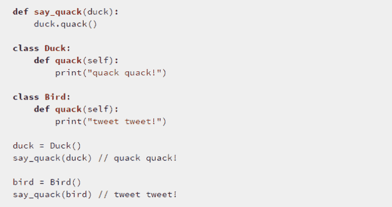
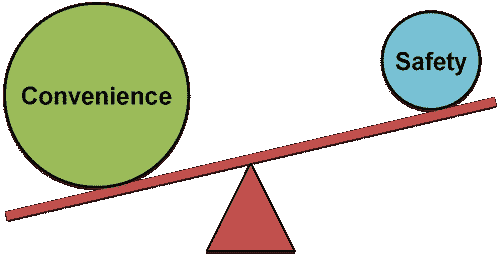
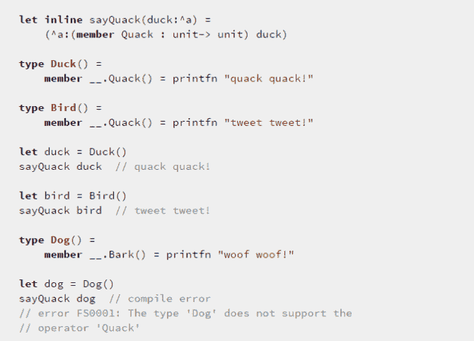
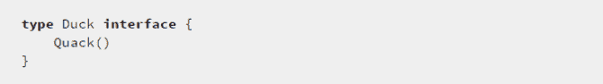
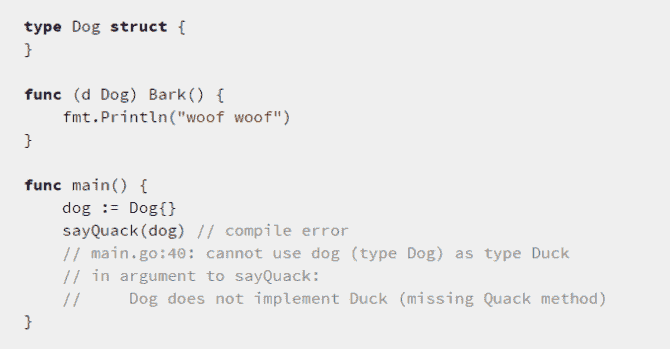
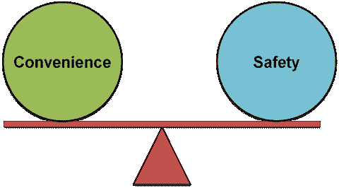

# 为什么我喜欢 Go 的界面

> 原文：<https://medium.com/hackernoon/why-i-like-gos-interfaces-2891adf2803c>

## Go 的接口是隐式实现的，结合了 duck 类型的便利性和静态安全性

当我听到人们谈论 *Go* 时，很多讨论都集中在它的并发特性上。虽然它有一个很好的并发故事，但语言领域目前充满了具有同样好或更好的并发故事的语言— *F#* 、 *Erlang* 、 *Elixir* 、 *Clojure* 等…

就我个人而言，我在使用 Go 的过程中发现真正有趣的是它的界面是如何工作的。简而言之，接口不需要显式实现——即没有*实现*关键字。相反，**接口被隐式满足**。

# 鸭子打字

在 Python 之类的动态语言中，你有了[鸭子打字](http://en.wikipedia.org/wiki/Duck_typing)的概念。

> *“如果它看起来像鸭子，叫起来像鸭子，那它就是鸭子”*

假设你在 Python 中有一个*say _ quak*函数，它期望它的参数有一个*quak*方法。你可以调用任何对象的函数，只要它有*嘎嘎*方法。

Duck typing 很方便，但是如果没有编译器来捕捉你的错误，你会为了方便而牺牲很多安全。

如果有一种两全其美的方法呢？

在 F#中，这可以通过[静态解析类型参数](http://theburningmonk.com/2011/12/f-inline-functions-and-member-constraints/)来实现:

但是从语法上来说，静态解析的 TP 有点笨拙，不容易阅读。在我看来，Go 的接口代表了一种更优雅的解决方案。

# 隐式实现的接口

在围棋中，假设你有一个*鸭子*的接口:

任何具有*嘎嘎*方法的结构都将隐式实现*鸭子*接口，并可用作*鸭子*。

*(自己试试* [*这里*](https://play.golang.org/p/j8RbA8tnwL) *)*

如果你有另一个结构，*狗*，它没有*嘎嘎*方法，而你试图用它作为*鸭子*，那么你会得到一个编译时错误:

*(自己试试* [*这里*](https://play.golang.org/p/j8RbA8tnwL) *)*

这就是鸭子打字的便利性和静态检查的安全性！

# 不方便

Go 界面的设计源于这样一个观察:模式和抽象只有在我们看过几次之后才会变得明显。

因此，当我们最无知的时候，不要在项目开始的时候就把我们锁在抽象中，我们可以在这些抽象对我们变得显而易见的时候定义它们。

当您创建一个新的接口时，您不必返回并标记每个实现，如果该实现由第三方所有，这有时是不可能的。

这使得 Go 接口非常便宜，并鼓励您创建非常精细、精确的接口定义。

总而言之，尽管我不喜欢用 Go 编写代码(因为你倾向于编写命令式的代码)，但我认为这种语言有一些非常有趣的想法和教训。

它也是我们这个时代非常相关的语言，一些重要的产品(咳咳，Docker)都是用 Go 编写的。

它仍然是一种非常小众的语言，它的网站在帮助你入门方面做得很好。如果你对学习这门语言感兴趣的话，来一次围棋之旅吧。

# 链接

*   [F#内联函数和成员约束](http://theburningmonk.com/2011/12/f-inline-functions-and-member-constraints/)
*   [围棋之旅](https://tour.golang.org/welcome/1)

> [黑客中午](http://bit.ly/Hackernoon)是黑客如何开始他们的下午。我们是 [@AMI](http://bit.ly/atAMIatAMI) 家庭的一员。我们现在[接受投稿](http://bit.ly/hackernoonsubmission)并乐意[讨论广告&赞助](mailto:partners@amipublications.com)机会。
> 
> 如果你喜欢这个故事，我们推荐你阅读我们的[最新科技故事](http://bit.ly/hackernoonlatestt)和[趋势科技故事](https://hackernoon.com/trending)。直到下一次，不要把世界的现实想当然！

