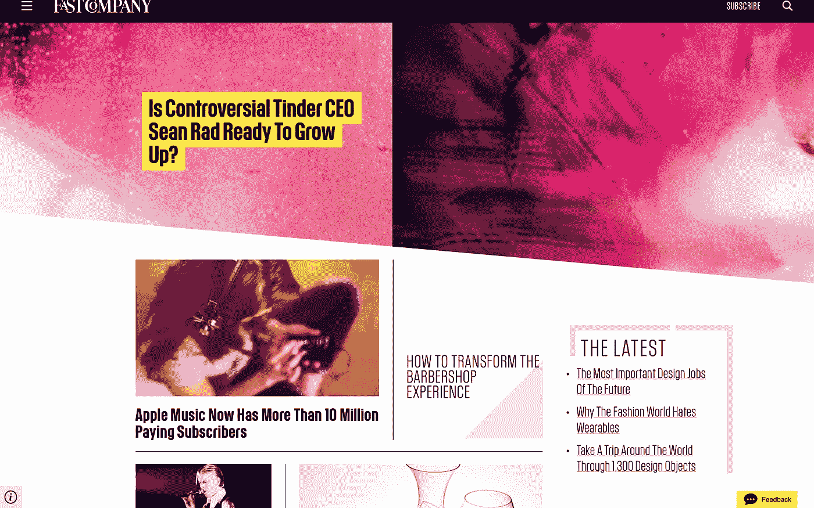
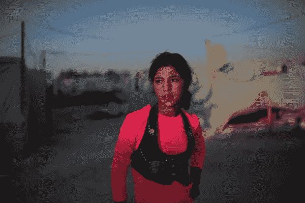

# 为什么我喜欢并怀疑这家新的快速公司

> 原文：<https://medium.com/hackernoon/why-i-love-and-am-skeptical-about-the-new-fast-company-505f7934e9f7>

如果你没有看过新的 Fast Company 网站，它非常时尚，看起来像这样:

我绝对喜欢这种外观，当它第一次出现在 iPad 上的《连线》杂志上时，现在已经去世的报刊亭应用程序首次亮相。这是一个非常有意的新媒体，旨在比表格和网格以及重复的格式更直观，并试图通过强调它们的独特性来讲述每个故事。

2015 年似乎是真正好的新媒体实验的启动年。《纽约时报》给所有订阅者发了一张 [Google](https://hackernoon.com/tagged/google) Cardboard，从我在 [Cardboard](https://hackernoon.com/tagged/cardboard) 和其他媒体上看到的剧集来看，他们在利用新技术向读者展示故事的重要、独特方面方面做得非常出色。

我读过《纽约时报》记者写的关于叙利亚的精彩专栏，并为之震惊。但是当我在谷歌 Cardboard 上看到*流离失所者*，我几乎站在哈娜和其他叙利亚难民的房间对面，这引发了一种新的同情。

新媒体的影响可以对创造不仅仅是为了读者的内容产生重大影响。对于 Fast Company 来说，片段、gif、条纹和颜色的流是无穷无尽的华丽，并真正强调了每个故事的独特品质。

《超人特工队》是一个无穷无尽的智慧源泉，几乎可以在任何情况下引用。当每个人都很特别时，没有人是特别的。

当我浏览《快速公司》时，我意识到我几乎没有读过任何一篇文章的真正标题。我不能 100%确定有多少文本是文章标题，而不仅仅是标题内容，格式的可变性几乎没有留下我应该从哪里开始的线索。

突出一个故事的独特性是新媒体的基本原则，但为了保持清晰，这些故事之间可能需要一些分离。

> [黑客中午](http://bit.ly/Hackernoon)是黑客如何开始他们的下午。我们是 [@AMI](http://bit.ly/atAMIatAMI) 家庭的一员。我们现在[接受投稿](http://bit.ly/hackernoonsubmission)并乐意[讨论广告&赞助](mailto:partners@amipublications.com)机会。
> 
> 如果你喜欢这个故事，我们推荐你阅读我们的[最新科技故事](http://bit.ly/hackernoonlatestt)和[趋势科技故事](https://hackernoon.com/trending)。直到下一次，不要把世界的现实想当然！

