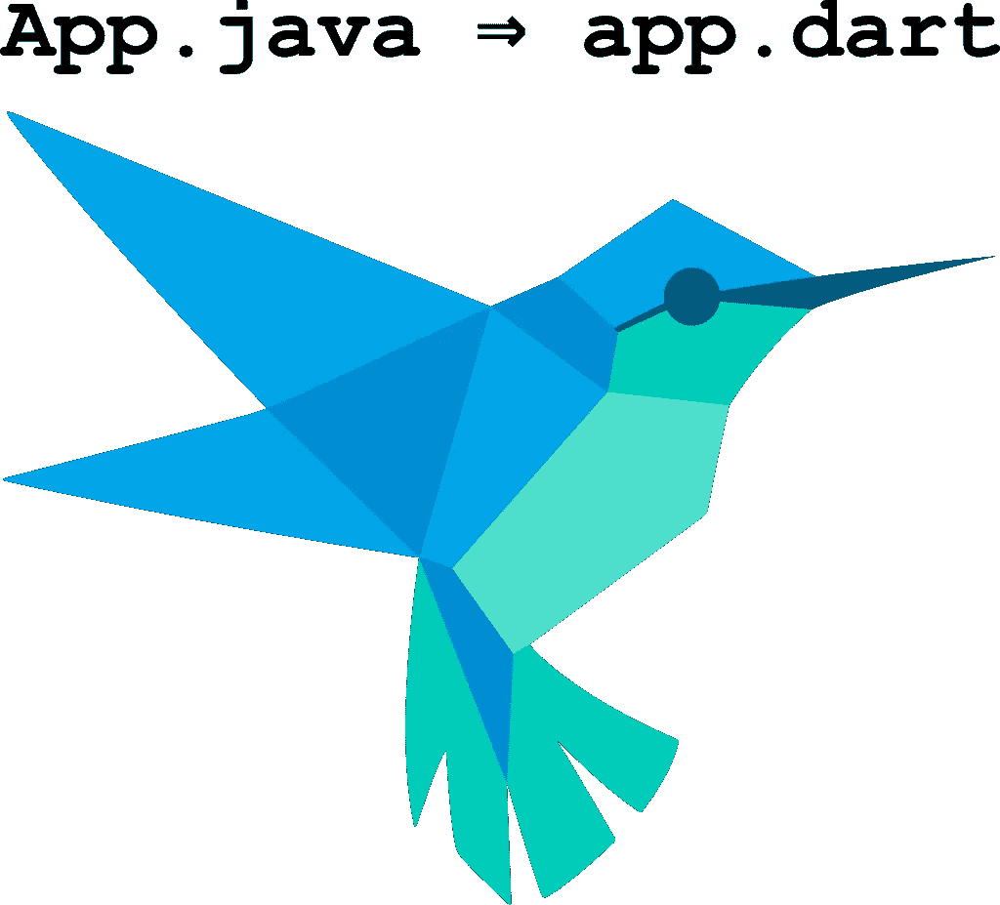

# 为什么我从 Java 转到 Dart

> 原文：<https://medium.com/hackernoon/why-i-moved-from-java-to-dart-8f3802b1d652>

我听说有些人正在从 JavaScript 转向 Dart。我的旅程有点不同:我从爪哇搬到了达特。并且，adwords.google.com 的一部分[跟我来了。](http://adwords.google.com)



AdWords 是谷歌收入流的核心[，目前正在 Dart](https://en.wikipedia.org/wiki/AdWords) 中被[改写。但我工作的 AdWords 的一角——在 YouTube 上销售可跳过广告的部分——自 2014 年以来一直在运行 Dart。](http://news.dartlang.org/2016/03/the-new-adwords-ui-uses-dart-we-asked.html)

这个故事有趣的部分是，没有人告诉我们使用 Dart，甚至没有人要求我们使用它；我们看到了 Dart 所能提供的东西，并决定值得一试。

关键是，我们没有进行大爆炸式的重写。我们使用的是 [Java/GWT](http://www.gwtproject.org/) ，并且能够在浏览器中将其与 Dart 集成，以便逐步迁移到 Dart。随着我们对 Dart 越来越熟悉，我们对它的热情也越来越高；最后，我们几乎重写了所有浏览器代码，从 [Java](https://hackernoon.com/tagged/java) /GWT 到 Dart。

以下是我发现的比起 Java 更喜欢 Dart 的主要原因。

# 1.Dart SDK

如果你已经写了很多 Java，你最大的抱怨之一可能是 SDK 库。关键的决定是很久以前做出的，不能改变。你只需要将 Java 的 [Iterable](https://docs.oracle.com/javase/7/docs/api/java/lang/Iterable.html) 与 Dart 的 [Iterable](https://api.dartlang.org/stable/1.21.0/dart-core/Iterable-class.html) 进行比较，就可以看出事情已经发展到什么程度了。

所以写 Java 最好的方法就是引入第三方库。在[谷歌](https://hackernoon.com/tagged/google)我们用[番石榴](https://github.com/google/guava)，相当奇妙。例如，它提供[可变](https://google.github.io/guava/releases/19.0/api/docs/com/google/common/collect/FluentIterable.html)。但如果不是 SDK 的一部分，它仍然是二等公民。

Dart 有机会从零开始做所有的事情，这是显而易见的。这里有一个例子，你可以在 Java 中使用 FluentIterable for:

```
print(
    [1, 2, 3].where((x) => x.isOdd).map((x) => x + 10));
-->
(11, 13)[try it on dartpad](https://dartpad.dartlang.org/53c91473ad1fa934f87959439da4f246)
```

# 2.回调、期货和异步/等待

如果你已经写了很多 Java/GWT，你可能已经对“回调”这个词有了一个自动的反应。仅仅提一下就会让你出一身冷汗。

我亲自编写和维护了可怕的代码，这些代码通过回调线程化回调来处理 RPC 链中不同的可能性。

这里有一个相对平淡的例子:

```
public void getFoo(AsyncCallback<List<String>> callback) {
  getThenFilter("foo", callback);
}private void getThenFilter(
    final String parameter,
    final AsyncCallback<String> callback) {
  makeRequest(new AsyncCallback<List<String>>() {
    void handle(List<String> values) {
      List<String> filtered = new ArrayList<>();
      for (String value : values) {
        if (value.startsWith(parameter)) {
          filtered.add(value);
        }
      }
      callback.handle(filtered);
  }
}
```

然后 Dart 出现了[未来](https://api.dartlang.org/stable/1.21.0/dart-async/Future-class.html)类，以及围绕它设计的 SDK，让所有这些都消失了。这是当它立即成为明确的达特是在与*我，个人*。它提供了让我的生活变得更美好所需要的一切:

```
Future<List<String>> getFoo() {
  return _getThenFilter('foo');
}Future<List<String>> _getThenFilter(String parameter) {
  return makeRequest().then((result) =>
      result.where((string) => string.startsWith(parameter))
          .toList());
}
```

而且不止于此。他们谈到向 Dart 添加 async/await 关键字是使用 futures 的一种更好的方式。你可以只写“await ”,然后继续编写*,就好像*异步代码被阻塞了一样，一切都会在幕后为你处理。

然后[他们真的做到了](https://www.dartlang.org/articles/language/await-async)。作为一名长期的 Java 开发人员，我已经学会将关于语言变化的讨论视为纯粹的假设，绝不会影响我的工作。我喜出望外:

```
Future<List<String>> getFoo() {
  return _getThenFilter('foo');
}Future<List<String>> _getThenFilter(String parameter) async {
  var unfiltered = await makeRequest();
  return unfiltered.where(
      (string) => string.startsWith(parameter)).toList();
}[try it on dartpad](https://dartpad.dartlang.org/266eb17a9b99fdc60b61ad6c1a9002c9)
```

# 3.没有废话，没有样板

从 Java 迁移到 Dart，你会遇到如此多的特性，仅仅是*让生活变得更简单:*

*   默认为 Public，通过前缀“_”为 private
*   集合文本；[试试看](https://dartpad.dartlang.org/966a339d9bef24d546866f3e437e21e6)
*   一切都是对象——没有“原语”
*   命名参数、可选参数、默认值；[试试看](https://dartpad.dartlang.org/13ab41b2107360973cfc6daee4c0768e)
*   属性— [不需要到处写“get”方法](https://www.dartlang.org/resources/dart-tips/dart-tips-ep-10)
*   瀑布— [一切都是建造者](http://news.dartlang.org/2012/02/method-cascades-in-dart-posted-by-gilad.html)
*   使用[强模式](https://github.com/dart-lang/dev_compiler/blob/master/STRONG_MODE.md)进行类型推断—只需为局部变量编写“var”
*   命名构造函数，自动赋值给字段；试试它们
*   字符串插值，几种类型的字符串文字；试试它们吧
*   dartfmt — [担心格式化](http://journal.stuffwithstuff.com/2015/09/08/the-hardest-program-ive-ever-written/)，所以你不必担心

获得其中的一个会让任何 Java 程序员笑逐颜开。整个事情一下子变得令人不知所措——从好的方面来说。

# 4.走向

语言的改进并没有随着 async/await 的加入而停止。我们最近得到了一个新的[泛型方法语法](http://news.dartlang.org/2016/12/dart-121-generic-method-syntax.html)。不可空类型实验的工作正在进行中。类型系统正在用[强模式](https://github.com/dart-lang/dev_compiler/blob/master/STRONG_MODE.md)进行修改。

Dart 正以一种彻底务实的方式向前发展:任何新特性都必须在真实代码中发挥作用。所以会有新的东西——但只是好的新东西。

# 5.丝网的

最后，Dart 附带了“webby”UI 框架。我们实际上在 AngularDart 以任何形式存在之前就开始了，用的是 [Web UI](https://pub.dartlang.org/packages/web_ui) 。然后我们用 AngularDart，现在用 [AngularDart 2](https://webdev.dartlang.org/angular) 。所有这些都有一些共同点:轻量级、类似 HTML 的模板。事实证明这是一种构建 UI 代码的好方法。

# 对永恒性的探索

在我看来，Dart 唯一缺少的东西是对不可变集合和值的良好支持。所以我很快地拼凑了一些可行的东西供我的团队使用，希望其他人会写一些我可以使用的包。

不过，最终我还是花时间做了一些值得开源的东西。[build _ collection](https://github.com/google/built_collection.dart)和[build _ value](https://github.com/google/built_value.dart)包诞生了。

仅此而已。Dart 准备好黄金时间了。你可以在其中构建巨大的、任务关键的网络应用，就像我们对视频广告词所做的那样；或者你可以使用 [flutter](https://flutter.io/) 开始为 Android 和 iOS 开发移动应用。正如我最近的文章所示，服务器上的 Dart 与客户端上的 Dart 配合得非常好。

我个人的故事；在 Dart 开发者峰会上发表演讲后不久，我加入了 Dart 团队。所以最后我真的做到了“跳槽去 Dart”。

# 更新

在 Reddit 上对这篇文章的[反馈之后，有一些额外的注释。](https://www.reddit.com/r/programming/comments/5nrias/why_i_moved_from_java_to_dart/)

FluentIterable 不是一个需要第三方库来补充 SDK 的*好例子，因为 Java 8 增加了提供非常相似功能的流。*

我想到的下一个 SDK 比较是读取一个文件。在 Dart 中，你可以只做“新建文件(' foo.txt ')。readAsStringSync()”或“等待新文件(' foo.txt ')。readAsString()"如果你不想阻塞。我总是不得不在 Java 中查找当前正确的做法。

很容易找到更多的例子，这并不奇怪:Dart 的 SDK 比 Java 的晚了很长时间。面向对象语言中的 API 设计已经走过了漫长的道路。

我想强调的是，这篇文章是关于编译成 js 的 Dart，以便在浏览器中使用。我们的过渡是从爪哇/GWT 到达特。

最后，我认为值得一提的是，在我使用过的众多语言中，Java 仍然是我第二喜欢的*语言。*

[](http://bit.ly/HackernoonFB)[](https://goo.gl/k7XYbx)[](https://goo.gl/4ofytp)

> [黑客中午](http://bit.ly/Hackernoon)是黑客如何开始他们的下午。我们是 [@AMI](http://bit.ly/atAMIatAMI) 家庭的一员。我们现在[接受投稿](http://bit.ly/hackernoonsubmission)并乐意[讨论广告&赞助](mailto:partners@amipublications.com)机会。
> 
> 如果你喜欢这个故事，我们推荐你阅读我们的[最新科技故事](http://bit.ly/hackernoonlatestt)和[趋势科技故事](https://hackernoon.com/trending)。直到下一次，不要把世界的现实想当然！

