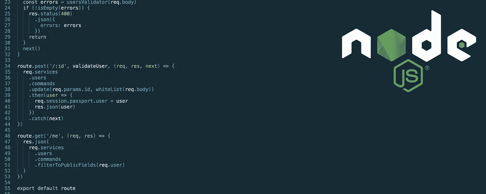

# 为什么我选择 nodejs 作为我的创业公司

> 原文：<https://medium.com/hackernoon/why-i-picked-nodejs-for-my-startup-dbcc83aa5495>

就在 2016 年底，我作为唯一的工程师跳进了一家新的创业公司。我的第一个重大决定是用什么技术堆栈来构建我们的产品。我选择了 nodejs，原因如下。

# 这是我最了解的

这是主要的原因，也是从零开始的时候最好的原因。有很多非常有趣的语言和框架。我对函数式编程非常感兴趣，也喜欢在 Ruby 中工作的时光，所以灵药和 Clojure 是我想到的两个东西。

我现在已经达到了几种语言的专业水平，所以我不认为我会花很长时间来掌握其中的任何一种。然而这并不简单:所有语言都有自己的习惯用法、框架、包管理器、开发工具和部署问题。对于 Clojure，我当然可以编写 LISP 代码，但是我对在生产环境中运行 JVM 一无所知。

Turns out I’m not Rich Hickey.

坚持我所知道的意味着我不需要因为没有深入了解堆栈而浪费任何宝贵的时间来学习新技巧或排除自己造成的问题。我也削减了一大块风险。我知道我在做什么。在创业初期，会有很多你不知道的东西——抓住你做的一点点是有意义的。

# 你可以用它快速建造东西

虽然不像 Ruby on Rails 那样高效，但您仍然可以非常快速地移动。多亏了令人惊叹的 [npm](https://www.npmjs.com/) 生态系统，nodejs 有一个你能想象到的几乎任何东西的模块。我会用别人的模块来节省时间。并不是所有的都很好，但我现在可以忍受奇怪的简陋的实现。如果我遇到了不是*【没有产品】*或者*【没有客户】*的问题，我以后会写我自己的。

# 它不再酷了

Nodejs 现在已经成熟，并且经过了实战考验，被许多大型科技公司使用，比如网飞和 Paypal。就连微软也热衷于[加入这个聚会](http://www.infoworld.com/article/3024271/javascript/nodejs-welcomes-microsoft-chakra-javascript-engine.html)。这意味着钱被花在保持稳定和使其更好上。我可以确信它不会很快被抛弃或忽视。

# 通用语

早在 2007 年，杰夫·阿特伍德写了另一篇有影响力的博客文章。他在书中创造了一个短语:

> JavaScript 是网络的通用语言。忽略它，后果自负。

自 2007 年以来，这一点变得更加真实。我喜欢这样想:

> Javascript 是编程语言的英语。它可能不是最好的，它肯定充满了怪癖，但它很容易上手，而且能完成工作。更确切地说，它现在无处不在，任何人对此都无能为力。

Javascript comes to the server.

制作 web 应用程序的一个确定因素是，其中某个地方会有 javascript，即使只是作为 transpiler 的输出。无法回避的事情，就应该去拥抱。如果你被某样东西卡住了，你不妨学着从中获得最好的东西。

# 它帮助我保持事情简单

我想让我的生活尽可能简单。通过选择 nodejs，我可以在我的所有栈中使用一种语言，而不是客户端和服务器端各用一种语言。我们坚持传统的 HTML、CSS 和 javascript 网络三足鼎立。

我可以雇佣各种各样的工程师，只要他们懂一点 javascript，几乎所有的 web 开发人员都懂。

还有其他好处，比如能够在浏览器和服务器之间共享代码。一些[反应](https://facebook.github.io/react/)合理直截了当的事情。

# 它将持续我很长时间

Nodejs 足够快，可以很好地扩展，当我超越它的时候，我将离现在的位置很远。这是一个我非常想解决的问题。当那一天临近时，它不会是 nodejs 的终点。我认为它是我系统中永久的一部分。

就像我说的，现在我想让事情变得简单。这也适用于我的架构，所以我的应用程序现在将是一个整体。一个代码库，一个部署，一切都在一个地方。对于涉及规模和复杂性的问题，微服务是一个很好的解决方案；对于生产力来说，就没那么多了。花在服务发现、负载平衡上的时间，以及其他我宁愿用来创造产品的时间。

The monolith. It’s not very fashionable, but it is very simple.

虽然有一天，我的庞然大物会开始吱吱作响，一些位会太慢，整个事情会变得笨拙，因为它的纯粹的大小。我见过一些创业公司，他们的 Rails 应用程序已经发展到这一步。提取功能并将其封装在进程外或完全分布式的尝试是成功的，但也带来了实质性的缺点。Ruby 是单线程和阻塞的。当 Rails 应用程序在网络上进行调用时，整个线程在做任何事情之前都会等待响应。您添加的服务越多，等待的时间就越长。

这意味着在过渡时期，事情会变得相当缓慢，而且过渡越深入，情况就越糟糕。这也导致了 Ruby 在代码库中的消失。虽然 Ruby 和 Rails 在早期阶段使团队能够快速移动，但后来 Ruby 似乎并不是分布式系统的最佳选择。所有团队的 Ruby 知识都在转换后被浪费了，这让 Ruby 主义者很难过。

有了 nodejs 系统，事情就简单多了。虽然它是单线程的，但它也是异步和非阻塞的。这意味着，当我们等待网络做它的事情时，其他请求将得到服务。添加分布式组件不会破坏性能。

更好的是，javascript 永远不会完全消失。随着更多的服务被提取出来，nodejs 层将逐渐收缩成一个贫血的 web 层。与 monolith 时代相比，它的职责将会减少，但仍将扮演一个重要的角色，聚合对服务的调用，呈现 html 管理会话和其他 web 内容。也会有大量的服务器端 javascript。

虽然许多服务最终可能会用一种新的语言编写(也许我最终会使用 Elixir 和 Clojure！)，机构的 javascript 知识也不会完全浪费。

It take a a village of services to build a system. All safely behind a thin wall of nodejs.

# 概括起来

*   这是我最了解的
*   得到更广泛行业的支持
*   这真的很有成效
*   每个人都知道 javascript
*   在客户机和服务器之间共享代码很好
*   无论如何，这是无法避免的
*   目前这已经足够好了，但是留下了一条通向不同事物的道路

我想未来几年我们会看到我是否会后悔我的决定。同时，我也雇佣了我工程团队的第一个成员。因此，如果你喜欢在 nodejs 上进行黑客攻击，请给我写一封邮件:dom@terriertech.io

> [黑客中午](http://bit.ly/Hackernoon)是黑客如何开始他们的下午。我们是 [@AMI](http://bit.ly/atAMIatAMI) 家庭的一员。我们现在[接受投稿](http://bit.ly/hackernoonsubmission)，并乐意[讨论广告&赞助](mailto:partners@amipublications.com)机会。
> 
> 如果你喜欢这个故事，我们推荐你阅读我们的[最新科技故事](http://bit.ly/hackernoonlatestt)和[趋势科技故事](https://hackernoon.com/trending)。直到下一次，不要把世界的现实想当然！

