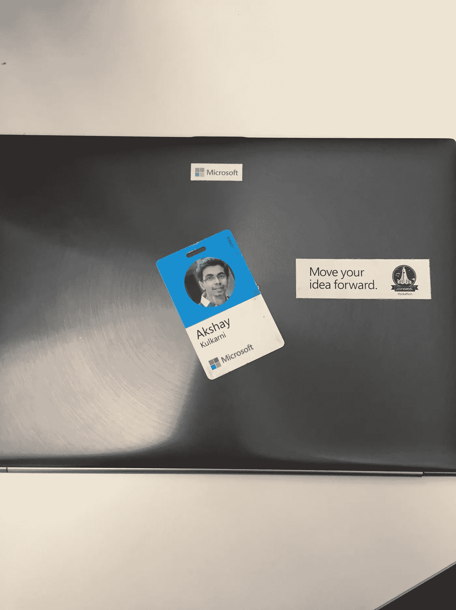

# 为什么我辞去微软的工作去创业

> 原文：<https://medium.com/hackernoon/why-i-quit-my-job-at-microsoft-to-start-a-startup-9b4d82545726>

今天是我在微软的最后一天。在一年半的惊人学习经历后，我决定辞职。我在这里的所有时间里，我认为我从来没有后悔过加入微软。当然，有些时候我对事情的进展不满意，但这是旅程的一部分。

总的来说，我认为微软是我遇到的最好的事情之一。做出离开的决定并不容易，而且是在深思熟虑之后做出的。

我先道歉，但这将是一个很长的帖子。对于需要快速总结的人来说，这就是了

> 我知道创业是我想做的，没有比现在更好的时机了

# 那我为什么要辞职呢？

我不太记得为什么，但在大学三年级结束时，我知道有一天我想开一家自己的公司。也许是做东西的快乐，看着其他人使用它并完全控制整个过程，或者也许是我只是跟风。

我已经开始着手我自己的[创业公司](https://hackernoon.com/tagged/startup) Intigrent，在那里我们基本上是在尝试做一个带有一些新功能的在线课程平台。我们希望在线课程更加个性化。也许这是个好主意，也许是个糟糕的主意。我永远不会知道，因为创业 9 个月后，我和我的联合创始人吵了一架，我们决定分道扬镳。我大学毕业后加入了[微软](https://hackernoon.com/tagged/microsoft)。

我在周末继续研究这个想法，并引入了一位新的联合创始人。她当时是我最好的朋友。我们改变了这个想法，因为我们觉得制作内容将是一个巨大的挑战。因此，我们决定专注于利用现有的在线内容，为学校的孩子们制作个性化的课程。但在创业 5 个月后，我和她发生了个人争吵，这对我们的职业关系也是致命的打击。然而，我仍然相信这是一个非常好的想法，但也许我不是合适的人来建立它。

所以到现在为止，我已经经历了由于职业斗争而失去的个人关系和由于个人斗争而失去的职业关系。然而，这场个人斗争对我有很大的影响，也许在某些方面，我仍在努力应对。但是在发表了这两个经历后，我想也许创业不是我的事情，我应该回到正常的工作中，努力在微软建立一个强大的职业生涯。

我试着，我真的很努力地试着把我所有的注意力放在我在微软的工作上。但当我听到一个新的创业想法或自己想出一个时，我总是会很兴奋。

> 毕竟，心想要它想要的

在这段时间里，我刚刚开始探索聊天机器人的意义，构建了一些无用的有趣的机器人，如 pokedex 和个人简历机器人。但是，随着我对这个领域的进一步探索，我意识到 98%的聊天机器人都很糟糕，这是一个人工智能问题，而不是建立一个机器人有多容易的问题。所以我想出了帮助人们制造更聪明的聊天机器人的主意。

我非常确信这就是我想要的工作，并决定放弃。辞去舒适高薪的工作是一个艰难的决定，但我只需要回答一个问题，坏处是什么？

我认为大多数人对风险的看法是错误的。辞掉一份工作并没有什么风险，风险在于留在原地。这么想吧。你 23 岁，没有家庭要照顾，可以靠快餐生存，前面还有很长的职业生涯。这种精确的组合在你的一生中只会发生一次。你会有 100 次为大公司工作的机会，但是你只有一次 23 岁。

意识到这一点后，这个决定基本上已经做出了，我很幸运，我的父母理解我的观点并支持我。

# **为什么不兼职做呢？**

到目前为止，这是我收到的最常见的问题之一。"你为什么不在空闲时间研究这个呢？"，“你为什么不在周末做这个？”

我认为这是一个根本错误的方法。创业是艰难的，我从我两次失败的经历中知道，有太多的事情可能会出错，其中大多数都会在某个时候出错。你需要大量的注意力和意志来克服这些困难，继续前进。我认为创业是那种要么全力以赴，要么不全力以赴的事情。没有中间地带。

LinkedIn 创始人雷德·霍夫曼有句名言，创业就像“把自己从悬崖上扔下去，然后在下落的过程中组装一架飞机”一边工作一边创业就像是带着降落伞从悬崖上跳下去。当事情变得困难时，你要打开降落伞。

最大化你实际建造飞机的可能性的唯一方法是没有降落伞，没有备份，没有任何东西可以返回。

# **下一步是什么？**

我不确定 ozz 是否会成功，但我可以肯定的是，我不会后悔。失败并不是因为缺乏尝试。

> [黑客中午](http://bit.ly/Hackernoon)是黑客如何开始他们的下午。我们是 [@AMI](http://bit.ly/atAMIatAMI) 家庭的一员。我们现在[接受投稿](http://bit.ly/hackernoonsubmission)，并乐意[讨论广告&赞助](mailto:partners@amipublications.com)机会。
> 
> 如果你喜欢这个故事，我们推荐你阅读我们的[最新科技故事](http://bit.ly/hackernoonlatestt)和[趋势科技故事](https://hackernoon.com/trending)。直到下一次，不要把世界的现实想当然！

