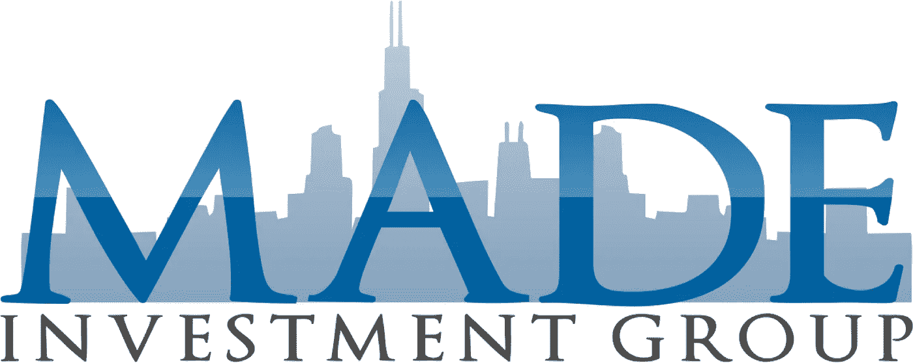

# 为什么我开了一家房地产公司…

> 原文：<https://medium.com/hackernoon/why-i-started-a-real-estate-company-a78e6e3f856c>

千禧一代的房地产投资

活着是多么美好的时光啊…

这是一个特殊的时刻，我相信我们大多数人会在它结束后很长一段时间内欣赏它。科技的崛起让我想起了淘金热，许多人试图找到或者我应该说创造黄金应用程序，他们可以兑现并赚上百万。但对我来说，我享受使用技术的好处，但我没有兴趣搬到硅谷…目前。

我选择了房地产…原因如下…

# 1.改变我的社区

当你还是个孩子的时候，有人问你长大后想做什么，我的回答是我想帮助别人，赚很多钱。这个答案至今仍在我脑海中。

在我的市场(芝加哥)，一个稳定的家可以拯救一条生命。我涉足房地产是因为我想在城市社区开发废弃房屋。芝加哥闲置房地产的数量令人震惊，最糟糕的是在这些地方发生的非法行为。我认为房地产是一个改变芝加哥的机会，同时也是一个赚钱的机会，从那时起，这是一个显而易见的事情。

# 2。时间价值或有价值的时间

我一直相信时间是无价的。它控制着一切，一旦失去就不可能再找回。我最害怕的事情之一就是朝九晚五地工作到 65 岁，到最后他们会批准我退休。这太疯狂了，浪费时间！作为企业家，我们热爱时间！作为千禧一代，我们热爱时间！传统的生活方式不适合我们。我知道这对我没用。

我们这一代最成功的公司已经找到了出售时间的方法！比如我们都爱的优步！优步正在摧毁它，因为它为我们节省了在大都市找停车位的时间，早上 5 点开车去机场的时间，还有我最喜欢的周六晚上的活动时间！他们把时间卖给我们，让我们的生活变得更轻松。经营我的房地产公司不需要我一周工作 40 多个小时，一年工作 49 周。我需要那段时间和我的家人在一起，和我的儿子一起去实地考察，去世界各地看世界杯。我也需要那段时间去创造和感激上帝赐予我的美好生活。

# 3.给我看看钱！

创业的目标应该是赚钱，但对我来说，目标是变得富有。我在为创造世代财富打下基础，我在这里建立一家公司，我的曾孙们将从中受益。我研究了在我之前的那些在房地产上赚了数十亿的人，就像所有其他竞争行业一样，总有人在争夺头把交椅。那个人就是我。

《福布斯》去年 3 月发布了一篇文章，列出了 20 位最富有的房地产大亨:

 [## 2015 年福布斯亿万富翁排行榜上最富有的 20 位房地产大亨

### 尽管过去一年许多房地产市场有所降温，但《福布斯》现在统计了更多的房地产亿万富翁

www.forbes.com](http://www.forbes.com/sites/erincarlyle/2015/03/05/the-20-richest-real-estate-tycoons-on-the-2015-forbes-billionaires-list/#2715e4857a0b4ad6f7014c1b) 

我用这些文章作为动力，也作为研究这个行业和主要参与者的指南。

现在你有了我开房地产公司的理由，跟我分享一下你创业的原因。

请与我联系:

电子邮件:info@stevedunlapjr.com

脸书/insta gram/潜望镜:@SteveDunlapJr

永远记住…我想要的只是房地产

> [黑客中午](http://bit.ly/Hackernoon)是黑客如何开始他们的下午。我们是 [@AMI](http://bit.ly/atAMIatAMI) 家庭的一员。我们现在[接受投稿](http://bit.ly/hackernoonsubmission)，并乐意[讨论广告&赞助](mailto:partners@amipublications.com)机会。
> 
> 如果你喜欢这个故事，我们推荐你阅读我们的[最新科技故事](http://bit.ly/hackernoonlatestt)和[趋势科技故事](https://hackernoon.com/trending)。直到下一次，不要把世界的现实想当然！

