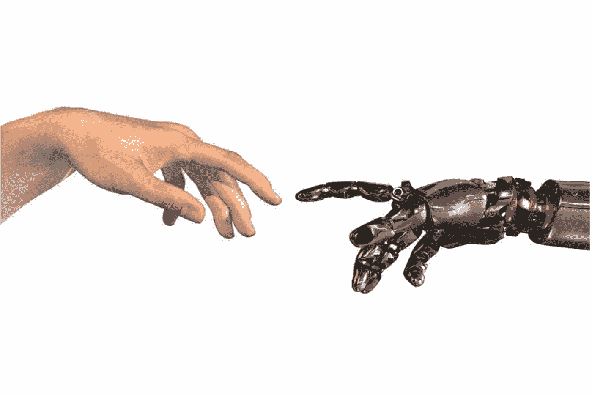

# 为什么我认为机器人应该取代我的工作

> 原文：<https://medium.com/hackernoon/why-i-think-a-robot-should-take-my-job-29cbd56e45b4>

## 我每天打卡上班，做机器的工作。很有可能你也是。

我的职业是抽血师。我每周在一家私人诊所工作 40 个小时，抽取血液，根据医生的指示进行处理，然后送到实验室进行检测。从任何存在主义的意义上来说，这都不是一件令人满意的事情，当然也不是一个二十年后我会以毕生的工作为荣的领域，但就目前而言，它能支付账单。这就是我想谈的。

美国创新天才里查德·巴克明斯行·福勒曾经说过:

> “我们应该摒弃每个人都必须谋生这种绝对似是而非的观念。今天的事实是，我们中万分之一的人能够取得能够支持所有其他人的技术突破。今天的年轻人完全正确地认识到了谋生的荒谬性。我们不断创造工作岗位，因为这种错误的想法，即每个人都必须受雇于某种苦差事，因为根据马尔萨斯达尔文理论，他必须证明自己存在的权利。因此，我们有检查员的检查员和为检查员制造工具以检查检查员的人。人们真正应该做的是回到学校，在有人告诉他们必须谋生之前，想想他们在想什么。”

这个“激进的想法”给我印象最深的是，他死于 1983 年。

除非你能让自己的收支平衡，整天写些中等水平的文章，否则你也许能根据任何给定时刻呈现的实时情况，用算法推导出你的工作程序的适当动作。如果是这样的话，那么你的工作可以并且*应该*由计算机来完成。如果这让你的屁股扭得更舒服，请允许我解释为什么这是个好消息。

## 这是事情的自然发展。

机器人革命不是什么新鲜事。不同之处在于，它们比以前先进得多，看起来也更闪亮——就是这样。一名会计师现在可以几乎瞬间无误地完成大量的数据收集和复杂的计算，而这在一百年前可能需要数百名数学家花费数小时才能完成。想想你的洗衣机、洗碗机，这样的例子不胜枚举。工具和[技术](https://hackernoon.com/tagged/technology)的使用甚至比智人物种还要早，一路上逐渐取代了有知觉的劳动。如今，哀悼 60 年代失去的传统电话总机接线员似乎有点愚蠢，从这个角度来看，机器在历史上担任餐馆服务员、司机、建筑工人的合法位置似乎是再自然不过的事情了……你应该明白这一点。

我们希望计算机做我们期望有明显和可预测结果的任务。他们不仅可能毫无差错地完成任务，而且可能会提高工作或生产的速度，并在没有工会反弹的情况下以很小的成本完成所有这些工作。

## 想想我们，而不是我。

现在来回答一个显而易见的问题:我的收入怎么样？这是一个非常重要的问题——在这个问题上，我们要与取代人的工作的每一项技术进步作斗争，在这个问题上，我们必须准备以历史上最大的规模来解决。正是因为这个原因，我们在生产力和技术潜力方面已经落后了，它融入社会是不可避免的，而不是可能的。所以，如果你有一份机械的工作，像我一样，你不应该问*如果*，而是问*什么时候*科技会取代我对社会贡献的价值。

从客观的角度来看，解决方案很简单:我们必须重新思考经济，并以一种为其公民提供服务的方式来构建经济，只要它允许其公民最大限度地为社会造福。为什么我们还没有做到这一点？

> 我们如此不可分割地坚持“我如何谋生”的主观观点，以至于问“作为一个社会，我们如何生活得更好”变得无关紧要

这在美国尤其如此，大老党的家乡决心把它的“吃白食者”进一步推向他们已经无法摆脱的贫困。我们痴迷于这样一种观点，即出于某种原因，任何一个每周不完成 x 量日常任务的人都不配体面地生存，而事实是，如果我们只是像强迫其他人做更适合这些机器的工作一样，努力最大化我们机器的生产率，我们都会过得更好。

## “但是，我喜欢做饭。”: (

说我会错过静脉切开术是不是很奇怪？我的工作中有一些方面是我真正喜欢的，比如与病人互动，我还有更多好消息:这些都不会消失！如果你不相信我，去威尼斯坐坐缆车吧。曾经实用的环城交通工具现在成了旅游新宠，每个参与者都非常想去那里。我的观点是，不再依赖平凡的工作作为生存的必要手段减轻了追求生活乐趣的压力，而不用担心你可能从中获利。

## 是的，有很多细节要梳理。

对于那些我们还不能完全自动化的工作，我们如何激励和奖励工人？我们如何公平地分配有限的资源以平衡特定市场的供给和需求？我们如何最有效地从生存型经济过渡到繁荣型经济？我们可以在每个问题上花上几个小时，这反过来又会刺激更多的问题，这就是为什么我们在这里不再赘述细节；然而，我相信我们可以找到简洁的解决方案。

如果你想要一个含糊而简短的答案，

> 请记住，我们不一定要消除经济，而是通过负责任地维护我们的资源、消除稀缺和提高生产力，让经济为人民服务，而不是人民为经济服务。

转型很难。继续沿着扩大贫富差距和破坏我们的资源和环境的轨迹前进也是困难的，考虑到我们作为一个社会，在不久的将来要做出许多艰难的决定，这就是为什么我宁愿机器人取代我的工作——这样我就可以自由地改进构成静脉切开术的简洁和算法过程，而不是每周重复几次不完善的过程。因此，我的人类尊严不是由我做平凡工作的能力来确认，而是由我以比机器更大的能力为社会做贡献的自由来确认。这样我就可以去旅行，去欢笑，去实现我在这个地球上的小小生命的最大潜能。这是我们对彼此的亏欠，也是我们对彼此的期望。

> [黑客中午](http://bit.ly/Hackernoon)是黑客如何开始他们的下午。我们是 [@AMI](http://bit.ly/atAMIatAMI) 家庭的一员。我们现在[接受投稿](http://bit.ly/hackernoonsubmission)并乐意[讨论广告&赞助](mailto:partners@amipublications.com)机会。
> 
> 如果你喜欢这个故事，我们推荐你阅读我们的[最新科技故事](http://bit.ly/hackernoonlatestt)和[趋势科技故事](https://hackernoon.com/trending)。直到下一次，不要把世界的现实想当然！

