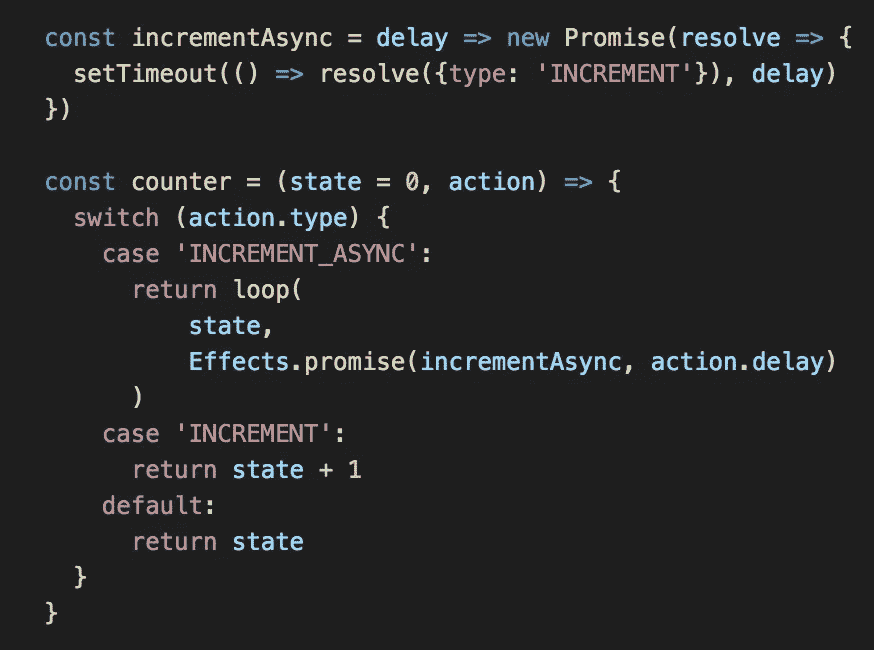
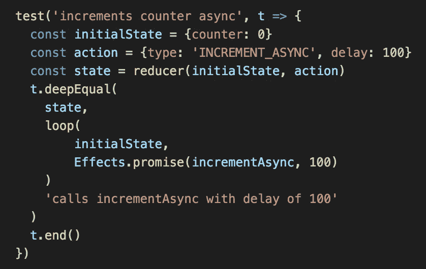
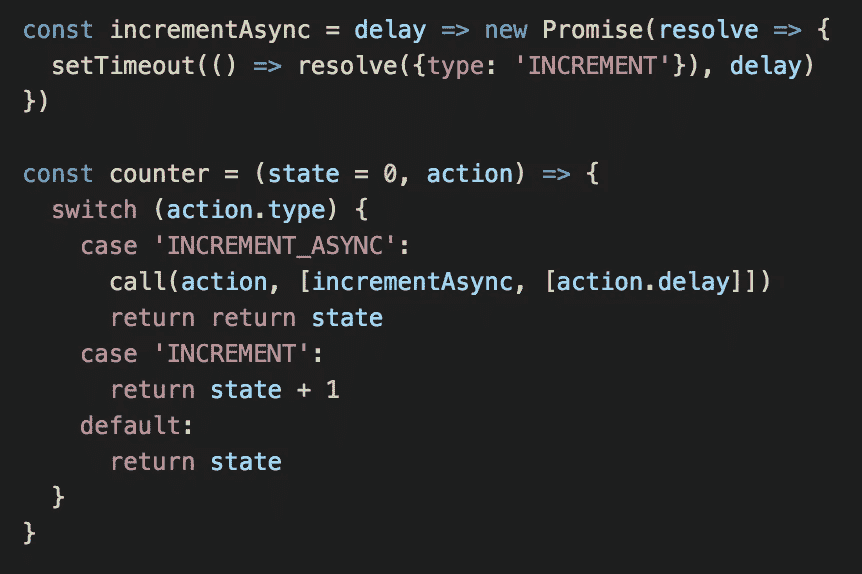
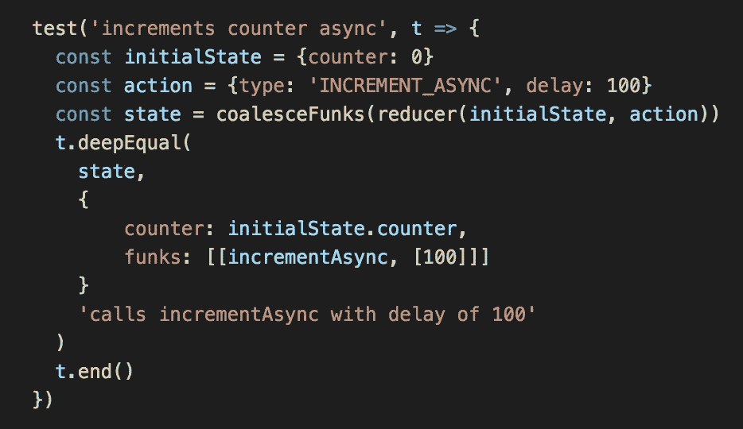
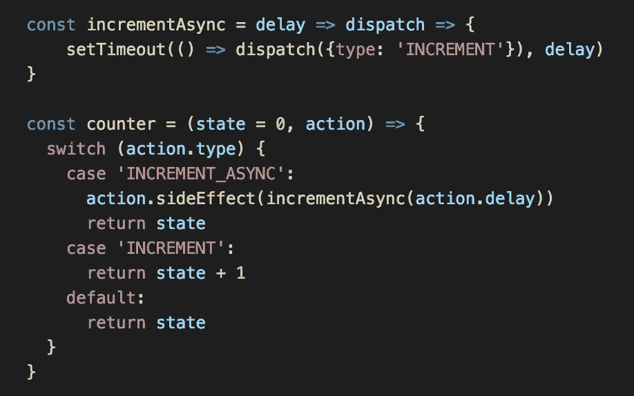
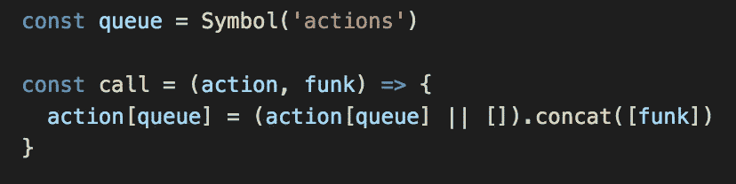
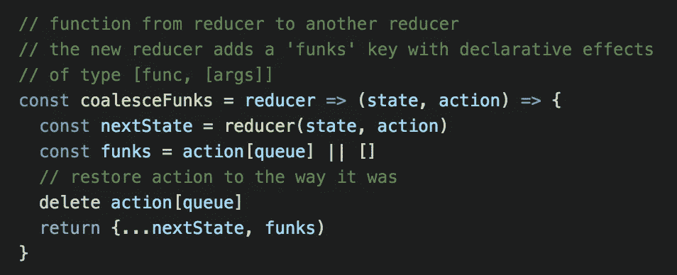
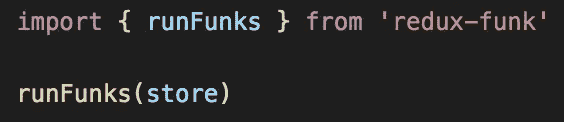

# redux Funk—简单、可测试的异步效果

> 原文：<https://medium.com/hackernoon/why-i-wrote-a-redux-async-outerware-277d450dba74>

Redux 应用程序中有大量的[库](https://github.com/markerikson/redux-ecosystem-links/blob/master/side-effects.md)用来做异步效果。[有些人认为这是一件坏事，但我喜欢 JavaScript 社区中知识分子的好奇心和探索的意愿。](/javascript-and-opinions/redux-side-effects-and-you-66f2e0842fc3#.rht62eejy)

没有一个[特效](https://hackernoon.com/tagged/redux)特效[库](https://hackernoon.com/tagged/library)能满足我的需求，所以我最终做了一些新的东西。我将分享我从其他效果库中借来的想法，以及它们如何在 [redux-funk](https://github.com/mheiber/redux-funk) 中使用。

> 对于一些背景，有一个[栈溢出帖子](http://stackoverflow.com/questions/34570758/why-do-we-need-middleware-for-async-flow-in-redux)解释了为什么你想要一个工具来实现 Redux 应用中的异步效果。

## Redux 循环 reducers 中的声明性效果

下面的例子展示了 Redux Loop 中的一些好主意。这是一个 reducer 的代码，它在延迟后返回一个指令来增加计数器:

Redux Loop Example

上面对**循环**函数的调用可以解读为“返回状态不变，调用 **incrementAsync** 带参数[ **action.delay** ]。

将异步内容放入 reducers 的一个优点是，当试图弄清楚"*当这个动作被分派时，应用程序做了什么？*”。一个动作应该被同步处理还是异步处理变成了一个实现细节，而不是决定你的代码在应用的哪个部分。相比之下，在 Redux Thunk 中，async stuff 生活在动作创作者中，而在 Redux Saga 中，async stuff 生活在 sagas 中。

Redux 中的一个很大的规则是 reducers 应该是纯的。起初，Redux 循环似乎违反了这条规则，但一切都很好。调用**循环**函数实际上不会产生任何副作用。相反，**循环**返回表示下一个状态和效果的数据结构。这使得编写测试变得非常容易——您可以使用深度相等检查来查看返回了什么效果:

Test for a reducer that uses Redux Loop

我没有使用 Redux 循环，因为我需要进行定制的缩减器组合，比如从一个缩减器中委托给另一个缩减器。这与 Redux 循环很复杂，因为它的效果 [**必须使用**](https://github.com/redux-loop/redux-loop/blob/master/modules/combineReducers.js#L26) **[**isLoop** 、 **getEffect** 、 **getModel** 和 **batch**](https://github.com/redux-loop/redux-loop/blob/master/docs/ApiDocs.md) 沿状态树** 向上传递。

> 问题是在 reducer 组合中，我们希望子 reducer 只能访问状态树的一部分，而不是全部。因此，当在**状态**上存储效果时(就像在 Redux 循环中)，效果必须以某种方式到达树的顶部，以便中间件可以看到它。另一种方法是遍历整个树，寻找效果，这可能不是一个好主意。我借用了 Redux Side Effect 的一个解决方案，在下一节描述。

这是异步计数器缩减器的 redux-funk 版本:

Reducer using Redux Funk for declarative effects. I explain how **call** is implemented in the next section.

在上面的代码中，****调用**用于对一个效果进行排队。效果**【incrementAsync，[action.delay]]** 可以解读为“调用 incrementAsync，以 action.delay 作为第一个参数。”我用 *funks 来指代*形式的效果**【func、【arguments……】】**。redux-funk 在状态树的顶部添加了一个 **funks** 数组来排队异步效果。因此，要测试使用 redux-funk 的减速器，您只需检查 **funks** 键:**

****

## **使用动作对象减少副作用—**

****Redux 循环代码有时不得不跳过重重关卡，将效果传递到状态树上。 [Redux 副作用](https://github.com/gregwebs/redux-side-effect)避免了这些困难，并且因为一个技巧而有了一个[微小的行数](https://github.com/gregwebs/redux-side-effect/blob/master/src/index.js)——它使用**动作**对象来传达效果。****

****以下代码显示了如何使用 Redux Side Effect 在缩减器中添加副作用:****

********

****Redux Side Effect example****

****Redux 副作用中间件只是检查**动作**上的效果，并以**调度**作为第一个参数调用它们。使用**动作**是一种快捷方式:当子 reducer 只获得整个状态树的分支时，**动作**在所有 reducer 之间共享。****

****尽管这个解决方案很优雅，但我最终没有使用 Redux 副作用，因为:****

*   ****这些效果是非声明性的。在上面的例子中，测试延迟是否正确的唯一方法是实际设置一个延迟并比较时间戳。****
*   ****减速器变得依赖于**副作用**方法的存在。****
*   ****改变动作对象[会破坏 Redux 范式](http://redux.js.org/docs/introduction/ThreePrinciples.html#changes-are-made-with-pure-functions)，如果可能的话，这是我想避免的。****

****redux-funk 还使用在**动作**对象上存储动作的技巧来避免传递效果。但是该实现保持了还原剂的纯度。 **call(action，funk)** 使用[符号](https://developer.mozilla.org/en-US/docs/Web/JavaScript/Reference/Global_Objects/Symbol)作为键，将 funk 添加到动作中:****

********

****Implementation of the ***call*** function in redux-funk****

****当使用 redux-funk 时，调用顶层 reducer 上的**congregate reducers**，它从动作中取出效果队列，并将它们放入存储状态。这就把活动还原到了原来的样子，更重要的是，让商店的消费者也能买到这些放克。上面的测试示例使用了**合并效果。******

****下面是**合并效果**的实现:****

********

****Implementation of **coalesceFunks******

## ****来自 React-Redux—订阅商店****

****React-Redux 包含使用状态呈现 UI 的助手，这可能是最重要的副作用。Redux 的大多数效果库都是中间件，但是，React-Redux 订阅存储并对当前状态做出反应。****

****因为 redux-funk 将效果作为商店状态的一部分，所以您可以只订阅商店，然后用效果进行编程。我做了一个小助手， **runFunks，**来处理效果，方式类似于 Redux Loop:****

********

****Helper for working with declarative effects****

******runFunks** 使 reducers 中描述的效果能够被实际调用。在反例中，函数返回一个动作的承诺。runFunks 调用函数并保持对**增量**动作的承诺。当承诺解决时， **runFunks** 分派动作:****

********

****Reducer using Redux Funk for declarative effects****

****下面是 runFunks 的实现:****

********

****Implementation of **runFunks******

****可以不用 **runFunks** 使用 redux-funk，实现自己的逻辑进行处理。这就是在**状态下储存效果的好处之一。例如，你可以使用上面代码的一个变体来给每个效果添加延迟，去抖，使用回调而不是承诺，进行远程过程调用，将依赖注入到恐惧中，等等。******

# ****尝试一下****

****如果您已经做到了这一步，那么您已经看到了 redux-funk 的完整源代码！****

****希望你有机会[尝试一下](https://www.npmjs.com/package/redux-funk)和玩玩[的例子](https://github.com/mheiber/redux-funk-examples)，它们改编自 [Redux Saga 的例子](https://github.com/yelouafi/redux-saga#building-examples-from-sources)。****

************************

> ****[黑客中午](http://bit.ly/Hackernoon)是黑客如何开始他们的下午。我们是 [@AMI](http://bit.ly/atAMIatAMI) 家庭的一员。我们现在[接受投稿](http://bit.ly/hackernoonsubmission)并乐意[讨论广告&赞助](mailto:partners@amipublications.com)机会。****
> 
> ****如果你喜欢这个故事，我们推荐你阅读我们的[最新科技故事](http://bit.ly/hackernoonlatestt)和[趋势科技故事](https://hackernoon.com/trending)。直到下一次，不要把世界的现实想当然！****

********