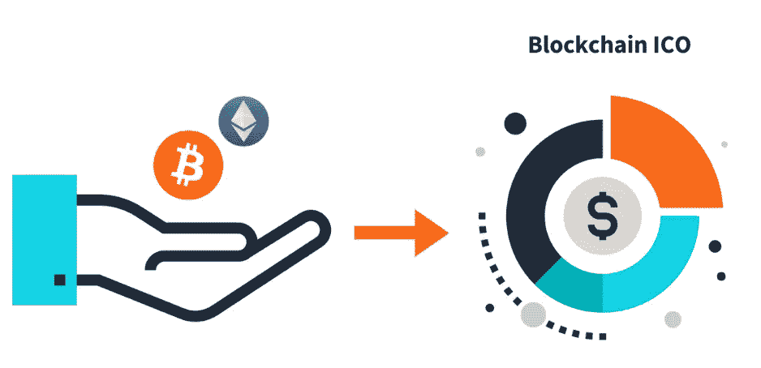
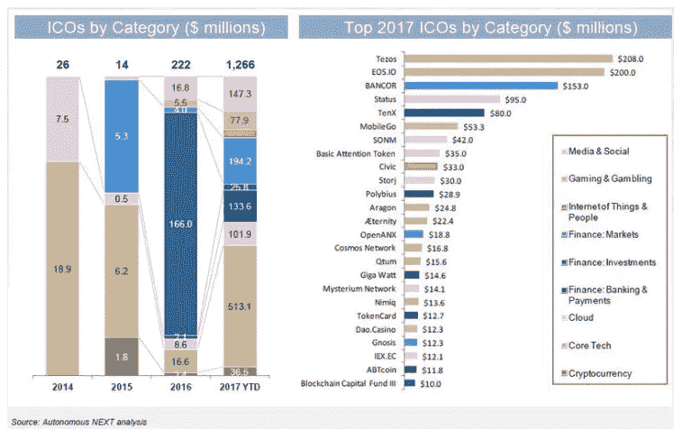

# ICOs 为何蓄势待发 2 颠覆一切电话会议—美国东部时间 7 月 27 日下午 2 点到 3 点

> 原文：<https://medium.com/hackernoon/why-icos-are-poised-2-disrupt-everything-conference-call-july-27th-2pm-3pm-est-1f6e2db7ec93>

在 Medium [这里](https://goo.gl/Aw8bMj)可以找到关于这次通话的博客帖子和音频回放。

6 月 29 日，我们与 Geektime 合作，与四位加密货币思想领袖(来自 Tezos、Bancor、DCG 和 Polychain Capital)和 400 多名参与者举行了电话会议。你可以阅读一篇博客文章，并在这里听一段电话录音。在电话会议后的几周内，以太币和其他加密货币下跌了 60%，然后上涨了 50%，Tezos 筹集了创纪录的 2.32 亿美元。根据下图，在 2017 年上半年，ICO 今年将筹集 25 亿美元，比 2016 年增长 10 倍。称这个空间是动态的显然是轻描淡写。

通过这次通话，我们明白了两件事。首先，ico 有望成为全球科技和金融生态系统中的一支颠覆性力量(这里有一篇关于“[为什么代币正在吞噬世界](https://goo.gl/7cDErx)”的博文)。第二，需要从两家公司的角度(谁应该考虑 ICO，成功 ICO 的关键是什么，ICO 的缺点是什么……)和投资者的角度(如何将不同的 ICO 放在上下文中，购买和交易 ICO 的最佳方式是什么……)进行跟进电话，以了解 ICO 的更多细节。为了回答这些问题以及其他问题，我们召集了另一个伟大的思想领袖小组，他们都是成功 ico 的成员。，他将更详细地介绍他们的 ICO 体验，并给出整个 ICO 流程和令牌生态系统的更多背景信息。

长达一小时的电话会议将在结束时留出 20 分钟用于提问。

*点击* [*此处*](https://attendee.gotowebinar.com/register/2360770596101238019) *在 GoToWebinar* 注册呼叫

扬声器 Bios:

**Vinny Lingham——**[**Civic**](https://www.civic.com/)**，**的联合创始人兼首席执行官，这是一个身份平台，旨在通过利用[区块链](https://hackernoon.com/tagged/blockchain)为每个人提供数字身份，为世界带来移动&数字民主。思域在筹集了 575 万美元风险资本后，最近完成了 3300 万美元的象征性出售。在 Civic 之前，Vinny 创办了 Gyft，该公司在 2014 年将比特币出售给 First Data 并作为产品开发的 SVP 加入他们之前，已经成为接受比特币的领先消费者平台。文尼还创办了许多其他公司，包括 Click2Customers、Yola & Newtown Partners(风投)

**Adam Perlow——**[**Zen Protocol**](https://www.zenprotocol.com/)的联合创始人兼首席执行官，这是一家总部位于以色列的分散式金融平台，由一项用于创建、发行和交易真实金融资产的突破性协议提供支持。

**Stan Miroshnik——联合创始人&**[**的首席执行官**](https://elementgroup.com/) **，**一家专注于数字金融的投资银行和资产管理公司，面向新兴的令牌化和加密货币资本市场。Stan 在投资银行、企业融资、并购和股票领域拥有超过 15 年的经验，曾任 Argon Group 首席执行官、Rosemount Consulting Partners 董事总经理、TNK-BP 执行副总裁以及摩根士丹利执行董事。

Emmie Change 是一家加密资产管理和投资公司 Superbloom 的首席执行官。SuperBloom 积极交易加密资产，构建交易算法和技术工具，并加速/启动新公司的预令牌销售。她之前创办了一家由 Y-Combinator 支持的教育科技公司，为成千上万的用户提供服务，并使两家教育科技公司的收入达到数百万美元。

*点击* [*此处*](https://goo.gl/fFNprj) *在 GoToWebinar* 登记呼叫

如果你喜欢这篇文章，点击💚这样其他人就可以在媒体上看到它了！