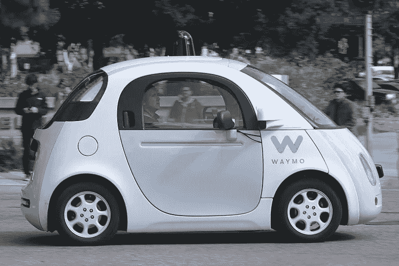
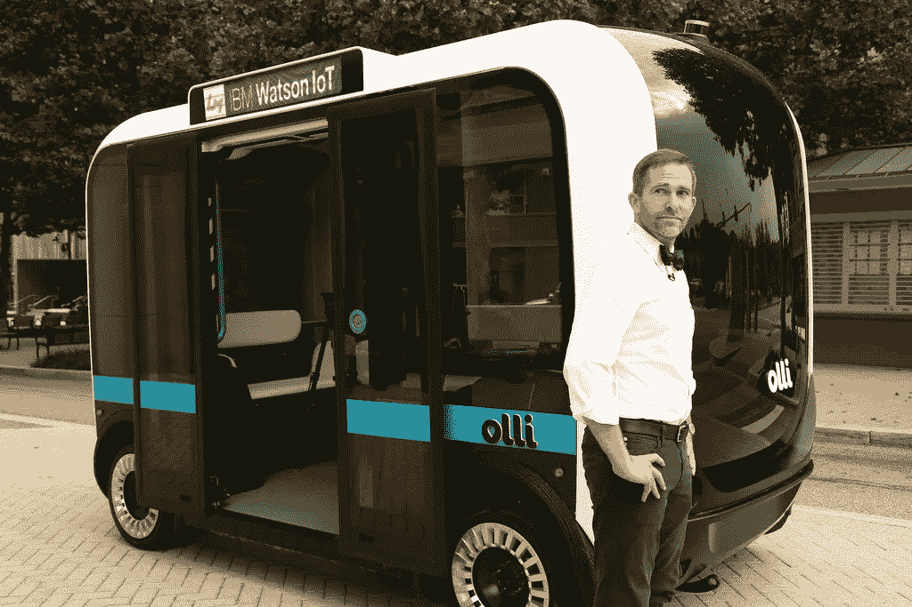

# 为什么我对电动汽车感到兴奋

> 原文：<https://medium.com/hackernoon/why-im-excited-about-electric-cars-c987de5f1500>

## 当电动汽车不再试图取代传统的“内燃机”汽车时，它们将提供更好的价值。

*编辑(2018 年 7 月):最初，我没有提到内燃机的排放物除了二氧化碳和水之外，还含有对健康有害或对环境有害的化学物质。我不是这些问题的专家，我只是就我所理解的不同车辆推进技术的利弊给出我最好的概述。***汽车排放物可以包括一氧化碳、氮氧化物、微粒和碳氢化合物。不同的燃料可能比其他燃料燃烧得更干净或更脏。据我所知，更轻、更易挥发的燃料，如天然气，燃烧起来更清洁，而更重、更稠、粘度更低的燃料，如柴油，燃烧起来更脏。**

*电动汽车提供了令人难以置信的可能性，因为它们是一种独特而灵活的[技术](https://hackernoon.com/tagged/technology)用于将储存的能量转化为动力。*

*电动汽车不是一个新的想法，一些最早的实验汽车是电动的。但在过去二十年里，由于电池技术的进步，电动汽车变得更加可行。*

*虽然已经有一些成功的电动汽车，但我们还没有经历过一个真正颠覆性的产品来重新定义我们对“汽车”或一般交通工具的概念。不幸的是，这主要不是基于技术限制，而是自满的消费者习惯、无聊的商业策略和缺乏想象力的投资决策阻碍了我们。*

*改进的电池技术，加上智能手机规模的计算，已经在小型消费产品(如无人机或悬浮滑板)中掀起了波澜，但电动汽车仍然是一种利基产品，只能在价格范围的中高端获得。玩具和身份象征固然不错，但这并不是电子技术提供最大价值的地方。我们一直在浪费一个巨大的机会。公司正试图设计电动汽车作为传统汽车的一对一替代品，但这是一个糟糕的战略，因为每种技术都有独特的优势和弱点。传统汽车是围绕发动机或“内燃机”的独特优势和弱点而设计的，因此我们需要能够发挥电动技术独特优势的电动汽车。*

# *不要禁冰！*

*电动汽车不会使内燃机或“内燃机”过时。替换 ICE 对于设计和推广电动汽车来说是一个糟糕的策略。作为一项技术，ICE 仍然有很大的价值。*

*通过内燃，有机燃料——容易获得、容易分配且能量密度高——与空气(也容易获得)混合，点燃或压缩以产生受控爆炸。这意味着一半的化学反应物在需要的时候被简单地从环境空气中吸入，而废物可以被排回到环境空气中。主要的废物，二氧化碳和水，是完全安全和惰性的，除了二氧化碳作为温室气体的影响(冰排放物也可能含有不同量的其他危险或有毒化学物质)。*

*相比之下，电池技术使用精心设计的金属和其他化学物质层来储存势能。任何储存大量能量的技术都有潜在的危险，电池也不例外，尤其是当我们继续测试它们的极限时。电池往往更重，前期更贵，但由于涉及许多变量，很难一对一地比较它们。*

*一个电池在其寿命内可以充电多少次？电池充电需要多长时间？电池每储存一单位能量会增加多少重量？电池每单位储能增加多少成本？我们是否拥有支持电池供电电动汽车的基础设施？二级化学品是否会导致车辆排放，对公众健康或环境造成危害？*

*为了比较电池和传统燃料，我们必须假设这项技术是如何使用的。这正是为什么我们需要找到每一种的最佳用途，而不是试图将它们进行面对面的比较并选择一个赢家。*

# *减排不是可有可无的*

*我们肯定需要大幅减少汽车尾气排放。我走路，骑自行车，玩滑板，乘公共汽车到处逛。我每年只开车或坐车几次。我想看到更多的人这样生活。另一方面，对于社区、个人和我们的经济来说，内燃机车是一项不可或缺且成本有效的技术。但是，如果我们不减少碳排放，全球二氧化碳水平将继续上升，其代价将在未来几代人的时间里伤害人类和地球的其他部分。*

# *我理想中的电动汽车:一辆本地通勤车*

*我说“电动汽车不应该是传统冰车的 1 比 1 替代”是什么意思？我们需要看看传统车辆的基本能力。大多数消费者会自动拒绝不符合他们基本期望和标准的产品，即使它在其他方面提供了很多潜在价值。如果你想走在这条曲线的前面，你应该想办法从一辆微型电动汽车中获益，把它作为主要或次要的交通工具。你能从一辆行驶里程为 30-50 英里、最高时速为 35 英里的汽车中受益吗？*

# *冰的价值特征，“想要冰”和“最小”电。*

## *冰车*

*   ***里程:** 300+英里*
*   ***时速:** 75+英里*
*   ***燃料成本:**$ 2.50/加仑/ 20 英里= 0.125 美元/英里*
*   ***初始成本:** $10，000+(新)*
*   ***维修费用:**？？？*

## *“准冰”电动车*

*   ***航程:** 100 英里*
*   ***速度:** 75+英里/小时*
*   ***燃料成本:**$ 0.05/英里或更少*
*   ***初始成本:** $25，000+(新)*
*   ***维护成本:**非常低*

## *提议的最小电气*

*   *范围:30-50 英里*
*   ***速度:**35 英里/小时(25 英里/小时，在中级到高级斜坡上)*
*   ***燃料成本:**$ 0.03/英里或更少*
*   ***初始成本:**？？？？*
*   *维护成本:非常低*

# *电动汽车提供了惊人的设计可能性*

*作为一名程序员，我们被教导编写模块化代码。使事物模块化“使交换或替换零件变得容易”。在[未来](https://hackernoon.com/tagged/future)你有很多改变事物的选择。*

*模块化设计对于传统车辆来说很困难——不同的部件以非常特殊的方式连接在一起。燃料必须通过管道从油箱输送到发动机，废气必须排出。发动机复杂、大且重，这限制了它的放置位置并占据了空间。最后，转向和驱动车轮的机制增加了复杂性。*

*一辆典型的 ICE 汽车将沉重的发动机放在前面，以保持汽车平衡。尽管发动机在前面，但它为后轮提供动力，因为前轮是用来转向的。这意味着一个机械传动系统需要在车的中间运行，这就是为什么在你的座位之间有一个凸起。电动汽车可以摆脱这个“驼峰”，但那只是开始。*

*我们被训练期望汽车有一个特殊的形式，因为冰上的规则使标准设计比备选方案好得多。但是有了一辆小型电动车，你会有更多的选择。车辆可以是盒子、立方体、梯形、半圆柱体或其他形状。它可以有更多的开放的内部空间，即使在相对较小的线性尺寸。在这方面，这很像《神秘博士》 *Tardis* ,新来者总是会注意到它的内部出乎意料地大。*

*在电动汽车中，很容易在电机和电池之间布线，不管你决定把它们放在哪里。电池或电机可以相对容易地维修、更换，甚至升级，而不会影响其他部件。在一辆极小的电动车中，最高速度低，空气动力学就不那么重要了，这给了你更多的灵活性。因为更轻，所以一切都更有效率。*

*一个令人兴奋的可能性是将一个小房子和一辆电动汽车结合起来。他们是彼此的完美组合，因为他们都支持极简主义、简单性和模块化。这可能会改变我们对住房和旅行的想法。此外，自动驾驶电动汽车提供了额外的设计灵活性，因为不需要适应人类操作员，只需要乘客。你不需要在前面有一个驾驶座，甚至根本不需要面向前方的窗户。*

*可能性是无限的。*

**

*A handsome car stands next to its bowtied human counterpart.*