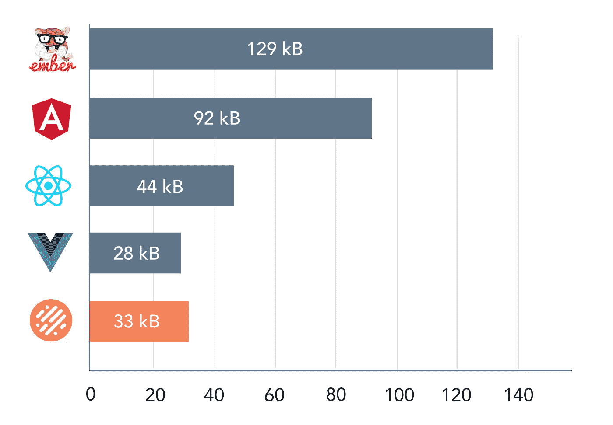
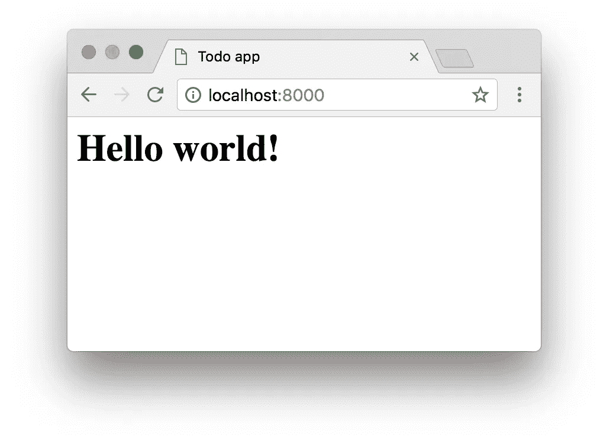
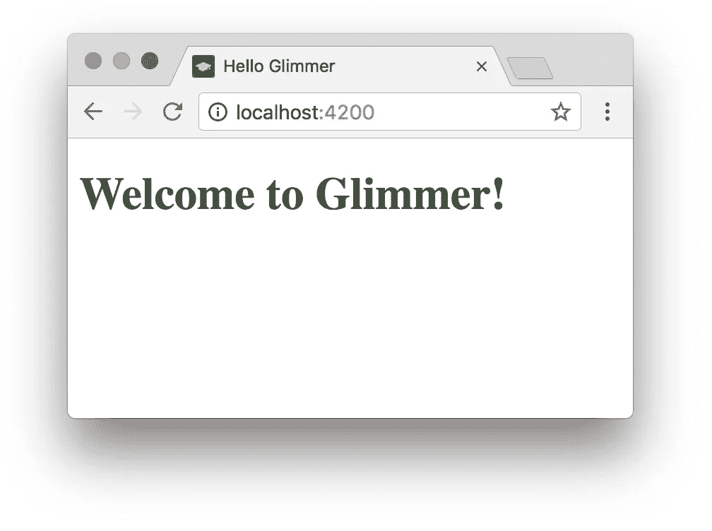
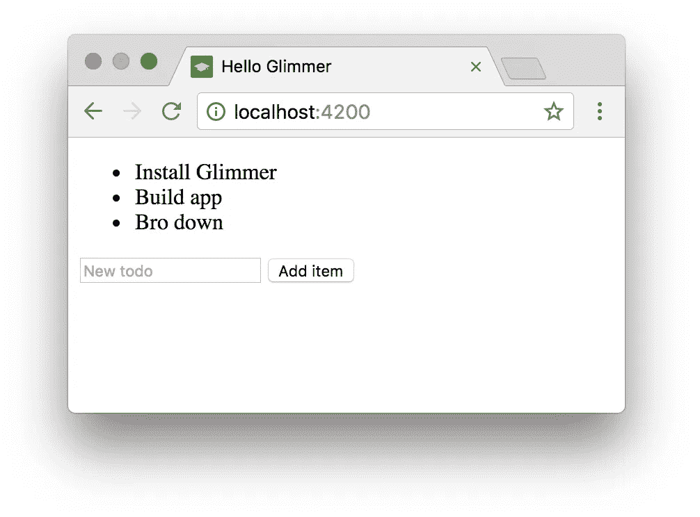
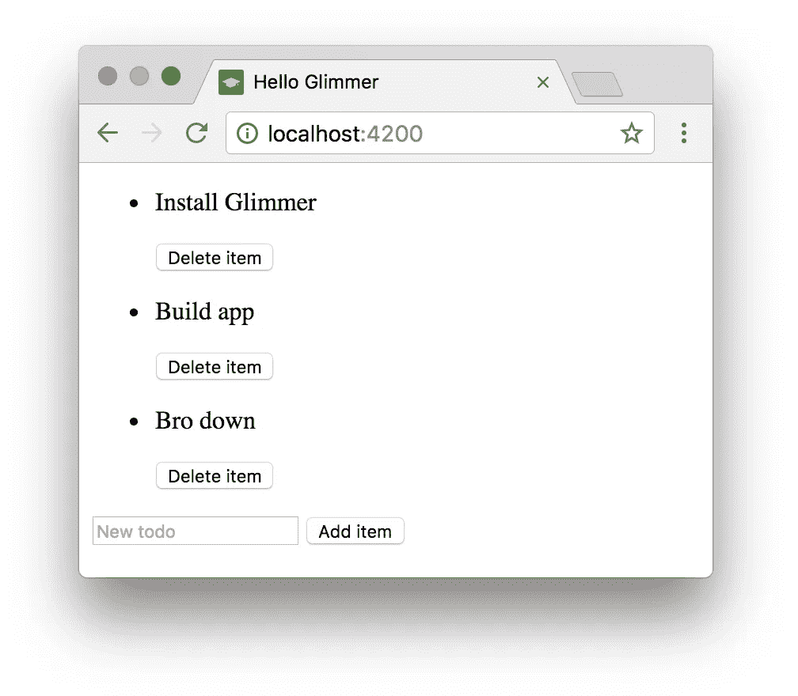
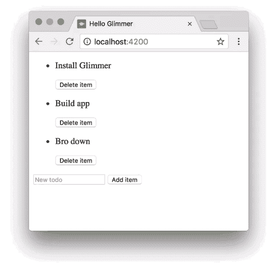
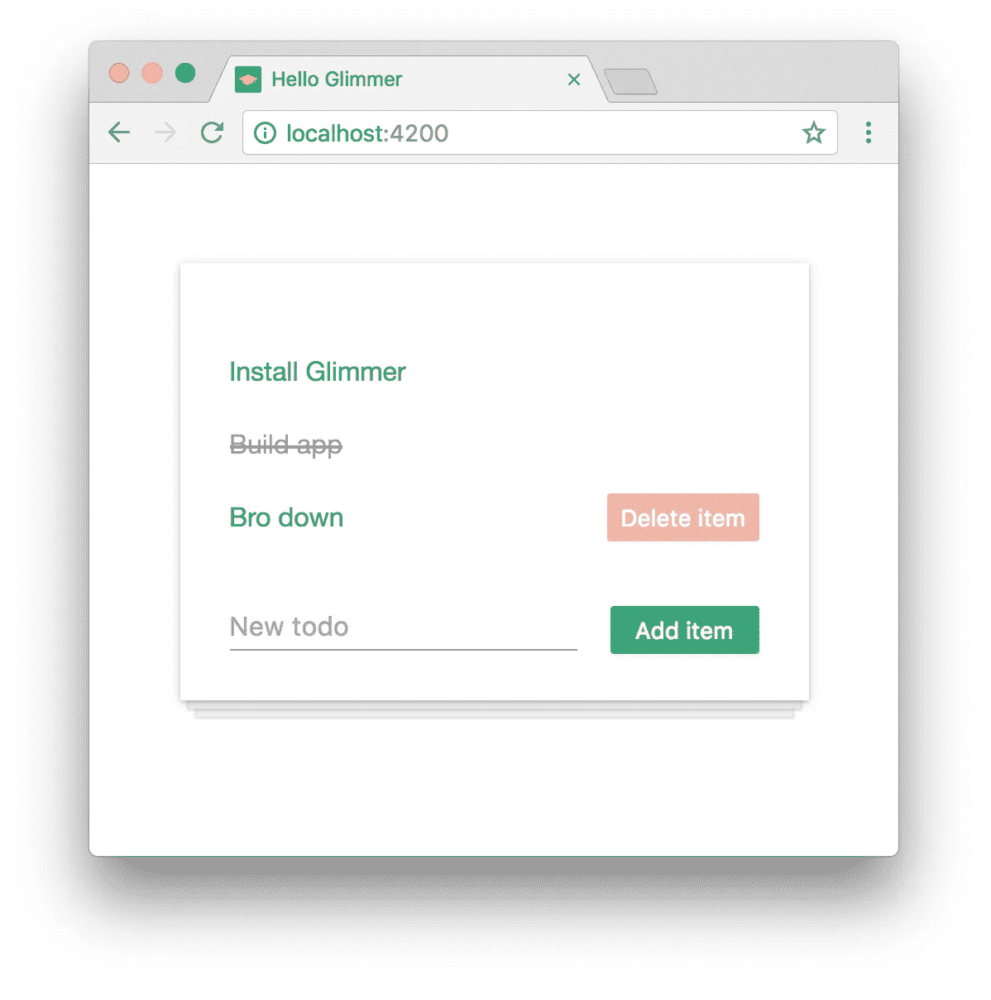
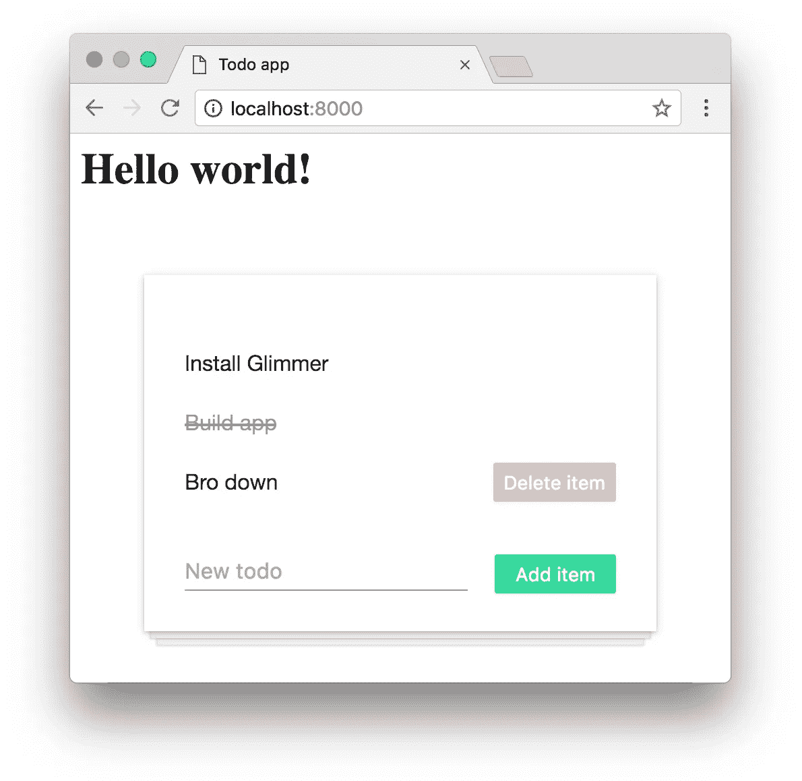

# 为什么我对 GlimmerJS 感到兴奋

> 原文：<https://medium.com/hackernoon/why-im-excited-about-glimmerjs-3631bd0c95c4>


我刚从波特兰的 *EmberConf* 回来，除了了解[社区](https://hackernoon.com/tagged/community)和[结交](https://hackernoon.com/tagged/making)一些令人敬畏的新朋友，GlimmerJS 的[公告](https://glimmerjs.com/)真正吸引了我的眼球。


你们中的一些人可能知道我是 Ember 的忠实粉丝已经很久了。像许多其他人一样，我最初被高学习曲线所阻碍，直到我最终学会接受框架的约定，并在这个过程中成为一名更好的开发人员。

尽管从那以后我基本上已经尝试了所有其他主要的 web 框架，但是当我必须构建一个雄心勃勃的 web 应用程序时，大多数时候我还是会选择 Ember。我为什么不呢？CLI 太棒了，Glimmer 引擎现在很快，而且由于[快速启动](https://ember-fastboot.com/)，获得服务器端渲染几乎只是一个`ember install`之遥。

尽管如此，近年来 Vue 和 React 等较轻的库抢尽了风头，这已经不是什么秘密。为什么？除了引入一些令人敬畏的新概念，比如虚拟 DOM 和单向数据流，React 还使得一点一点地移植现有的 Rails/Laravel/Django 前端变得更加容易。

这是至关重要的。公司通常不太热衷于从零开始重写软件，Ember 没有办法让开发人员在跳入水中之前先尝试一下。直到现在。



Bundle size of different libraries + frameworks (minified + gzipped). Based on my own independent research.

有了 [GlimmerJS](https://glimmerjs.com) ，你终于可以获得 Ember 的渲染引擎和 CLI 的好处，而不必购买整个生态系统。这个项目是新的，因此显然还有点粗糙，但根据我目前所看到的，我印象深刻。

> 说够了，给我看看代码！

让我们看看如何用一些 Glimmer 组件来增加任何传统 web 应用程序的趣味！我将从一个极其简单的网站开始:没有 Babel，没有 ES6，只有带有脚本标签和 CSS 链接的普通 HTML。

我们称我们的应用程序为`todo-app`,因为它将包含一个待办事项列表(是的，我知道，不是一个非常原始的概念…)如果你在跟随时遇到困难，你可以查看该项目的 [GitHub repo](https://github.com/t4t5/todoapp-glimmer) 。

```
$ mkdir todo-app && cd todo-app && touch index.html
```

下面是`index.html`的内幕:

```
<html> <head>
   <title>Todo app</title>
 </head>

 <body>
   <h1>Hello world!</h1>
 </body></html>
```



好了，让我们为这个页面创建一个交互式的`todo-list` web 组件！我们将首先在项目中创建一个`components`文件夹，所有未来的 Glimmer 组件都将存放在这里:

```
$ mkdir components && cd components
```

使用最新的 Ember CLI ( [与 Yarn](https://glimmerjs.com/) 一起全局安装)，我们现在只需运行这个命令:

```
$ ember new todo-list -b @glimmer/blueprint --web-component
```

Ember 将生成我们快速开始使用新组件所需的一切。安装完成后，我们将切换开发设置，只关注组件:

```
$ cd todo-list && ember server
```

访问 localhost:4200，您会看到这个页面:



这是我们新组件的默认标记，你可以在`todo-list/src/ui/components/todo-list/template.hbs`找到。让我们把它变成更像“待办事项”的东西！



我们走吧！我个人非常喜欢 Handlebars 语法，因为它清楚地表明了常规 HTML 的结束和 Glimmer 的接管。(与 Angular 的`<ul *ngFor="item in items">`或 Vue 的`<li v-for="item in items">`相比)。

接下来，我们希望列表中的每一项都呈现到它自己的`todo-item`组件中。在我们的`todo-list`文件夹中，我们在现有的项目中生成一个新的 Glimmer 组件:

```
$ ember g glimmer-component todo-item
```

我们现在可以更新我们的`todo-list/template.hbs`,让它为每个列表项使用这个新组件:

```
{{#each items key="[@index](http://twitter.com/index)" as |item|}}
  <todo-item
    [@item](http://twitter.com/item)={{item}}
  />
{{/each}}
```

注意当您调用组件时，Glimmer 如何使用`@`来区分参数(props)和常规 HTML 属性。这是我非常喜欢的另一个特性，不仅仅是因为它优雅的语法，还因为它避免了必须在库中手动添加属性的问题。



到目前为止，一切顺利。现在让我们添加一些功能！

我们将从向列表添加项目的能力开始。为此，我们首先需要导入`tracked` decorator，这样我们就可以指定允许更改哪些属性(Glimmer 区分可变和不可变属性以提高性能)。我们将在`items`和新定义的`newItemText`属性上使用这个装饰器:

```
// src/ui/components/todo-list/component.tsimport Component, { tracked } from "@glimmer/component";export default class TodoList extends Component { @tracked newItemText = ''; @tracked items = [
    {
      text: "Install Glimmer",
      isDone: false,
    },
    // ...
```

我们继续将一些事件绑定到我们的`input`和`button`标签。这样我们就可以在用户输入时更新`newItemText`，并在点击按钮时向列表中添加一个新项目。对于那些熟悉 Redux 的人来说，您会认识到我们使用不可变的 spread 语法的方式:



It works!

我们还想在用户点击“删除项目”时删除一个项目，并在用户点击文本时删除它。为了实现这一点，我们需要在`todo-item`上的一些事件处理程序，它们将触发动作直到`todo-list`(遵循 Ember 的“数据向下，动作向上”惯例)。

同样，我们这里用于更新数据的技术非常类似于 Redux 的做事方式。

您现在应该能够*添加项目*、*删除项目*和*切换“删除”*(尽管在切换它们时您不会看到任何 UI 变化)。

作为压轴戏，让我们给这一切添加一些 CSS 吧！您会注意到 Glimmer 项目附带了一个`app.scss`文件，因此您可以立即利用 SASS 预处理器，而无需任何额外的设置。只需将以下内容复制粘贴到您的`app.scss`中:



Now that’s much prettier!

就是这样！我们的任务完成了！现在唯一要做的就是将它导入我们的静态网站，这样我们就可以在 Ember 环境之外使用它。

这也非常容易，因为 Ember CLI 已经为我们编译了应用程序。在`todo-list`组件的`dist`文件夹中，你会发现一个`app.js`和一个`app.css`文件——它们是你渲染组件所需要的！

回到静态网站，添加对这些文件的引用(一个脚本标签和一个链接标签)。然后只需在您现有的“Hello world”标题后调用带有`<todo-list />`的组件:



Boom!

既然是*甜*！值得注意的是，我们的 Glimmer 组件目前是以“开发”模式构建的。通过使用`ember build ---environment=production`，我将`app.js`压缩到 34.18 KB，这实际上比 React + React DOM 本身要小。相当令人印象深刻！

希望这已经让你尝到了在你的网站上添加交互式 Glimmer 组件是多么容易。我当然很期待看到这个图书馆如何发展，以及它在未来如何与 Ember 生态系统的其他部分整合。

如果你喜欢这个教程，你可能也会喜欢我在陆渡开设的关于 [*余烬*](https://www.ludu.co/course/ember) *和* [*长生不老药*](https://www.ludu.co/course/discover-elixir-phoenix) *的在线课程。* [*去查查*](https://www.ludu.co/browse) *！*

[](http://bit.ly/HackernoonFB)[](https://goo.gl/k7XYbx)[](https://goo.gl/4ofytp)

> [黑客中午](http://bit.ly/Hackernoon)是黑客如何开始他们的下午。我们是 [@AMI](http://bit.ly/atAMIatAMI) 家庭的一员。我们现在[接受投稿](http://bit.ly/hackernoonsubmission)，并乐意[讨论广告&赞助](mailto:partners@amipublications.com)机会。
> 
> 如果你喜欢这个故事，我们推荐你阅读我们的[最新科技故事](http://bit.ly/hackernoonlatestt)和[趋势科技故事](https://hackernoon.com/trending)。直到下一次，不要把世界的现实想当然！

