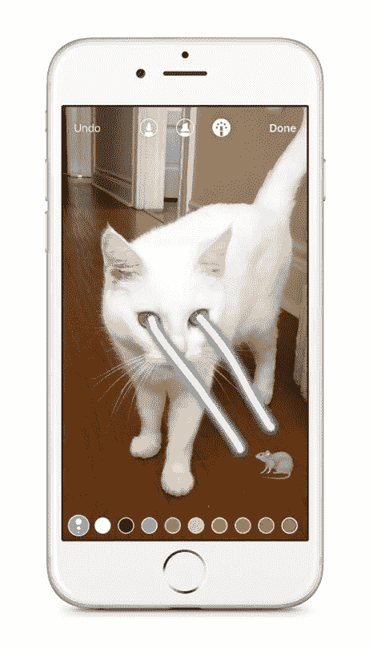
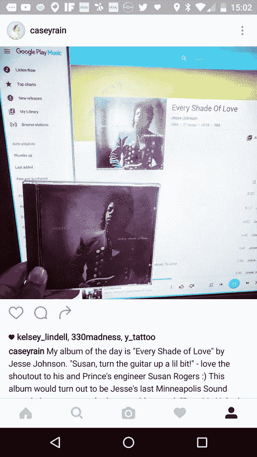

# 为什么我要离开 Snapchat 去 Instagram Stories。

> 原文：<https://medium.com/hackernoon/why-im-leaving-snapchat-for-instagram-stories-abf419963d08>

你知道吗，当你做了一个新东西，它变得非常受欢迎，没有人真正与你竞争，所以你忽略了你有很多问题的事实，因为没有动力花时间去解决它们？毕竟，人们不会停止使用你的应用。

那是 Snapchat。除了现在， [Instagram Stories 在这里](http://thenextweb.com/opinion/2016/08/03/everyone-says-instagram-stories-copied-snapchat-but-its-got-a-killer-feature/#gref)，它完全吃掉了他们的午餐。这和 Snapchat Stories 的概念毫无疑问是一样的，除了它实际上是有效的。过滤器、文本、图片、视频、图画——全都在那里，而且全都完美地工作。

我想我在 2012 年 Snapchat 首次在 Android 上推出时使用的是 Galaxy S2。从那以后我换了 Nexus 4，Nexus 5，Nexus 6，现在又换了 Nexus 6P。所有高端手机都采用了当时最新的处理器。Snapchat 对 T2 来说一直是一种可怕的体验。在每台设备上，它有时会滞后，有时会崩溃，并且通常会使用大量内存，导致手机速度变慢。

在 Nexus 4 上，甚至出现了让手机重启的 bug。Snapchat 的回应？“是谷歌的错”。也许是，也许不是。但是其他应用程序——甚至是由一个人编写的应用程序——将能够快速开发出一种变通方法。Snapchat 有着大多数公司永远不会看到的巨额资金，显然无法做到这一点。

以为只是安卓的问题？没有。我在一部 iPhone 5S 和我的 iPad Mini 3 上用了一段时间 Snapchat。可以说这是一个更稳定的*小*，但仍然容易造成滞后和崩溃。你在 Android 论坛、Reddit 和社交网络上听到的一个常见短语是*“Snapchat 的 CEO 讨厌 Android！”*。这很可能不是真的，但潜台词是真的——所有 Android 用户都知道这款应用的体验很差。这相当于全球智能手机市场 80%的份额。**在一些国家，比如西班牙，安卓系统的市场份额为 93%,而 iOS 系统仅为 7%。**如果社区普遍认为你的应用表现不佳，这样的统计数据肯定会让你停下来吗？

时间和金钱没有花在改善应用程序的性能上，这完全违背了逻辑——不仅仅是在 Android 上，而是在两个平台上。应用程序可能会有错误，这绝对是意料之中的事，但通常它们会随着时间的推移而改善。当你的应用程序在 4 年后还这么不稳定，那就有问题了。如果你不是镇上唯一的游戏，人们早就离开了。添加一百种不同的交互式过滤器很有趣，但它不应该优先于应用程序的稳定性和性能。

我在 Snapchat 上大概有 60、70 个朋友。如果你包括那些关注我但不是我朋友的人，可能是 100 人。相比之下，我的 Instagram 上有 3000 名粉丝。坦白说，这没什么好争的。

**所以——为了我短暂的、24 小时后就消失的社交媒体需求，我会在 Instagram Stories 上全押。**在这里，我不必担心这个应用程序是否会挂在我价值 500 英镑的智能手机上。也许你会加入我— @CaseyRain 是把手。如果你不喜欢普林斯、迈克尔·杰克逊、科技和放克的东西，就不要跟着我；)

和平…..凯西

> [黑客中午](http://bit.ly/Hackernoon)是黑客如何开始他们的下午。我们是 [@AMI](http://bit.ly/atAMIatAMI) 家庭的一员。我们现在[接受投稿](http://bit.ly/hackernoonsubmission)并乐意[讨论广告&赞助](mailto:partners@amipublications.com)机会。
> 
> 如果你喜欢这个故事，我们推荐你阅读我们的[最新科技故事](http://bit.ly/hackernoonlatestt)和[趋势科技故事](https://hackernoon.com/trending)。直到下一次，不要把世界的现实想当然！

