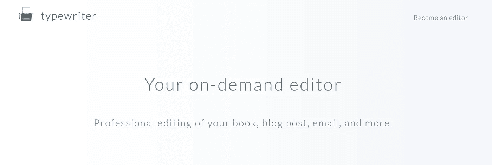

# 为什么我要试着改变世界，一次一句糟糕的话

> 原文：<https://medium.com/hackernoon/why-im-trying-to-fix-the-world-one-bad-sentence-at-a-time-4736b103ac75>

Little, Yellow, Different — Typewriter.plus

这件事困扰了我很多年:我会看到一份推介材料滚进我的邮箱，主题是“我们未来世界上最好的产品！”或者邮件的其余部分写得很懒散，或者登陆页面看起来像是被谷歌翻译了几次，从希腊语翻译成英语，然后翻译成法语，再翻译回英语。这非常令人沮丧。

我不是在这里宣称自己在词汇上比任何人都优越，但我知道一家年轻的初创公司——见鬼，任何人——都需要两样东西:好产品和好信息。我谈过的许多公司都有很棒的产品。然后他们用一个可怕的信息来推销它。

他们失败了。

人们需要编辑。我是一名编辑。为什么不做一个编辑东西的服务呢？

我做到了。

我创造了一个叫做[打字机](http://typewriter.plus)的东西。非常简单:你上传一个文档，得到一个价格，然后结账。然后，我把它送给我的一个编辑团队进行清洗和润色，我们试图以标语建议、替代方案和使语言流行的东西的形式提供额外的帮助。这不仅仅是为了拷贝编辑或细微的修正。在未来，我预计这将变得更像一个具有简化、易于理解的定价模式的机构。我们想让你所有的作品都令人惊叹。

我为什么要这么做？嗯，我现在算是自由人了，我在尝试一些新的东西。我总是受到[彼得·尚克曼](http://shankman.com/about/)的[助手](http://helpareporter.com)项目的启发。它开始只是一个玩笑，现在它是媒体的一个主要动力。如果你需要一个来源，这绝对是世界上最好的东西。打字机应该是那样的。

我想做一些无缝、简单、快速和强大的东西。有很多其他的编辑选择，包括 Fiverr，但是花 5 美元在你的文章上花 5 分钟的人不会为你赢得客户。一个能帮助你更好、更清晰地交流的人会为你赢得一百个客户。

我敢打赌:你同意获得好的、干净的副本是要花钱的，你的信息是你的世界中最重要的东西。我是来帮忙的。让我们来解决这个问题。

> [打字机加](http://typewriter.plus)。

> [黑客中午](http://bit.ly/Hackernoon)是黑客如何开始他们的下午。我们是 [@AMI](http://bit.ly/atAMIatAMI) 家庭的一员。我们现在[接受投稿](http://bit.ly/hackernoonsubmission)，并乐意[讨论广告&赞助](mailto:partners@amipublications.com)机会。
> 
> 如果你喜欢这个故事，我们推荐你阅读我们的[最新科技故事](http://bit.ly/hackernoonlatestt)和[趋势科技故事](https://hackernoon.com/trending)。直到下一次，不要把世界的现实想当然！

