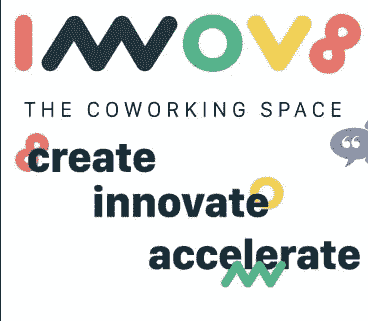

# 为什么 Innov8 的 Logo 有起伏？幕后…

> 原文：<https://medium.com/hackernoon/why-innov8s-logo-has-ups-and-downs-behind-the-scenes-5c17b5564b5f>

r[Made by Rahul Rande](https://www.facebook.com/pandeindia)

> 世界著名的设计师和艺术家卡尔·拉格费尔德说:“标志和品牌是如此重要。在世界上的很大一部分地区，人们看不懂法语或英语，但却非常擅长记忆符号”。

曾几何时，区分你的品牌和其他品牌不是你的工作，而是人们的工作。口碑和一些优质产品，就是这样！

但今天，更多的是人们如何通过你鲜明的身份与你联系；与竞争对手的产品相比，人们会如何伸手去拿百货商店货架上的产品。

***这就是*** [***拉胡尔【潘德】***](https://www.facebook.com/pandeindia) ***在创作*** [***Innov8 的 logo 时重点关注的。***](https://innov8.work/) ***确实有新意！***

标志对你的品牌或公司的营销成功至关重要。如果你的身份是独一无二的，令人难忘的，那么你的顾客就更容易记住你的身份。通过你的标志，你为你的品牌创造了个性，这将吸引人们并与他们建立个人关系。

这里我总结了一个用来制作 [innov8 logo 的设计流程:](https://innov8.work/)

## 1.头脑风暴

从你想到公司或品牌时想到的关键词开始。随意制作你的思维导图。

> 例如，为了给 innov8 创造标志，[拉胡尔·潘德](https://www.facebook.com/pandeindia)想出了这些词——加速、社区、资助、创业、起伏(成功&失败)、孵化等等。然后，他开始围绕这些单词画草图，并试图尽可能抽象地用视觉来表现它们。

# 2.研究

*做好用户调研和市场调研。*

不妨想想:**产品的性质**

# 目标受众—

对于 innov8 来说，观众主要由乐观的年轻人组成，他们会认同这个很酷的标志。

# 调色板—

## 规则:根据研究，观众最能接受的颜色是蓝色。大多数品牌在他们的商标上只使用两种颜色！

颜色背后有一种心理，世界不同地区不同。

## 红色意味着大胆和充满活力。

## 黑色和白色意味着奢华、权威和优雅。

## 黄色与幸福、温暖、谨慎有关。

# 印刷术—

## 规则:要么用你自己的字体使它与众不同，要么尝试基本的衬线和无衬线字体。

在这里和那里添加一点粗体和斜体，检查哪个最适合。尽量避免没有 MS 的漫画，因为那看起来真的很业余。

最多使用两种字体，否则标志会显得过于装饰性。

# 规模和可扩展性—

根据你的标志服务的公司，你必须决定尺寸和可伸缩性。

> 例如:社交媒体和在线营销应用需要小尺寸的可见标志。但是要尽量保持你的标志足够基本，这样当它变得非常非常小的时候也能被认出来。

# 效果—

特效看起来很酷，但是我们的目标是吸引观众，而不是分散观众的注意力。太多的珠光宝气会破坏氛围。

# 永恒的—

找到能表明你立场的东西。以此为基础进行设计。你的 logo 要能征服时间的考验，这样 30 年后你还是觉得没必要改。它不应该与任何其他公司相差甚远，否则客户可能不会信任你。此外，即使你确实需要对原来的标志做一些改变，也应该尽量少，这样人们仍然可以通过它认出你。

> 例如:谷歌将他们的 logo 字体从 Serif 改为 San Serif，并取消了斜角效果，使其变平，因为他们想冒险进入小屏幕(移动)行业。

***注意:尽量避免陈词滥调，因为它们没有回忆价值。如果没人记得，那有身份又有什么意义呢？***

# 3.起草

此时，你将脑海中所有的泡泡聚集在一起，创造出一些设计。能素描就素描！向你周围的人征求真实的意见，并采纳他们的反馈。

> 不要让你的客户支配你，否则你最终会有一个他们喜欢的标志，但它可能不会工作。让他们参与提炼阶段，在这个阶段你有 2 到 3 个实体设计。

## 然后:迭代，迭代，迭代！

# 4.抛光剂

处理一些小的效果，比如阴影，层次等等。令人难以置信的是，几毫米的变化会给标志带来和谐。

# 5.测试

这是你在公共场合推出 logo 前最重要的一步。视觉感知和第三方与徽标的关联有助于让我们注意到急需的更改。

*因素可以是——年龄、性别、肤色、语言、科技意识、教育等。*

# 6.保护

最后一步是获得商标注册的标志，符号或在标志中使用的词。

> 拉胡尔说，不要忘记标志制作的黄金法则！
> 
> 不完全必要的东西必须去掉。
> 
> 不要结合其他 logo 做自己的 logo；这肯定不是原创的。
> 
> 避免复杂的细节。
> 
> 你的标志应该是黑白的，看起来不错，容易辨认。
> 
> 该标志应易于描述。
> 
> 最重要的是，不要追求在线标志制作软件。这就像从你所有的积蓄中购买一瓶非常昂贵的酒，然后用塑料杯喝下去。
> 
> 如果一个企业家已经在结构、管理、营销和开发上投入了大量的资金，他应该在设计语言上花点时间来脱颖而出。

希望这个博客能对你的标志有所帮助。

我们即将到来的活动

*   [**领英营销**](https://goo.gl/SjLt6j)

**我们感谢拉胡尔·潘德先生的时间，并树立了标志创新的伟大榜样！**

Rahul Pande

[**拉胡尔·潘德**](https://www.facebook.com/pandeindia) **是一名自学成才的平面设计师，在包括 Adobe India 在内的许多公司担任设计顾问。**

**作者:** [**释迦牟尼**](https://www.linkedin.com/in/sakshi-kaul-a19358b3?authType=NAME_SEARCH&authToken=e8IX&locale=en_US&trk=tyah&trkInfo=clickedVertical%3Amynetwork%2CclickedEntityId%3A403973301%2CauthType%3ANAME_SEARCH%2Cidx%3A1-1-1%2CtarId%3A1485013957550%2Ctas%3Asakshi%20kaul)**20 岁作家，酷爱山川、美酒和古典名著，是**博客作者