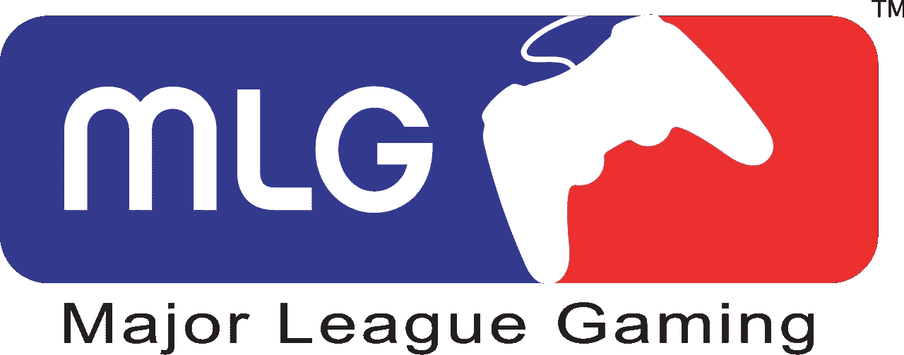
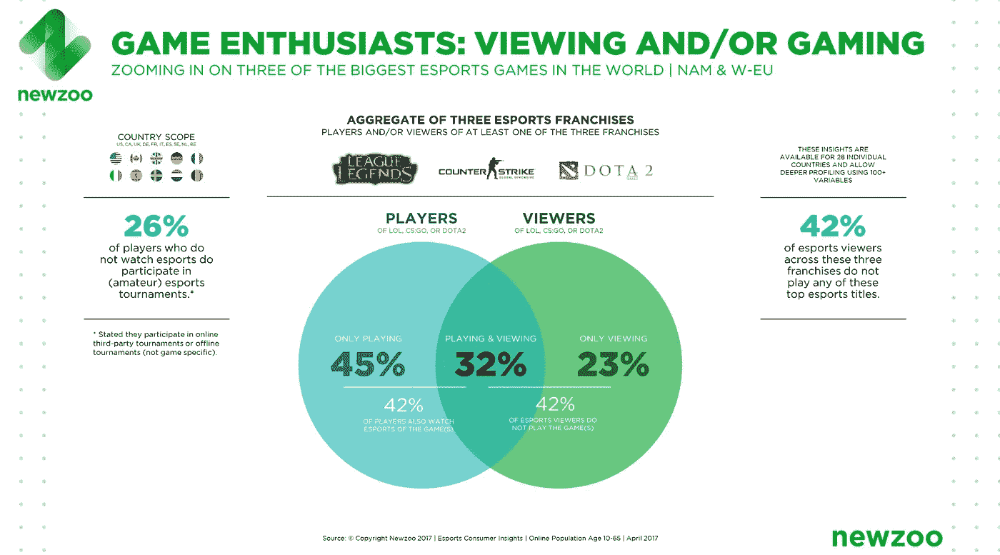

# 为什么要投资电竞？关于电子竞技的常见问题:已回答

> 原文：<https://medium.com/hackernoon/why-invest-in-esports-deab33a4835b>

正如之前在[风险资本投资论文的诞生](https://hackernoon.com/the-birth-of-a-venture-capital-investment-thesis-afd2903ae12)中所讨论的，我对投资种子阶段的电子竞技[初创公司](https://hackernoon.com/tagged/startups)充满了热情。

当我告诉别人(家人、朋友、其他投资者等)时。)，我通常会得到一组关于电子竞技的问题。这些问题通常伴随着一种表情，这种表情传达了我所说的“书呆子羞耻”你知道那种表情，当人们因为你不够酷而为你感到难过的时候，哦，等等，也许你没有。

Esports is filling arenas worldwide, a truly global phenomenon

电子游戏不仅仅是为父母地下室里的书呆子准备的。这些比赛经常在竞技场举行，比如这里显示的，有 50，000 多名粉丝，就像你可能已经更熟悉的专业体育赛事一样。

虽然有许多投资者已经并将投资于这个领域，*我们是为数不多的积极向首轮融资前的电子竞技初创公司投资的公司之一*。这篇文章的底部是关于谁在投资这个领域的信息，以及市场上的优秀教育资源。

以下是新进入这个领域的人不断问我的问题:

# ***“什么是电竞？”***

**电子竞技—** [一种面向观众的多人视频游戏，通常由职业玩家进行竞争](https://www.google.com/search?q=define+esports&rlz=1C1CHZL_enUS687US687&oq=define+esports&aqs=chrome..69i57.2505j0j7&sourceid=chrome&ie=UTF-8)。

# ***“你是说有‘职业’电子游戏玩家？”***

是的，我就是这个意思。我很惊讶人们不知道这一点(考虑到收视率市场的规模)，就像人们对我给出的答案感到惊讶一样。这些玩家通过赞助、流媒体(订阅他们的流媒体)以及参加和赢得高水平锦标赛来赚钱。

Yes, a professional esports league is already thriving

已经有一个专业的组织，[大联盟游戏](http://www.majorleaguegaming.com/)，除了游戏制作人举办的冠军赛之外，还举办专业比赛( [Riot Games](https://www.riotgames.com/) 、[暴雪娱乐](http://us.blizzard.com/en-us/)等)。)

# ***“人家付钱，去网上看别人打电子游戏？”***

是的，事实上，根据 NewZoo 的一份行业报告(我将在本笔记中多次引用)，流媒体的市场是巨大的。

有趣的事实:2016 年观看[英雄联盟](http://na.leagueoflegends.com/)世界总决赛的人比当年观看 NBA 总决赛第七场的人还多。[4300 万观众观看了 LoL 总决赛](http://www.tsn.ca/lol-worlds-final-reaches-43-million-viewers-1.625743)，而[根据尼尔森](https://www.nytimes.com/2016/06/21/business/media/game-7-of-nba-finals-draws-close-to-31-million-viewers.html)的数据，3100 万观众收看了 2016 年 NBA 总决赛第七场(所有七场比赛的平均观众人数接近 2000 万)。

This is the main page of Twitch on a random Monday night around 6 PM PST

如果你在任何时候登录 [Twitch](https://www.twitch.tv/) ( [亚马逊以近 10 亿美元收购的流媒体网站](http://www.businessinsider.com/amazons-970-million-purchase-of-twitch-makes-so-much-sense-now-its-all-about-the-cloud-2016-3)，游戏玩家可以在那里流媒体播放他们的视频游戏(字面意思是在周二上午 11 点尝试)，将会有数百万人在线观看其他人玩游戏。在周五晚上的午夜登录，你会看到我在这里得到了什么。

# ***“非游戏玩家真的会在线看视频游戏流吗？”***

[42%观看流媒体视频游戏的人，他们自己并没有玩游戏](https://newzoo.com/insights/articles/esports-franchises-70-watch-only-one-game-and-42-dont-play/)——所以不仅仅是像我这样的书呆子想更好地玩游戏，这个领域正在变成一个合法的娱乐市场。以下是 NewZoo 关于这一主题的一些游戏具体数据，可以为您提供关于世界上三大游戏的更多背景信息(基于游戏和观看数据):

Source: NewZoo ([link to source here](https://newzoo.com/insights/articles/esports-franchises-70-watch-only-one-game-and-42-dont-play/))

# ***“光看别人在线玩游戏怎么会好玩？”***

只是试一试，**去看看几个高度关注的游戏玩家，** [**不敬博士**](https://www.twitch.tv/drdisrespectlive) **，或者** [**乔希 OG**](https://www.twitch.tv/joshog) **(这家伙是正统的好)，或者** [**忍者**](https://www.twitch.tv/ninja) **或者** [**Viss 来自组队 Solo 中期**](https://www.twitch.tv/tsm_viss) 。像“不尊重博士”这样的玩家在任何时候都有数万名观众，并有数千万次独特的观看。我称他为电竞界的电击运动员。你会喜欢看这家伙打几场比赛。

当你在 Twitch 上观看视频流时，你可以看到玩家的画中画图像，覆盖在他玩游戏时屏幕上的同一视图之上。玩家边玩边评论，评论通常是值得观看的。不尊重博士是滑稽的，去检查他一个半小时之间的一天上午 10 点太平洋时间和下午 6 点太平洋时间。当我在工作而不是在 ESPN 或美国消费者新闻与商业频道的时候，我经常把它放在背景音乐中。

# **“为什么要投资电竞？”**

***巨大的市场***—2016 年，视频游戏市场的规模刚刚超过 1000 亿美元(来源: [NewZoo 2017 年游戏市场报告](https://newzoo.com/insights/articles/newzoo-2017-report-insights-into-the-108-9-billion-global-games-market/))，而电子竞技尤其是该领域中一个庞大且不断增长的利基市场。2017 年，电子竞技的市场规模预计将达到 6.96 亿美元。(数据来源: [NewZoo 2017 电竞市场报告](https://newzoo.com/insights/trend-reports/global-esports-market-report-2017-light/))。

***无与伦比的增长***——去年电子竞技市场同比增长超过 43%。到 2020 年，该市场预计将超过每年 15 亿美元，而更广泛的游戏空间到 2020 年将超过 1280 亿美元(来源:上面列出的 NewZoo 报告)。这些都是保守的估计；这份报告预测到 2020 年电子竞技市场将达到 50 亿美元。无论如何，这都是一个高速增长的市场。

***极高的用户参与度***——每天花数小时玩和/或看视频游戏的人数惊人。[这里有一篇文章引用了一项调查结果，显示普通玩家每周花超过 6 个小时玩游戏](https://www.polygon.com/2016/4/29/11539102/gaming-stats-2016-esa-essential-facts)。这是一个令人印象深刻的平均值，表明有许多非常投入的用户，比许多其他市场(职业体育迷等)更多。).

***在货币化用户*** — [根据 Venture Beat](https://venturebeat.com/2016/11/18/how-the-growth-of-esports-compares-to-the-trends-in-traditional-sports/) ( [引用了 NewZoo](https://newzoo.com/insights/articles/global-esports-market-report-revenues-to-jump-to-463-million-in-2016-as-us-leads-the-way/) 的另一篇报道)中的这篇文章，“传统的体育联盟，如篮球，以每人 15 美元的价格将粉丝货币化。电子竞技现在的盈利是每人 2.83 美元。”这对我来说是个机会。

***全球观众*** —没有国界，没有边界，也没有球场限制。任何有互联网连接的人都可以在任何游戏中成为世界上最好的玩家，并与任何人联系和一起玩。由于市场的全球性，我在这篇博客中链接的这些报告低估了市场的潜力。

***所以，概括一下，为什么要投资这个领域:大规模、高增长的市场，用户参与度高，货币化尚未实现。告诉我在哪里邮寄我的钱包。***

# **想了解更多电竞知识？**

我收集了一些资源，这些资源有助于我理解什么是电子竞技，为什么人们会投资这个领域，为什么人们会喜欢看别人玩电子游戏:

1.  《卫报》做了一个视频，大约需要 11 分钟观看。它将解释一些球员是谁，这项运动是如何发展的，并让你了解这项运动的全球性:[https://www . the guardian . com/sport/video/2017/jun/16/e-sports-the-digital-revolution-has-arrival-video](https://www.theguardian.com/sport/video/2017/jun/16/e-sports-the-digital-revolution-has-arrived-video)
2.  NewZoo 电竞 2017 市场报告—去翻翻这个，你会被一些统计数据震惊:[http://resources . new zoo . com/2017-new zoo-global-Esports-Market-Report-light](http://resources.newzoo.com/2017-newzoo-global-esports-market-report-light)
3.  在我写完这篇博文的时候，我看到了这篇文章，非常有帮助，是关于“[为什么电子竞技游戏是热门的新事物](https://www.bloomberg.com/news/articles/2017-06-23/why-competitive-video-gaming-is-the-hot-new-thing-quicktake-q-a)
4.  密纳德·汉密尔顿(T4 BITKRAFT 的合伙人，第一家电子竞技风投基金)在 Tech Crunch 上发表了一篇关于洛杉矶电子竞技的精彩文章。这里有一些关于谁在投资电子竞技，以及谁是该领域的主要参与者(双关语)的精彩内容:[https://TechCrunch . com/2017/06/13/in-la-some-investors-wish-they-all-can-live-an-esports-world/](https://techcrunch.com/2017/06/13/in-la-some-investors-wish-they-all-could-live-in-an-esports-world/)
5.  BITKRAFT 博客也是一个很好的读物:[http://www.bitkraft.net/blog](http://www.bitkraft.net/blog)
6.  Digits to Dollars 是一个报道电子竞技领域的博客。他们关于[电子竞技经济学(here)](https://digitstodollars.com/2017/05/26/the-economics-of-esports/) 的博客文章很值得一读，并链接到他们其他几篇电子竞技文章。绝对值得一读。
7.  最近一直在看的飘带:[不敬博士](https://www.twitch.tv/drdisrespectlive)、[忍者](https://www.twitch.tv/ninja)、 [TSS_Viss](https://www.twitch.tv/tsm_viss) (这些会给你一种什么是画人的感觉)。
8.  在推特上关注谁: [FNATIC](https://twitter.com/FNATIC) ， [ESPN 电竞](https://twitter.com/ESPN_Esports)， [NEWZOO](https://twitter.com/NewzooHQ) 。
9.  Tech Crunch 关于流媒体对电子竞技的重要性的文章，解释了这种现象如何以及为什么会出现，以及电子竞技的下一步是什么:[https://TechCrunch . com/2017/02/17/the-importance-of-streaming-to-e-sports/](https://techcrunch.com/2017/02/17/the-importance-of-streaming-to-e-sports/)

Deep Space Ventures 是一家位于德克萨斯州达拉斯的风险投资基金。斯蒂芬·海斯是创始人兼管理合伙人。在这里可以联系到 DSVC。

[点击这里在 Twitter 上关注斯蒂芬](https://twitter.com/hazesyah)

> [黑客中午](http://bit.ly/Hackernoon)是黑客如何开始他们的下午。我们是 [@AMI](http://bit.ly/atAMIatAMI) 家庭的一员。我们现在[接受投稿](http://bit.ly/hackernoonsubmission)并乐意[讨论广告&赞助](mailto:partners@amipublications.com)机会。
> 
> 如果你喜欢这个故事，我们推荐你阅读我们的[最新科技故事](http://bit.ly/hackernoonlatestt)和[趋势科技故事](https://hackernoon.com/trending)。直到下一次，不要把世界的现实想当然！

