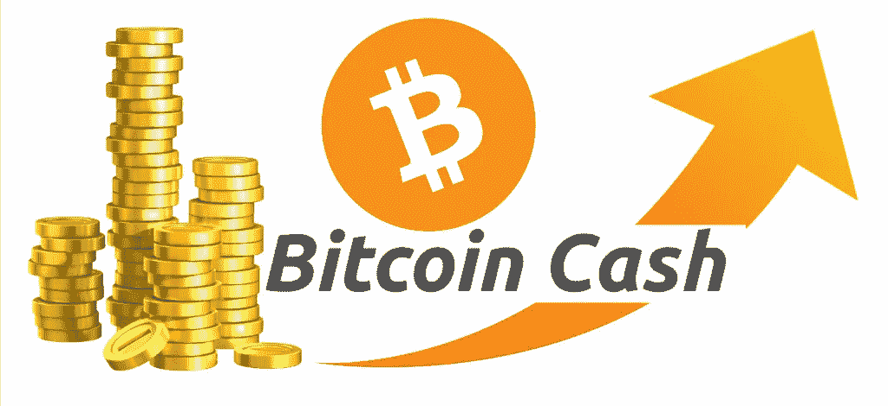
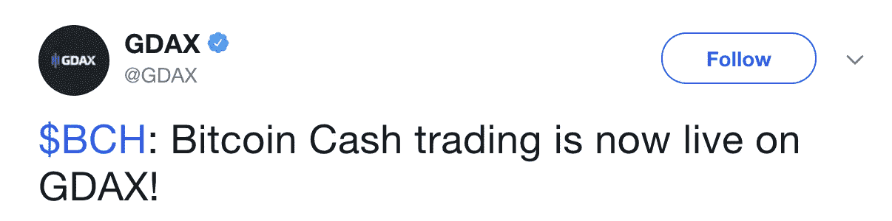
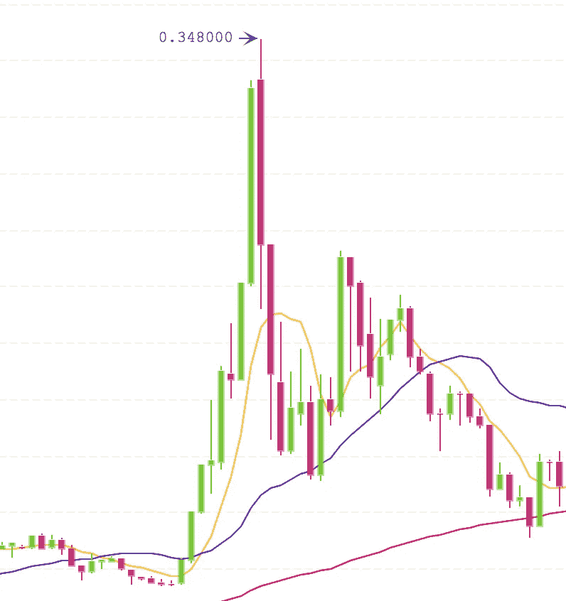
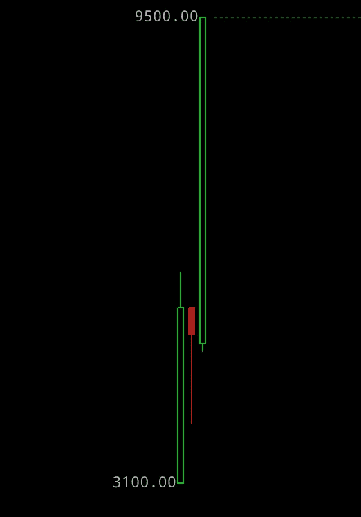
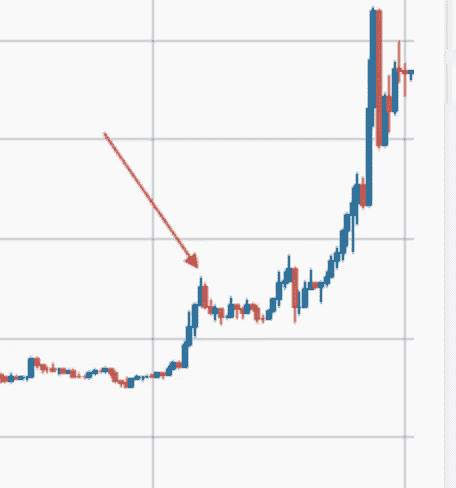

# 比特币现金为什么会暴涨？

> 原文：<https://medium.com/hackernoon/why-is-bitcoin-cash-spiking-11e158b734ee>

在不到 5 分钟的时间里上涨了 300%,内幕交易的指控，以及一个交易对在推出后几分钟就被下线。比特币现金正在坐过山车，而且还没有结束。

过去一个月，投资者一直在猜测比特币基地下一个交易的加密货币是什么。Dash？比特币现金？涟漪？北美最大的交易所采用的任何硬币都必然会立即出现价值飙升。

太平洋时间昨天下午 4 点，突然宣布比特币现金将成为比特币基地的下一个加密产品。这引发了一场席卷所有交易所的狂热活动。

在几分钟内，一些交易所的 BCH 股票价格翻了一倍到两倍。

Binance BCH/BTC graph over 5 minute intervals.

在 Binace 上，比特币现金飙升至近 6000 美元，然后暴跌回 3000 美元。

GDAX 的波动性甚至更大。BCH 美元开始交易时的价格为 3100 美元，几分钟后，交易价格接近 9500 美元。**几秒钟后，GDAX 将比特币现金下线。**

“由于大幅波动，我们暂停了 BCH-美元订单的交易，”GDAX 在 Twitter 上解释道。

关闭比特币现金交易可能暂时推迟了反弹。自 GDAX 将其比特币现金对下线以来，其他交易所的价格已经大幅下降。但狂热可能会持续到明天早上。

[GDAX 计划在太平洋时间 12 月 20 日上午 9 点重新启用比特币现金交易。](https://status.gdax.com/incidents/51pnkvm843hq)

From cryptocompare.com. Volume and price data rose

尽管宣布的消息出人意料，但至少有些人知道比特币基地将比特币现金加入其名单的决定。此前 24 小时，多个交易所的比特币现金交易量飙升。

仅在一天前，比特币现金的价格上涨了 20%。再加上多家交易所的股价飙升，导致了对内幕交易的指控。

比特币现金会继续攀升吗？明天早上将重新打开新用户群的闸门。价格可能会攀升，然后回到更现实的水平。

## 喜欢这篇文章吗？我们现在有电报信号组了！

我们发布**简单有效的交易信号**。所以你可以花更少的时间做技术分析，花更多的时间**得到结果。**
👉[https://t.me/coinandcrypto](http://telegram.coinandcrypto.com/medium)

