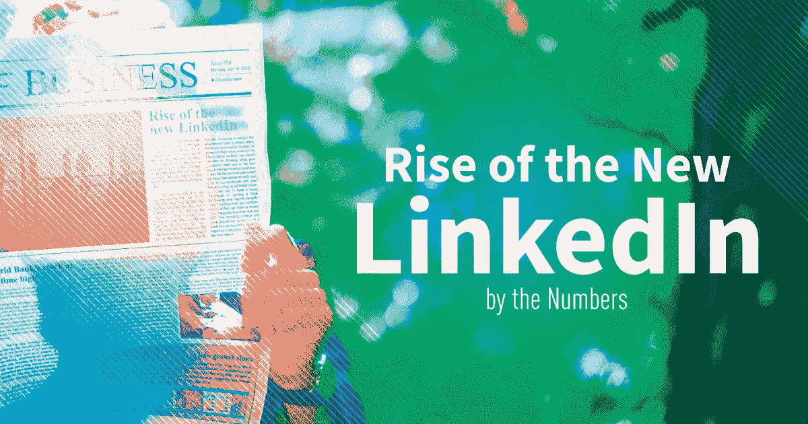
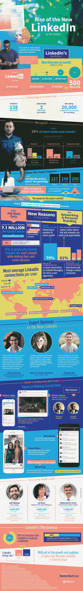

# 为什么大家都在说 LinkedIn？

> 原文：<https://medium.com/hackernoon/why-is-everyone-talking-about-linkedin-b6c1e84e359b>

因为这是目前最有效的网络。

曾几何时，你可能一年登陆一次 LinkedIn 来更新你的简历——如果你真的想保持领先的话，那就几个月一次。

但是有些事情已经改变了。

LinkedIn 上的人比以往任何时候都多，即使参与率相对较低，它仍然是进行专业对话的最佳场所。

这并非偶然，而是有意为之。

老 LinkedIn 死了。输入新的 LinkedIn。

被快速推出的产品所震撼:

*   桌面和移动应用程序上完全重新设计的用户界面
*   带滤镜的 LinkedIn 原生视频
*   活跃状态(就像外行人的 FB 信使)

由于所有这些创新，我们将会看到 3 个主要趋势:
1——更多的时间在网站上——一旦你开始发信息，你将会留下来消费/生产内容。
2——千禧一代搬进来——视频/信息友好——千禧一代正处于失业和就业不足的困境中，他们需要建立自己的个人品牌。LinkedIn 是这个星球上最好的网站之一，拥有 5 亿多用户和财富 500 强中的每一家公司。
3——个人故事——基于文字的帖子仍然是王道。

LinkedIn 似乎每天都在增长势头——如果你不在那里，你就错过了。你打算如何掌握[新领英](http://www.numbersleuth.org/trends/new-linkedin/)？

