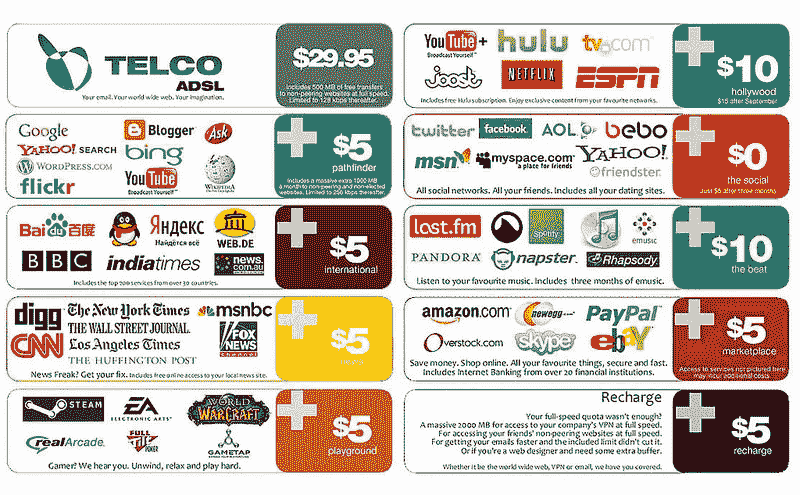

# 网络中立为什么重要？

> 原文：<https://medium.com/hackernoon/why-is-net-neutrality-important-880fcb56f693>

再过几天，12 月 14 日，联邦通信委员会(FCC)将投票决定改变美国互联网的监管方式。对像你我这样的普通用户如何在线获取信息的影响可能是巨大的，原因如下。

目前，有一项关于开放通信的政策，要求流量的处理应该是非歧视性的:宽带提供商不能碍事，他们不能审查或达成有利于某些类型内容的交易。举例来说，康卡斯特今天不能像对待任何其他新的视频流媒体初创公司一样对待网飞。

联邦通信委员会主席 Ajit Pai(曾在威瑞森担任副法律总顾问)提议投票取消这些规则，以支持更少监管的互联网。根据他们的主要论点，更少的监管意味着电信公司的投资额将停止下降。然而，[FCC 使用的相同数据](http://www.businessinsider.com/fccs-claim-that-broadband-investment-has-dropped-is-flawed-2017-11)显示，自 2013 年以来，投资在最坏的情况下持平(或实际上在最好的情况下增加)。

联邦通信委员会还认为，如果任何公司开始行为不端，消费者可以去别处做生意。尽管如此，超过 50%的美国人口只能接入一家互联网提供商，因此他们甚至不能用钱包投票。捍卫消费者权利的唯一途径是通过诉讼和集体诉讼。

在新提出的计划中，一切都是坏的吗？不，有一个要点对于发现未来的滥用行为至关重要:宽带提供商有义务对其流量做法保持透明；换句话说，如果康卡斯特与任何其他流媒体服务达成推广网飞的协议，或者如果他们开始屏蔽或限制某些网站，这必须是众所周知的事情(即使这只是意味着在合同末尾的细则中多了一行)。

令人惊讶的是，FCC 主席拒绝参加任何科技记者可以就新计划提问的采访。更不幸的是，网络中立规则已经成为一个党派问题:每次新政府当选，规则都开始改变。

播客“太尴尬而不敢问”的最新一集包括卡拉·斯威舍和劳伦·古德对联邦通信委员会民主党成员杰西卡·罗森沃塞尔的采访，我很幸运地让[在采访中提出了我在推特上的一个问题](https://twitter.com/irodrisa/status/937938355693559808):你如何防止网络中立规则随着每届新政府而改变？

这位专员强调了网络中立规则始于无党派的观点。她提到，FCC 第一次将这些规则写在纸上是在乔治·w·布什总统任期内。她继续说道:“*事实上，这十年来并不是一个特别的党派问题。[……]所以我们现在看到的攻击，对我来说很不幸，这是党派性的，不知何故我们现在通过一种类型的政府说是，另一种类型的政府说不是的棱镜来看待这个问题。我不认为这种来回对经济有好处，我认为我们可以在这些问题上使用一些稳定性，但这种稳定性应该包括对互联网开放的一些基本承诺。*

FCC 似乎决心取消当前的网络中立规则，我们不会知道它会变得多糟，直到为时已晚。

你喜欢这篇文章吗？ [**每月订阅**](https://geekonrecord.com/subscribe/) **一篇新帖。**

*原载于 2017 年 12 月 11 日*[*geekonrecord.com*](https://geekonrecord.com/2017/12/11/why-is-net-neutrality-important/)*。*