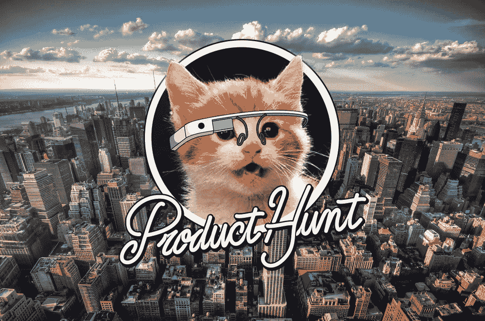
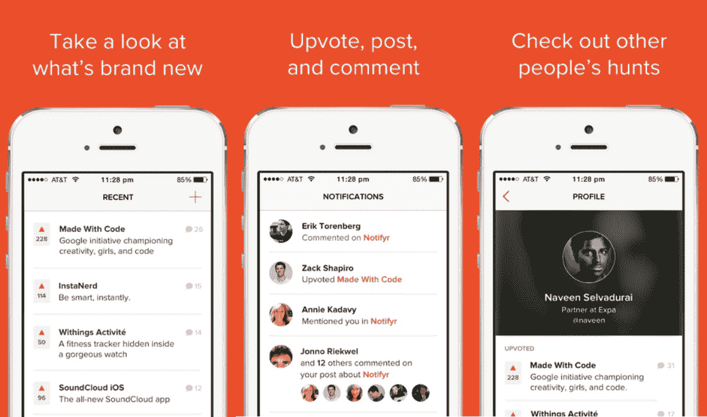
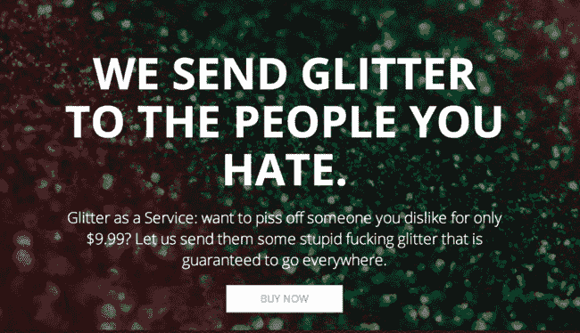

# 为什么产品搜索在初创公司发布会上如此受欢迎？

> 原文：<https://medium.com/hackernoon/why-is-product-hunt-so-popular-for-startup-launches-f29c913a945c>

[产品搜索](http://producthunt.com)已经成为“**产品爱好者分享和研究最新移动应用、网站、硬件项目和技术创新**的首选工具

该平台将同行推荐与类似论坛的形式相结合，并展示既有趣又与以技术为重点的社区相关的产品。虽然 Product Hunt 的网站看起来不怎么样，但它已经积累了大量活跃的追随者，包括关键的技术影响者、名人、记者，最近还有风险投资家。

[Ryan Hoover](http://ryanhoover.me/) ，Product Hunt 的创始人，在 2013 年积极地发展这个社区，并且被认为仅仅在高质量的帖子上建立了 Product Hunt 的基础。任何人都可以提交产品进行评论，但是只有一小部分 Product Hunt 的每月访问者被允许在讨论中发帖。Product Hunt 首先向媒体公司和技术影响者提供特殊访问权限，能够扮演看门人的角色，并将其内容保持在一定的热门标准。

[*Image*](http://images.wired.it/wp-content/uploads/2015/04/1427975784_Product-Hunt.jpg)

与 Reddit 类似，适度和社区选项“投票”帖子的结合，使访问者可以轻松决定某个特色产品或创业公司是否值得探索。

随着社交功能的增加，如关注其他用户的能力，媒体对直接消息产品创始人的访问，以及管理产品集合的能力，产品搜索可能会引领一场技术公关革命。由于该平台已成为科技公司创始人宣传其产品或服务的最终场所，记者们蜂拥而至，“有机发现”有趣的产品，并直接与初创公司创始人互动以撰写他们的故事，而不是筛选无休止的电子邮件推介。

要了解产品搜索的真正媒体力量，只需看看 2014 年简单消息应用程序 [Yo](http://www.justyo.co/) 有史以来最大的产品搜索发布活动。这款应用最初出现在 Product Hunt 上，并在几乎所有可以想象到的技术出版物中引发了大量的、有点有争议的报道。

[Image](https://static2.businessinsider.com/image/53b301afeab8ea5f27d61a1c-1190-625/yo-messaging-app-arrives-on-windows-phone.jpg)

这里也是[运送你的敌人闪光](https://shipyourenemiesglitter.com/)的起点。这家初创公司在产品搜索和社交媒体上发布后 24 小时内，就引起了媒体的狂热，创始人马修·卡彭特[以 8.5 万美元](https://www.theguardian.com/technology/2015/jan/22/ship-your-enemies-glitter-site-sells)的价格卖掉了网站。

[Image](https://images.mic.com/zevzgz3dw3jkj6m1ecwoq5jlajeafzgb7ggpurheemkdxrtqcxriiofjdk3o9fq8.jpg)

许多创业公司试图重现 Yo 和 Ship Your ants Glitter 的成功，并转向产品搜索作为这样做的发射台。而且在产品搜索上出现后受到媒体关注的产品越多，平台持续增长的可能性就越大。

现在，许多初创公司不再在 iOS 应用商店发布产品，也不再不厌其烦地向 TechCrunch 记者发送电子邮件，而是首先在 Product Hunt 上独家发布产品。有影响力的社区对话和反馈已被证明是一种成功的方式，可以让新产品起步，同时获得广泛的认可。

一个合作的电子邮件客户端，[前台应用](https://frontapp.com/home)，决定在三个不同的频道推出他们应用的新移动版本:[黑客新闻](https://news.ycombinator.com/news)、 [TechCrunch](http://techcrunch.com/) 和[产品搜索](http://producthunt.com)。然后，该团队在他们的博客上提供了对每个渠道结果的分析。

在产品搜索方面，该应用在发布当天获得了 150 多张赞成票，投资者也很感兴趣。该团队制作了这个幻灯片演示文稿，“ [*黑客新闻 vs TechCrunch vs 产品搜索:哪一个对启动你的初创公司最有效？*](http://www.slideshare.net/Frontapp/hn-vs-tc-vs-ph) “分享自己的成果。

许多其他创业公司也分享了他们的故事和推出产品搜索的建议。

# 这里有几个值得一读的:

## [**我是如何推出产品搜索史上第二大最受欢迎产品的**](/startup-grind/how-i-launched-the-2-most-upvoted-product-of-all-time-on-product-hunt-f3772fb20ad8#.qjcisfgho)

## [**我们是如何在一天之内完成产品发布并赚到 1000 美元的**](/the-maître-journey/how-we-nailed-our-product-hunt-launch-and-made-1-000-in-one-day-397fcce072d9#.vzj9hm88s)

## **这 6 个策略让我们在产品搜寻(和 9k+访问量)上排名第一**

** [## 产品搜索

### 成功的故事&如何在黑客中午。

hackernoon.com](https://hackernoon.com) 

得益于社交媒体和 Product Hunt 等平台，产品创造者或初创公司创始人与行业影响者和媒体直接沟通从未如此容易。创始产品搜寻团队的成员还推出了名为 [**产品搜寻电台**](http://www.producthunt.com/radio) 的每周播客系列，涵盖新兴产品和所有科技产品。该系列以技术和媒体行业的思想领袖为特色，并作为新公司扩大其声音的另一个令人耳目一新的创意渠道。

传统媒体传播的中断仍然是一个值得关注的重要领域。你认为还有哪些平台正在出现，并为初创公司创始人创造了与媒体联系和扩大品牌知名度的新方式？请在评论中分享你的想法。

> [黑客中午](http://bit.ly/Hackernoon)是黑客如何开始他们的下午。我们是 [@AMI](http://bit.ly/atAMIatAMI) 家庭的一员。我们现在[接受投稿](http://bit.ly/hackernoonsubmission)并乐意[讨论广告&赞助](mailto:partners@amipublications.com)机会。
> 
> 如果你喜欢这个故事，我们推荐你阅读我们的[最新科技故事](http://bit.ly/hackernoonlatestt)和[趋势科技故事](https://hackernoon.com/trending)。直到下一次，不要把世界的现实想当然！

**