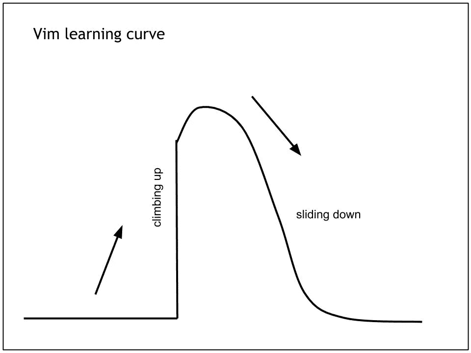

# 为什么崇高的文本不是一件令人不愉快的事情？

> 原文：<https://medium.com/hackernoon/why-is-sublime-text-not-something-to-be-frowned-upon-bb7b01fe6c2f>

已经有一些人，顾问，以及更多的人，启发了关于“真正的程序员”的事实，*他们使用 emacs 或者 vim* 。

*‘我用崇高的文字’*，经常被误解为*‘我是新手，不喜欢纯黑的窗口’。这个 7 岁的编辑不可能与 39 岁的 emacs 和 15 岁的 fork 以及另一个 39 岁的编辑 vi 竞争。然而，还有更多的事情要做。*

崇高的文本爱好者对 vim 和 emacs 说的第一句话是*“我为什么要打开一个我不知道如何退出的编辑器？”很公平。他们不仅仅是文本编辑器。他们有内置代码来编辑任何外部代码。那不是很漂亮吗？嗯，你必须遵循一些步骤来关闭它。(或者你可以随时强制关闭你的主机。不管他们有多强大，你都属于人类。)它们还拥有更强大的功能，让用户的生活变得更加轻松。*

但是在你想到你轻松的生活之前，他们会先让你讨厌你的生活。Pascal Precht 在他的一个博客中讨论了 vim 的学习曲线墙。这里有一张很能说明问题的图片。

emacs 用户的下一个论点是*“我们不喜欢使用 touchpad，我们希望所有的东西都在我们的编辑器中，比如邮件、新闻等等！”*

你太棒了，先生！但是让我也告诉你，你很少对崇高用户有错误的结论。我们也不喜欢触摸板！就我而言，我熬过了整整一学期的大学生活，我的触摸板一直不工作。但这并不意味着我转到了 emacs 或者 vim。subl 打开，pgup pgdn 和箭头键导航，`ctrl + s`保存，`ctrl + t`新标签，我的意思是我已经用键盘完成了一切，事实是 Chrome 也遵循这些命令(反之亦然)。想象一下，你在浏览一个网页，想知道为什么 j 和 k 没有帮助你。

我想说的是，为什么我们不鼓励新手使用编辑器，让他们的生活变得非常简单，这样他们就可以简单地学习如何编码，而不是学习如何编码。稍后，让他们决定他们是否真的不喜欢这个编辑，然后去做更有挑战性的工作，我相信有些人肯定会去做更有挑战性的工作。

但我肯定不会。我会等着有一天我会厌倦把我的手放在如此美丽的东西上。

> [黑客中午](http://bit.ly/Hackernoon)是黑客如何开始他们的下午。我们是 [@AMI](http://bit.ly/atAMIatAMI) 家庭的一员。我们现在[接受投稿](http://bit.ly/hackernoonsubmission)，并乐意[讨论广告&赞助](mailto:partners@amipublications.com)机会。
> 
> 如果你喜欢这个故事，我们推荐你阅读我们的[最新科技故事](http://bit.ly/hackernoonlatestt)和[趋势科技故事](https://hackernoon.com/trending)。直到下一次，不要把世界的现实想当然！

