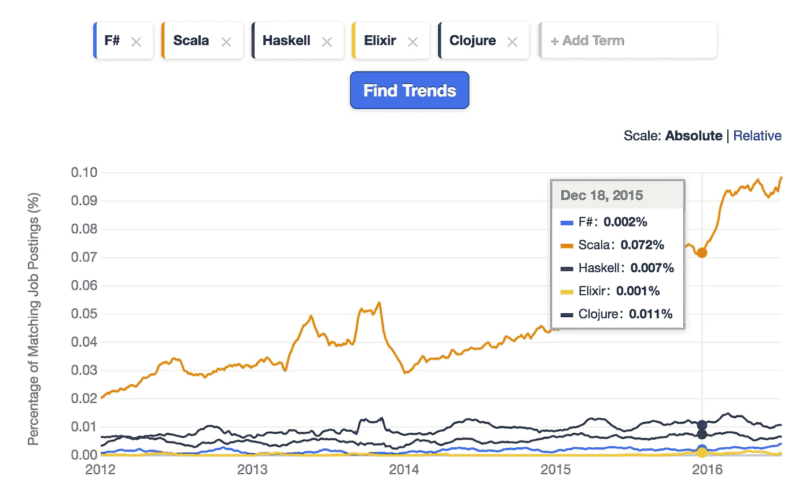

# 为什么 F#不是。网？

> 原文：<https://medium.com/hackernoon/why-isnt-f-the-king-of-net-2a9a1963e087>

F#是迄今为止市场上最好的语言之一，无论从哪个角度来看都是最好的。

它很实用。它拥有杀手级的工具——一些业内最好的工具。它是静态类型的。相当快。当它不够快时，它有一个简单的机制来调用快速的非托管代码。它可以访问中大量有用的库。 [NET](https://hackernoon.com/tagged/net) 生态系统……不胜枚举。

那么为什么没有更受欢迎呢？

郑重声明，它*不是*很受欢迎。我们来看看就业市场，好吗？F#与它的功能竞争对手相比如何？

From Indeed trends: [http://www.indeed.com/jobtrends/q-F%23-q-Scala-q-Haskell-q-Elixir-q-Clojure.html](http://www.indeed.com/jobtrends/q-F%23-q-Scala-q-Haskell-q-Elixir-q-Clojure.html)

F#是底部的小蓝线。只是一点点。

而针对 Java/C#？Fuggedaboudit。

这是为什么呢？

## 的问题是。网

我认为问题在于 F#是一种. NET 语言。“但是等等，”你说，“你没有列出。NET 作为 F#的一个/好处/？”是的，我做到了。但这也是问题所在。

## 对于大多数人来说，C#已经足够好了

微软用 F#创造了一种最好的语言，然后悄悄地把它束之高阁。他们继续全力支持 C#。C#是一门非常好的语言。比 Java 好多了。由于 Java 的糟糕，Scala 获得了适度的流行。另一方面，C#通常最终会吸收其他语言的最佳思想。这意味着，如果 F#今天做得更好，只要等一会儿，C#最终也会这样做。

F#更好。在我看来，*好多了。仅仅几个原因:自动匹配，优秀的模式匹配，更简洁的方式，更好的类型推断…*

但是 C#已经足够简单了。NET 开发人员不会费心去寻找更好的选择。

## F#不符合。网络文化

这里有一点背景。在担任前端工程教师和目前的(Rails)工作之前，我做了 15 年的. NET(主要是 C#)开发人员。我喜欢 Visual Studio。我喜欢 C#。老实说，我觉得微软在很大程度上是可以忍受的。我甚至在那里工作过一段时间。

也就是说，我讨厌。网络生态系统。在. NET 商店找一份工作，你有 99%的把握保证你只有一种技术选择——无论微软在兜售什么。为什么 eff 的 SharePoint 怪物还在吃小孩子？因为微软商店比我见过的任何其他开发者群体都更容易随大流。“微软说我们应该使用这个。因此，我们要用这个。”

有超快的 ORM 吗？谁在乎。微软说使用实体框架。

获得了一个用于实时分布式消息传递的高级平台？坚韧的豆子。微软说要使用他们出售的每份许可证仅售 5 万美元的不稳定的信息系统。

而 F#已经开源很久了。它从一开始就是反文化的。它总是避开微软的方式，支持看起来最好的方式。有时候，这是微软的方式。通常不是这样。如果一个微软店的文化是油，F#就是水。

## 函数式编程仍然不是主流

我认为在五年左右的时间内，功能优先的编程将成为规范。但是现在，Java/C#仍然是主宰。

F#是在函数式编程真正开始上升之前引入的。我认为这损害了它的机会。如果它在今年(2016 年)作为一种热门的新跨平台语言发布，我认为它会获得更多的兴趣。如果微软说，“这是我们新的、占主导地位的语言”，那就更是如此了。就像苹果对待 Swift 一样。

## 变革即将来临

微软的开放程度远远超出了我的想象。谁会预测到 2016 年 ASP.NET 会是开源的，而 Service Stack 会是闭源的？克雷克雷。

函数式编程正在慢慢走向主流(React/Redux、Scala、Elixir、clo jure……)。

如果这些趋势继续下去，F#可能还会受到关注。

## 结论

尽管 F#有其优点，但它还没有成为主流。网语。环境和文化问题难辞其咎。是时候进行自下而上的变革了。如果你在. NET 商店工作，你应该检查 F#。如果你喜欢它——我想你会的——你应该尽可能地在内部推广它。

动手吧。你不会后悔的。

> [黑客中午](http://bit.ly/Hackernoon)是黑客如何开始他们的下午。我们是 [@AMI](http://bit.ly/atAMIatAMI) 家庭的一员。我们现在[接受投稿](http://bit.ly/hackernoonsubmission)并乐意[讨论广告&赞助](mailto:partners@amipublications.com)机会。
> 
> 如果你喜欢这个故事，我们推荐你阅读我们的[最新科技故事](http://bit.ly/hackernoonlatestt)和[趋势科技故事](https://hackernoon.com/trending)。直到下一次，不要把世界的现实想当然！

