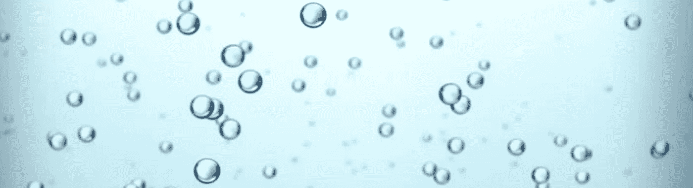
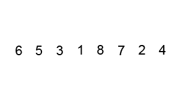

# 为什么叫冒泡排序。

> 原文：<https://medium.com/hackernoon/why-its-called-bubble-sort-3a7d06455d1e>

冒泡排序是一种顺序排序算法。它通过比较相邻的元素进行排序，如果它们顺序不对，就交换它们。我刚刚想到为什么它被称为冒泡排序，以及它的命名有多巧妙。

考虑以下 Python 中的冒泡排序实现。

我们给这个算法传递一个未排序的列表。对于列表中的每个索引位置，我们将该位置的元素与其后的元素进行比较。如果前面的元素大于后面的元素，那么我们交换它们。

当冒泡排序到达列表中最大的元素时，该元素将被一次又一次地向前推进，直到到达末尾。在下一次迭代中，第二大元素将被推到后面，依此类推。

那么为什么叫冒泡排序呢？比周围的水更有浮力的气泡会浮到水面。类似地，值大于其周围元素的列表元素会“冒泡”到列表的末尾。

多有趣啊！

> [黑客中午](http://bit.ly/Hackernoon)是黑客如何开始他们的下午。我们是 [@AMI](http://bit.ly/atAMIatAMI) 家庭的一员。我们现在[接受投稿](http://bit.ly/hackernoonsubmission)，并乐意[讨论广告&赞助](mailto:partners@amipublications.com)机会。
> 
> 如果你喜欢这个故事，我们推荐你阅读我们的[最新科技故事](http://bit.ly/hackernoonlatestt)和[趋势科技故事](https://hackernoon.com/trending)。直到下一次，不要把世界的现实想当然！

