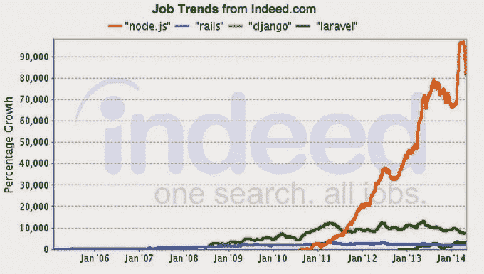

# 为什么要学习 MEAN Stack？

> 原文：<https://medium.com/hackernoon/why-learn-mean-stack-9181506ec62>

朋友们，你们好，随着越来越多的编码训练营和在线课程平台(如可汗学院)转向 Javascript 作为他们的教学语言，看来“Javascript”真的越来越受欢迎，并且是使用最广泛的。

但是为什么呢？为什么每个创业公司创始人都在找一个刻薄的栈开发者？我们考虑与我们的开发者社区分享这一点…

我们开始吧:

*   没有它，你在网络上做不了多少事情，所以人们越来越多地直接使用 Javascript，跳过 Ruby、Python 和 PHP。
*   Javascript 拥有最活跃的开发者社区。
*   你应该一开始就学习 Javascript 的第三个原因是:可雇佣性——雇主不仅仅需要熟悉特定 Javascript 技术的工程师。而这些技术恰好是组成 MEAN STACK 的技术——MongoDB、Express.js、Angular.js 和 Node.js

注意:你可以清楚地看到，就就业增长而言，Node.js 是明显的赢家。

一些数据驱动点说明为什么 MEAN STACK 变得如此流行？(注:该数据来自 indeed.com(最大的招聘信息汇总网站)。

*   node . js & express . js——支持 MEAN Stack 的 web 服务器和准系统 web 开发框架。Node.js 发布不到 5 年，但已经被 Linkedin、沃尔玛、SAP 和微软采用。
*   MongoDB——它是 MEAN Stack 使用的文档存储数据库。Mongo 也很受 Rails 应用程序的欢迎，并且是 Meteor.js 项目的默认数据库。

注意:雇主对 MongoDB 的需求是 NoSQL 数据库中增长最快的。从绝对意义上来说，MongoDB 也在胜出。

**哇关于平均堆栈的事实:**

*   它已经被贝宝、优步、Linkedin 和其他许多网站使用
*   angular . js—MEAN Stack 中的“A”。谷歌(以及推而广之的 YouTube)已经投入了大量资金和工程人才来改进 Angular.js。
*   如上所述，每一个平均堆栈的单个组件正在成为其各自类别的赢家。

因此，从乔布斯的角度来看，关注整个平均堆栈是有意义的。如果你的雇主想用 Backbone.js 而不是 Angular.js，你已经熟悉了其中一个，并且可以很容易地学习另一个。因为它们都有共同的 Javascript。

[**学贱栈，练贱栈很多。把它放在你 Linkedin 个人资料的显著位置。请于 2 月 26 日上午 10 点到下午 4 点在 Okhla 的 Founders Cafe 加入我们。**](http://goo.gl/DdCjqb)

博客作者:Ayushi Mohindra

> [黑客中午](http://bit.ly/Hackernoon)是黑客如何开始他们的下午。我们是 [@AMI](http://bit.ly/atAMIatAMI) 家庭的一员。我们现在[接受投稿](http://bit.ly/hackernoonsubmission)，并乐意[讨论广告&赞助](mailto:partners@amipublications.com)机会。
> 
> 如果你喜欢这个故事，我们推荐你阅读我们的[最新科技故事](http://bit.ly/hackernoonlatestt)和[趋势科技故事](https://hackernoon.com/trending)。直到下一次，不要把世界的现实想当然！

