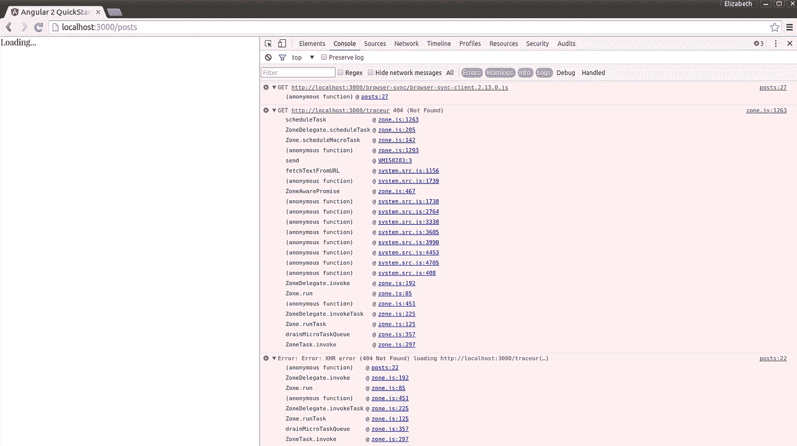
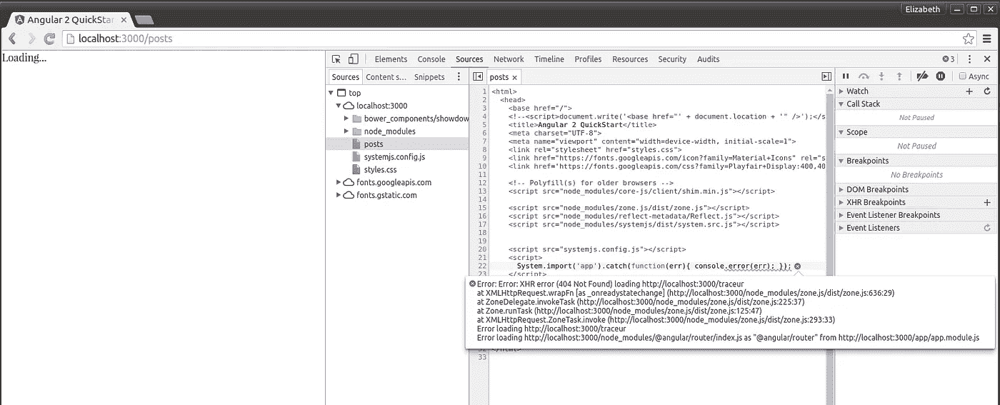
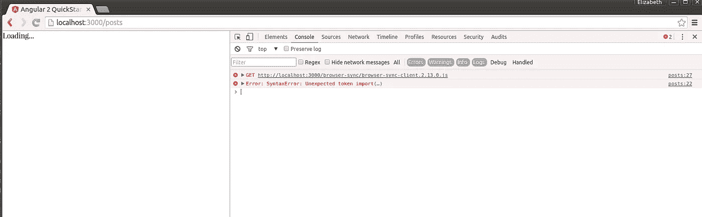
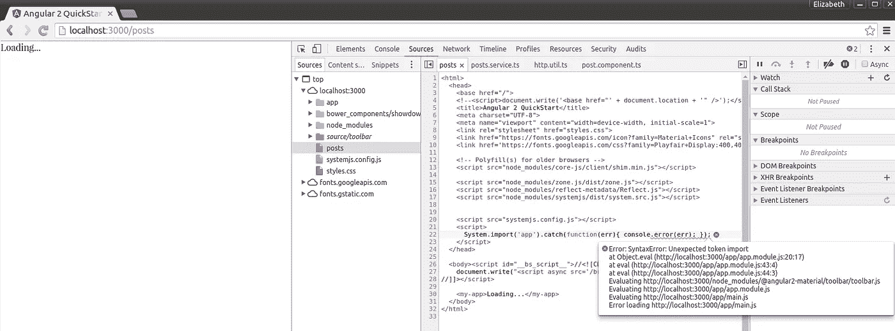

# 为什么学习 Angular 2 是痛苦的

> 原文：<https://medium.com/hackernoon/why-learning-angular-2-was-excruciating-d50dc28acc8a>

几个月前，我决定尝试 web 开发。Angular 2 当时是新的闪亮的，所以我决定下载它并开始建立一个网站。现在，作为一个主要是 Java 开发者的人来说，这是一次全新的非常有趣的经历。我遵循了所谓的“5 分钟快速入门指南”,在与 Angular 2 及其过多的依赖项争论了一个半小时后，我能够启动并运行一些东西。

接下来，我开始搭建一个真正的 app。我决定从零开始建立一个个人博客平台，主要是为了[的学习](https://hackernoon.com/tagged/learning)，部分是因为我多年来一直想开一个博客。拥有一个博客的愿望将是激励我学习新技术和继续建设我的项目的胡萝卜。

几个月来，我一直在关注 Angular 2 的发布，每个周末，我都在博客上聊天。哦，我说了“咕嘟咕嘟”吗？我的意思是一遍又一遍地用我的头使劲撞墙，试图理解和处理这个怪异的 [Javascript](https://hackernoon.com/tagged/javascript) 生态系统。

也许我只是习惯了 Java 世界的慢节奏、健壮、经过战斗考验的库。也许[从 Angular 2 开始学习](https://hackernoon.com/tagged/learning) web 开发就像试图学习一个新的视频游戏并从硬核模式开始。我不知道。

我所知道的是，从我作为一名 Java 工程师的角度来看，Angular 2 的发布是一场灾难。每一个小版本都有很多突破性的变化。每次我查看那该死的“5 分钟快速启动”时，它的大部分都已经完全改变了。甚至不要让我开始整个 Angular 2 路由器业务。作为一个用户，尤其是一个不太熟悉 Javascript 世界的用户，这确实是一个失败，并且很难处理。

我发现自己在激情的时刻写了这篇文章，对几天前宣布的最新 Angular release 感到愤怒。Angular 2，这次是为 rulz 设计的，已经发布了，你可以升级到它，并且在长达 6 个月的时间里不用处理重大的变化！那么，我天真地对自己说，我应该把我的博客从@angular 2.0.0-rc.4 升级到@angular 2.0.0。

这是我刚刚经历的旅程:

1.  升级到@angular 2.0.0
2.  从我的组件中删除所有“指令”字段。显然 Angular2 已经决定采用模块。
3.  删除所有以 _ 指令结尾的导入。
4.  将@angular/forms 从 0.3.0 升级到 2.0.0。出于某种原因，@angular/forms 远远落后于 angular 的其他版本。直到这次发布。
5.  将 angular-material 升级到 2 . 0 . 0-α8–2(我们能不能先暂停一下，欣赏一下一个叫 2 . 0 . 0-α8–2 的版本的可笑之处？？).
6.  升级到 typescript 2.o，正如我不愉快地惊讶的那样，它目前处于测试阶段。在 Angular 中终于达到了相对稳定的版本，但令人沮丧的是，意识到 angular-material，我的堆栈中的一个关键工具，具有不稳定的依赖关系，领先于 Angular 2 的依赖关系。

此时，“国家预防机制启动”正在发挥作用。这是困难的部分开始，因为现在我必须处理非常神秘的错误消息，自从我开始学习 Angular 2 以来，这些错误消息一直困扰着我。比如这个:



经过一些故障排除(现在我已经可以调试 System JS 的无用错误消息了)，问题是由我的 systemjs.config.js 文件中的错误行引起的:

```
// No umd for router yet
packages['@angular/router'] = { main: 'index.js', defaultExtension: 'js' };
```

我猜@anguler/router 现在有 umd 了。无论 umd 是什么……

之后我遇到的下一个问题是:



太好了，angular-material 中的一个随机文件出现了一个奇怪的语法错误。没有有用的错误消息，没有行号。几乎没有什么能帮我弄清楚下一步该做什么。我不知道是否要升级依赖项，降级依赖项，安装新的依赖项，改变我的 tsconfig.js 文件的语法(这在我升级到 typescript 2.0 时无疑是改变了)。我迷失在困惑和沮丧的海洋中。

现在，那些经验丰富的 web 开发人员可能很容易解决这样的问题。我不是这个意思。这与我刚刚面临的特殊问题无关。那就是 Javascript 生态系统是完全混乱的。每个新库的每个新版本都有一系列突破性的变化。新的库将在它们的 API 确定之前发布。beta 版的库现在已经是旧闻了，因为只有 alpha 版的库是新的和有趣的。超过 6 周的 Stackoverflow 帖子不再相关，可能涉及我不再使用的旧版本的问题。

我心中的 Java 工程师正为这个生态系统的挫败感而尖叫。web 开发已经陷入了什么样的疯狂？现在 Javascript 到底是怎么回事？？？

好吧，我想是时候退一步说我其实很爱 Angular 2。当我升级了所有的依赖项，并且一切正常时，当 Intellij 给正确的东西加了下划线，并且我的 typescript 编译器正确连接时，Angular 2 棒极了。

公平地说，我一直在使用尚未正式发布的库版本。也许，你会说，这是我的错，因为我试图下载并使用一个仍然处于 alpha/beta/release candidate 的库版本，并期望它能够工作并相对容易使用。也许你是对的。但是，考虑到成千上万的开发人员已经在使用 Angular 2，我们应该问自己这样一个问题:发布仍在开发中的库是负责任的吗？宣布一个候选版本，然后在从 rc.1 到 rc.6 的演进过程中做出大量的突破性改变，这有意义吗？在升级 Angular 2 版本及其所有相关依赖项的过程中，有多少人浪费了成千上万的时间？而且，正如大多数工程师将证明的那样，开发人员的时间在今天的就业市场上是一种宝贵的商品。有多少开发人员被尝试使用 Angular 2 的经历彻底烧伤，并发誓永远放弃 Angular 而支持 React？有多少其他的 Javascript 库也给他们的用户带来了这样的挫折和不必要的痛苦？

也许 Javascript 生态系统正在经历*强烈的*成长的烦恼。也许开发人员很快就理解了他们最初设计中的错误，并在他们不断迭代他们的库的越来越好的版本时厚颜无耻地纠正它们。也许 Javascript 世界是绝大多数软件工程师即将生活的地方，因为那里的工具将会快速有效地发展。也许人们会用 Javascript 完成更多的工作，用 Javascript 编写的工具会比其他软件工程领域的工具更容易使用。或者，也许，仅仅是也许，Javascript 世界将永远是一个笑话，一个工程潮人去浪费时间并感觉自己处于创新前沿的地方，而实际上，他们生活在一个疯狂和混乱的世界，浪费了几个小时的生产力，以便他们可以使用最新和“最棒的”工具。

但我只是一个卑微的 Java 工程师。我最感兴趣的是:你觉得呢？

> [黑客中午](http://bit.ly/Hackernoon)是黑客如何开始他们的下午。我们是 [@AMI](http://bit.ly/atAMIatAMI) 家庭的一员。我们现在[接受投稿](http://bit.ly/hackernoonsubmission)并乐意[讨论广告&赞助](mailto:partners@amipublications.com)机会。
> 
> 要了解更多信息，[请阅读我们的“关于”页面](https://goo.gl/4ofytp) , [喜欢/在脸书给我们发消息](http://bit.ly/HackernoonFB)，或者简单地，[发推文/DM @HackerNoon。](https://goo.gl/k7XYbx)
> 
> 如果你喜欢这个故事，我们推荐你阅读我们的[最新科技故事](http://bit.ly/hackernoonlatestt)和[趋势科技故事](https://hackernoon.com/trending)。直到下一次，不要把世界的现实想当然！