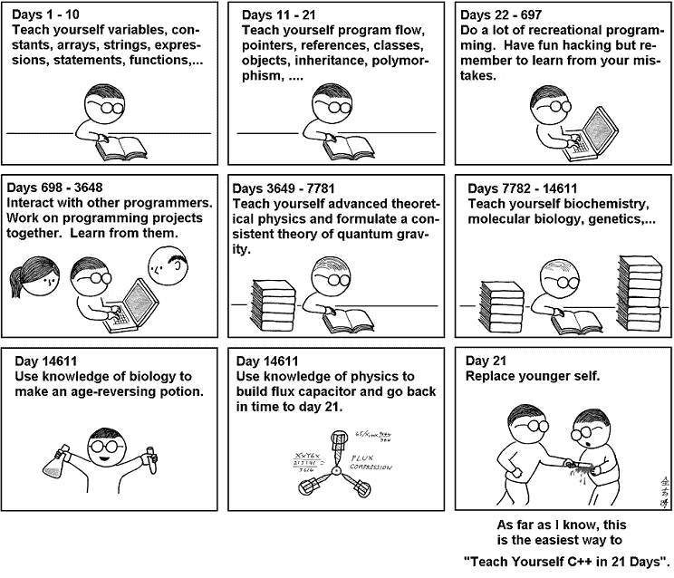

# 为什么独自学习编程是一个可怕的想法

> 原文：<https://medium.com/hackernoon/why-learning-to-program-alone-is-a-terrible-idea-11d489b80a62>

学习编程很难，很多人甚至在尝试之前就放弃了。但是我们看到很多书声称在 21 天或更短的时间内教授编程。以下是唯一可能发生的方式([奥鹅](http://abstrusegoose.com/249)

如何在 21 天内自学编程

说真的，为什么 [**大家都这么冲**](http://norvig.com/21-days.html) ？

以下是我的故事:

我非常疯狂地开发自己的策略游戏。我知道计算机非常聪明，能在许多策略游戏中打败人类。它们到底是如何工作的？随着时间的推移，我开始了解计算机智能术语，人工智能。当我发现目标时，我很兴奋！我开始为 AI 上网。很多人劝我'**数据结构和算法**'是 AI 的先决条件。我还好，让我们先选 D.S 和 Algo 再选 AI。我再次被告知，掌握一些语言的基本编码技能是 DS 和算法的先决条件。不，跳过它，我是用 java 编码的极客。
从一些网络课程上学习了 ds 和算法，新手到进阶。他们真的很棒！
现在一路移动到 AI！我又开始学习一些很棒的在线课程，并用我学到的人工智能解决了一些有趣的问题。哦，是的，我学到了太多！我居然实现了 AI 开发小游戏，分享给朋友。生活变得令人敬畏。

有一次朋友让我参加类似 topcoder 和 codeforces 这样的在线编程比赛。我的信心在另一个层面上。我开始参与 topcoder。因为我的自信，我花了一个多星期才知道我是一个甚至没有基本编码技能的编程新手。这一经历非常吸引人。我像任何事情一样在 topcoder 开始实践。我几天内解决的问题，其他人几分钟内就解决了。这些人是谁？他们属于某个我不知道的团体吗？我在寻找能回答我的人。
由于我的努力，我和一些同样是新手但对在 topcoder 中成长感到好奇的人进行了交流。**哇！我们握手言和，创建了我们自己的实践和知识共享社区。相信我，我们的增长是指数级的！到目前为止，当我回想起我的编码经历时，我能说的不多**

1.  单单学习就能增强你的信心，直到你面对现实。
2.  无论这门学科有多难，竞争环境都会挑战你的极限。
3.  当我们合作学习时，我们不知不觉地控制了我们的懒惰。
4.  或多或少，人类生来就是协作学习的

我以艰难的方式学到了这一课，当我这样做时，我们没有一个简单的方法来找到一起学习的人，我花了很多时间和精力来找到一起学习的人。

这就是为什么我们试图解决一起学习的问题。我们是这样开始的。检查[**【https://colearn.co】**](https://colearn.co)。祝你好运，玩得开心。

> [黑客中午](http://bit.ly/Hackernoon)是黑客如何开始他们的下午。我们是 [@AMI](http://bit.ly/atAMIatAMI) 家庭的一员。我们现在[接受投稿](http://bit.ly/hackernoonsubmission)并乐意[讨论广告&赞助](mailto:partners@amipublications.com)机会。
> 
> 如果你喜欢这个故事，我们推荐你阅读我们的[最新科技故事](http://bit.ly/hackernoonlatestt)和[趋势科技故事](https://hackernoon.com/trending)。直到下一次，不要把世界的现实想当然！

