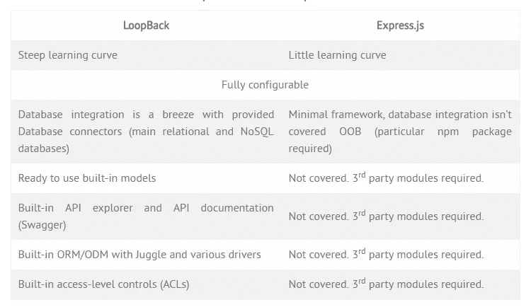

# 为什么 LoopBack 比 ExpressJS 好？

> 原文：<https://medium.com/hackernoon/why-loopback-is-better-than-expressjs-bcf01de87582>

在过去的几年中，已经从传统的软件开发方法转变为接口隔离原则(ISP)，这不仅为 web 浏览器，也为移动设备提供了服务器通信的便利，并且无需对代码进行任何更改。如今，软件开发中最流行的方法之一是 [MEAN](https://da-14.com/services/mean-stack) ，用于构建 web 和移动应用程序以及网站和门户的 JavaScript 堆栈。

如果你正在开发 Node app，你很可能[需要一个 RESTful API](https://da-14.com/services/api-development) 用于你的前端或者你的数据分发。有很多工具和方法，但主要问题是选择正确的方法。DA-14 目前正在开发休闲旅游行业的预订应用。对于这个项目，我们选择了 LoopBack 框架，在这篇文章中，我们将分享我们的经历。

## 什么是环回？

**LoopBack** 是一个高度可扩展的开源框架，用于创建 API，只需很少或不需要编码，并将它们与后端数据源链接起来。简而言之，它构建在 Express 之上，附带了一组 Node.js 模块，既可以独立使用，也可以一起使用来为客户端应用程序(如手机、浏览器等)构建 REST APIs。)用最简单的方式。

有许多优点使它成为一个强大的工具。例如，它是一个成熟的企业级框架，有助于采用 API 设计最佳实践；它自动生成 API 代码，使设计和测试更容易，因此，允许开发人员专注于 UX(用户体验)和业务逻辑；此外，它简化了与 Oracle/MongoDB/SQL Server/MySQL 旧数据和新数据的连接。

## 真实案例:

*每个项目都是不同的，需要采用独特的方法，并充分考虑技术要求和客户期望。考虑到上述优点，环回似乎是复杂应用程序的一个显而易见的选择。然而，我们的点对点平台证明仍然存在一些瓶颈，需要灵活性和定制的解决方案。*

*我们的团队协助开发了订票应用程序，旨在让旅行变得轻松便捷，而 LoopBack 有助于在短时间内实现这一目标。除了快速的 RESTful API 设置和极大的灵活性，这个框架还可以用来创建微服务和模型。容易处理数据库是另一个优势，在开发过程中发现，因为不需要安装特定的包和驱动程序，所有的工作都是通过 DB 连接器完成的。*

有了 OOB 最大的 API 工具包，Swagger 从第一天起就是必不可少的。它用于在一致的基础上描述和记录 REST APIs，确保文档的格式是人类和机器可读的。

*尽管大多数人认为环回是一个单一的解决方案，但它仍然会变得令人困惑，并且需要编码技能。面临的挑战之一是无法搜索表格和数据的内聚模型。作为解决方案，我们创建了视图(PostgreSQL ),允许我们同时搜索多个表。如果您面临类似的问题，您也可以集成 Sequalize，但我们建议您选择其中一个选项。*

*我们还使用 Joi 模块在验证方面做了一些定制改进。它支持为 JavaScript 对象(存储信息的对象)创建蓝图或模式，以保证关键信息的有效性。最重要的是，对于这种类型的应用程序，注册时使用真实姓名是必不可少的，而 Joi 可以确保这一点。*

## 带有 LoopBack 或 Express 的 RESTful APIs:选择什么？

## 总结

Node.js 是快速完成项目的完美解决方案，这就是为什么它被初创公司、中型公司甚至大型企业广泛应用，如 PayPal、沃尔玛、易贝、LinkedIn、优步和其他行业巨头。就其本身而言，LoopBack 使 API 的生成、设计、连接到数据库、测试等变得更加容易，从而使开发人员能够专注于解决方案架构、业务策略和用户体验。

为你的 RESTful API 选择正确的框架考虑灵活性、可维护性、成本和可用特性。虽然性能和功能很重要，但是一个特定项目的需求、目标和业务逻辑才是焦点。

> [黑客中午](http://bit.ly/Hackernoon)是黑客如何开始他们的下午。我们是 [@AMI](http://bit.ly/atAMIatAMI) 家庭的一员。我们现在[接受投稿](http://bit.ly/hackernoonsubmission)并乐意[讨论广告&赞助](mailto:partners@amipublications.com)机会。
> 
> 如果你喜欢这个故事，我们推荐你阅读我们的[最新科技故事](http://bit.ly/hackernoonlatestt)和[趋势科技故事](https://hackernoon.com/trending)。直到下一次，不要把世界的现实想当然！

