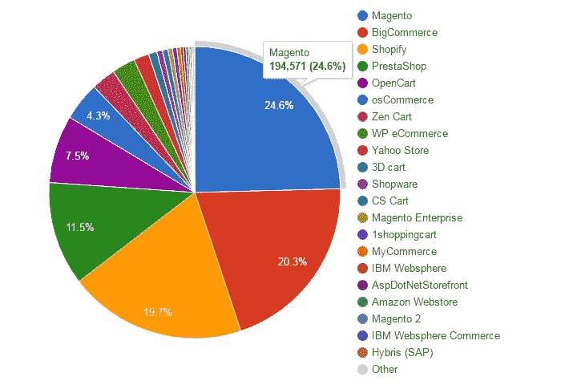

# 为什么 Magento 在 2017 年仍然是电子商务巨头

> 原文：<https://medium.com/hackernoon/why-magento-is-still-an-ecommerce-giant-in-2017-d7b60b291765>

[可口可乐](https://buy.shareacoke.com/)、 [Foxconnect](https://www.foxconnect.com/) 、[福特](https://accessories.ford.com/)、[奥林巴斯](http://www.getolympus.com/)、 [Vizio](https://www.vizio.com/) 、[雀巢 Nespresso](https://www.nespresso.com/us/en/) 有什么共同点？

有答案了…！！没有吗？

让我告诉你一个有趣的事实。所有这些网上商店，事实上世界上超过四分之一的电子商务商店都是由电子商务行业巨头 Magento 提供支持的。

过去几年，Shopify、Volusion 等“即插即用”电子商务平台出现了真正的增长。然而，对于许多店主、商家和电子商务开发商来说，Magento 仍然是他们网络电子商务项目的首要考虑因素。

那么，是什么让 Magento 独一无二，成为电子商务行业的宠儿呢？

让我们来看看一些事实，这些事实将有助于你理解为什么 Magento 在 2017 年仍被视为电子商务巨头。

# 开放源码

Magento 是一个免费的电子商务平台，在 3.0 版开源许可下发布，使用 PHP 和其他开源工具构建。通过使用这些技术和保持开源意味着 Magento 作为一个平台比竞争对手有几个明显的优势。该平台适应性很强，可以不断修改以完全符合项目要求。

使用开源工具也意味着该平台为商家和开发者保证了健壮的性能和增强的安全性。

# 为电子商务定制设计

现在所有主要的 CMS 包括 WordPress，Drupal 和其他都提供电子商务功能(在某些情况下是开箱即用的！)，它们采用纯电子商务方式设计。

因此 Magento 驱动的电子商务解决方案为每个人提供了更好的体验，从开发人员到商店管理员，再到来到店面购物的最终用户。多年来，Magento 已经发展成为一个功能丰富的电子商务解决方案，预装了建立电子商务网上商店所需的所有基本工具。

# Magento 社区

哪里有开源 app，哪里就有社区！

由于 Magento 是一个非常受欢迎的开源电子商务平台，因此有一个庞大的社区，由店主、商人、开发商、设计师、代理商、电子商务顾问、技术解决方案提供商和全球普通终端用户组成，他们详细讨论 Magento 的一切。该社区确保该平台保持最新、快速、可靠、安全且没有错误。这个社区的优点是非常热情，让每个新来的人都有宾至如归的感觉。

# 没有与托管相关的限制

与 Shopify 和 Volusion(“为电子商务而生”的平台)不同，Magento 允许你选择托管解决方案。这样你就可以选择最适合你的需求和预算的托管解决方案提供商。类似地，当需要迁移您的存储时，您可以在何时何地托管您的存储没有任何限制。

# 默认响应设计

移动设备在全球电子商务交易中的份额正在快速增长，很快将超过所有其他设备类别。意识到这一点后，Magento 加入了 HTML5 功能，确保店面的设计能够完美地满足移动设备的需求。此外，Magento 还提供网格、图像缩放、AV 功能、手势控制、拖放等功能。

# 第三方组件集成

第三方插件和扩展极大地缓解了 Magento 商店管理员和开发者的生活。Magento 提供了所有第三方组件的无限制集成，从而大大缩短了开发和部署时间。

好的一面是这些组件中的许多都是免费使用的。其他的只要几美元就可以买到。

在 Magento 的可扩展 API 的帮助下，你可以毫无障碍地连接到任何你选择的应用程序或插件。无论是支付网关、分析工具还是运输和跟踪方法，您只需要找到最佳的扩展，然后立即将其插入 Magento 商店。

# Magento 扩展和定制选项

每个行业都有自己的电子商务商店设计惯例。适用于时尚和服装的方法可能不适用于家具零售商。类似地，规模、运营规模、客户支持要求、计费和交付选项等。在电子商务环境中提出各种挑战。

Magento 是一个高度可定制的电子商务平台。它允许您通过编辑布局和模板或添加您选择的新颜色和样式来开发令人难以置信的前端用户体验。后端优化也可以通过重写代码、修改事件和网格来重新设计，以满足业务需求。

所有 Magento 用户感兴趣的一个关键点是扩展和模块的巨大市场。Magento 用户可以毫不费力地发现多种扩展来扩展和定制他们的商店，并通过利用不同的扩展将他们的店面与竞争对手的区分开来。

# 快速且可扩展

说到页面加载速度，Magento 显然是赢家！

慢装网店倒闭很快。在许多情况下，慢速网页造成的损失是永久性的，并极大地导致了企业的灭亡。Magento 采用高端缓存技术，如 [Cloudways 全页缓存](https://www.cloudways.com/blog/free-magento-full-page-cache-cloudways/)和其他数据库优化技术，如 Memcached 和 Redis，大大加快了存储速度。

Magento 适合小型到大型(甚至大型)的电子商务商店，因为它足够灵活，可以随着您的业务增长。事实上，Magento 的性能、稳定性和可靠性可能会让您大吃一惊。

# 多家商店

许多电子商务平台让你每个账户有一个商店。有了 Magento，你可以设置多个商店，这些商店可以通过一个后端来管理。您可以使用单个管理面板控制商店的库存、订单、账单、客户信息。

每个商店可以有不同的主题和与之相关的模板。您也可以为单个商店分配一个子域。通过单个管理面板同时控制所有商店的便利性极大地简化了经营单个或多个类别的多个商店的管理。

# 结论

万磁王提供了许多功能，帮助开发人员为他们的客户创建完美的商店。这些工具缓解了展示产品、在线交易、折扣管理等 Magento 胜过竞争对手的一些领域的问题。然而，请记住，Magento 不是一个即插即用的电子商务解决方案。这确实需要开发人员和管理员具备一定水平的开发和商店优化专业知识。

> [黑客中午](http://bit.ly/Hackernoon)是黑客如何开始他们的下午。我们是 [@AMI](http://bit.ly/atAMIatAMI) 家庭的一员。我们现在[接受投稿](http://bit.ly/hackernoonsubmission)并乐意[讨论广告&赞助](mailto:partners@amipublications.com)机会。
> 
> 如果你喜欢这个故事，我们推荐你阅读我们的[最新科技故事](http://bit.ly/hackernoonlatestt)和[趋势科技故事](https://hackernoon.com/trending)。直到下一次，不要把世界的现实想当然！

