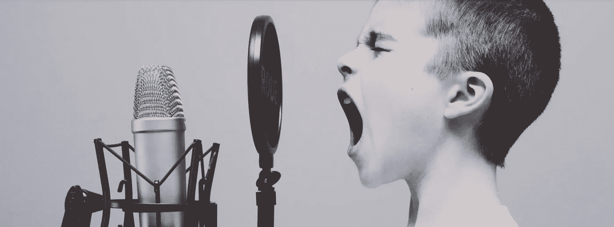
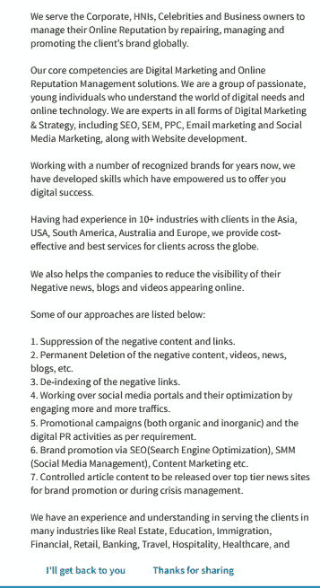
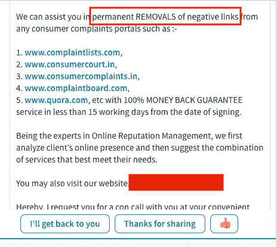
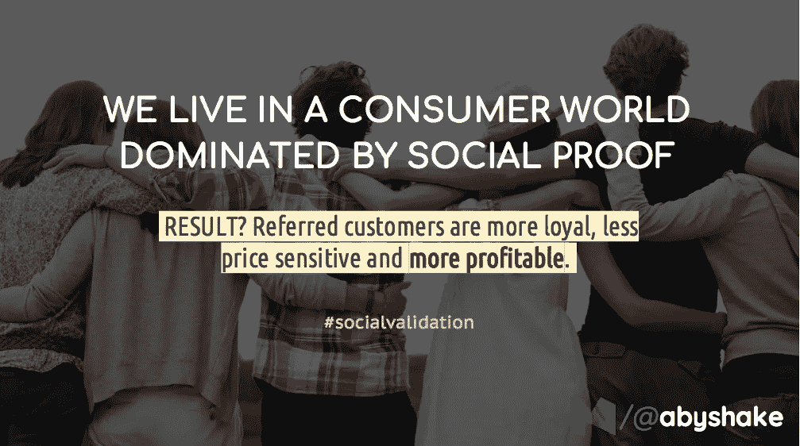

# 为什么“管理”负面评论是最糟糕的主意

> 原文：<https://medium.com/hackernoon/why-managing-negative-reviews-is-the-worst-idea-820e7f0e5113>

## 有很多商家可以帮你获取和删除/压制负面评论。不是化解，而是压制。这样做是不对的。无论是道德上还是商业上。



Listen to your customers’ negative feedback. It’ll help your business. ([img](https://unsplash.com/photos/ASKeuOZqhYU))

我今天在 LinkedIn 上收到了最令人不安的消息。开始了。



The email was from the relationship manager at a “Online Reputation Management and Digital Marketing company”

通常情况下，这样的信息会被忽略，但我会浏览一下，看看是否有什么有价值的东西。当我看这个的时候，这个引起了我的注意。

> 禁止负面内容和链接。

压制？？真的吗？

接下来的两点同样令人不安。

> 永久删除负面内容、视频、新闻、博客等。
> 
> 负面链接的去索引。

我的天啊。

现在，我不幼稚了。我知道一些品牌确实从事这种做法，当有需求时，企业会迎合这种需求是合乎逻辑的。重点是——需求不应该存在。

# 我不怪她伸出援手



毕竟，她只是在做她的工作。很大程度上，我也不怪她的雇主。他们看到了一个快速赚钱的机会，所以我有什么资格质疑他们充分利用这个机会的意愿。

我责怪那些品牌，那些创造了对这种服务的需求的企业。我同情他们，因为他们花费了数千美元在一项徒劳的活动上，浪费了一个巨大的商业发展机会。

# 为什么负面评价很重要



所有评论都很重要。很多。如果你已经看过我之前分享的关于推荐营销的[资料，就在开头(第二张幻灯片)，我会谈谈`**social proof**`在当今世界的力量。](https://hackernoon.com/how-to-have-a-kickass-referral-program-e65ecaca02b4)

积极的评价，甚至来自陌生人的评价，有助于我们更轻松地做出购买决定。负面评论加深了我们的怀疑。这就是为什么这个市场——一个消除负面评论、让负面评论消失的市场——存在。

但事实是，在顾客面前，没有什么比看到一个负面评价被拒绝更能强化顾客的信心了。它展示了企业获得最大客户满意度的意愿和决心，并表明他们甚至会为此付出额外的努力。

> 不要消除负面评价。把他们转过来！

在我之前的组织中，我交给处理我们的应用商店页面的人的第一个任务是，所有负面评论都应该在几小时内引起我和直接利益相关者的注意。然后我们会看看是否能把皱眉头颠倒过来。

负面评论也有助于你理解两件事:

1.  在你的产品、运营或方法中，你需要改变/修改/改变什么？
2.  是什么阻碍了你的用户和客户在爱上你的时候实现那令人惊叹的时刻？

本质上，它可以帮助你获得很多信息，这些信息是你成为更好的企业所需要的。所以，在我看来，负面评论是有用的。你为什么要消灭他们？？

和他们一起工作。

# 今天到此为止；明天见。

[](https://upscri.be/a5ccb9/)

Click here to join the mailing list.

```
**Well, frankly that’s all I wanted to talk about.****But, while we are on the subject of reviews, let us talk about it a bit more. You can skip this part if you would like to.**
```

# 评论是一件有趣的事情

不管你从事哪一行，你不可能也不会是完美的。这是事实。在你的操作中可能会有不足，或者你可能做的每件事都是对的，但即使如此，完美在很大程度上也是可以感知的。所以——你不会对每个人都是完美的。总之。

有几件事你需要接受。

## #1.仅仅因为你提供了最好的服务，人们不会给你留下积极的评价

尽管听起来令人失望，但这是事实。你的客户并不完全是快速和宽松的给予狂欢和赞美。他们会喜欢你的服务，要么在心里称赞你，要么认为提供优质服务是你的工作而不予理会(*老实说，这不是一个错误的观念*)。

最好的情况？

1.  他们在过去与你领域内的服务提供商有过一些不愉快的经历，所以你让他们大吃一惊。为此，他们会永远记住你。
2.  他们喜欢你的服务，所以下次他们需要类似的服务时，你的名字有 40-70%的可能会第一个出现在他们的脑海里。
3.  他们正在和一个朋友交谈，突然出现了一个特定服务的话题。顺便说一句，这正是你提供的服务。他们会谈论它。现在，你有推荐人了。

但是除此之外，是的——你没有得到任何积极的评价。

> 除非你主动要求。

是的。如果你知道你的客户对你的服务很满意，请他们给你留下一个积极的评价。请遵循一些简单的规则:

1.  使离开评审的过程简单、容易且不浪费时间。
2.  尽早得到它。一旦你赢得了顾客的赞赏。时间流逝得越多，你得到那份评估的机会就越来越少。

但即便如此，也不是所有人都会留下这么令人垂涎的评论。你自己想想。有多少次客户服务代表要求你花一分钟。在通过电话/聊天解决了您的问题后，给他/她留下一个评价，您实际上这样做了多少次？

你的消费者没什么不同。

## #2.一旦你跨过门槛，你的消费者就会特意留下负面评价。

这很容易引起你的消费者的负面情绪，如果他们甚至有点生气，他们会觉得更有必要给你留下负面评价。考虑到这一点，你需要让客户感到欣喜若狂，因为他们甚至会考虑给你留下一个积极的评价。

对于一个负面的评论来说，对一些人来说，即使是交货单上的一个错别字也足够了。

不同的人对企业不能也不应该跨越什么界限有不同的看法。他们对你的最低服务期望。如果做得不够，你会招致强烈反对。

## #3.一些消费者会因为你责备他们而留下负面评价。不管你是不是罪有应得，都不重要了。

不相信我？

以 Snapdeal 见证 playstore 上数万个应用卸载和负面评价为例。为什么会这样？因为 Snap(现在仍被普遍称为 Snapchat)的 CEO 据称发表了一些反印度的言论。Twitter 上有人搞砸了，写了 Snap *deal* 而不是 Snap *chat* 。从那以后就像滚雪球一样。当然，即使 Snapchat 不得不面对的反弹也是我不同意的，但 Snapdeal 呢？他们只是无缘无故地被盯上了。