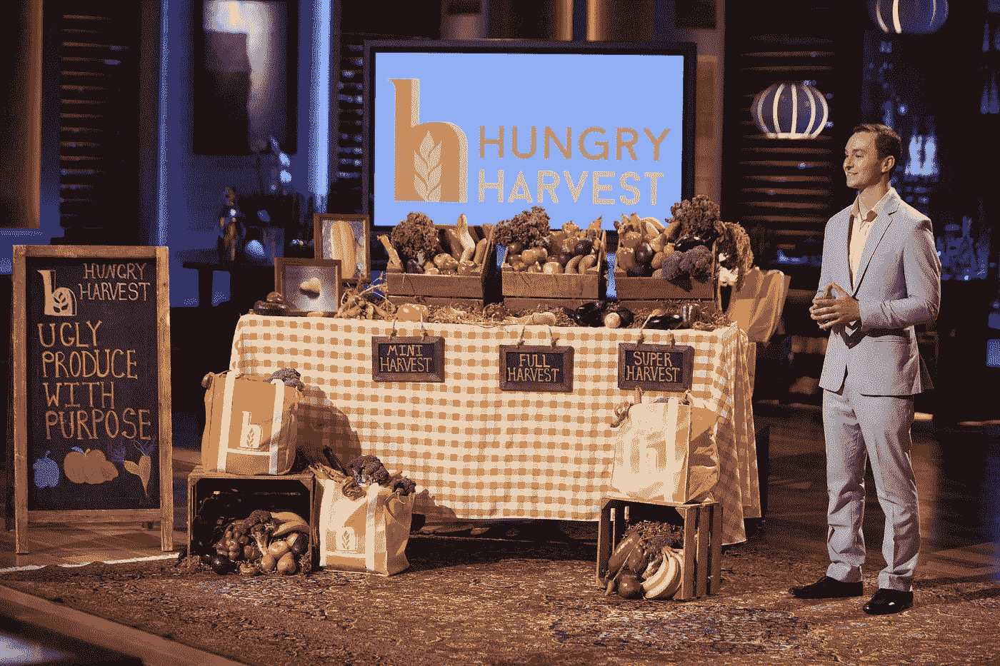
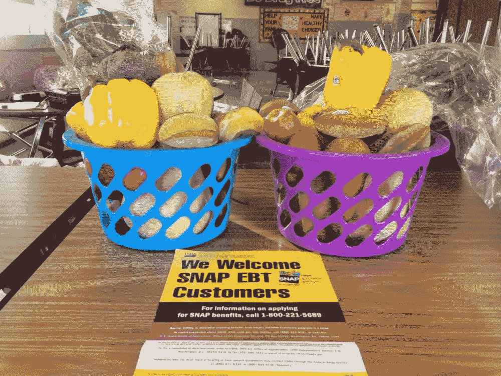

# 为什么马克·库班对我的生意判断错误

> 原文：<https://medium.com/hackernoon/why-mark-cuban-was-wrong-about-my-business-a8d15d3f3ce1>

[*饥饿收获*](http://www.hungryharvest.net) *是一家鲨鱼坦克支持的农产品配送服务公司，其使命是消除食物浪费和结束饥饿。我们采购那些本来会被浪费掉的产品，并每周把它们装在各种盒子里送到成千上万的订户手中。我们每运送一箱农产品，就会为缺乏粮食保障的家庭补贴 3 磅农产品。*

Here I am on set, nearly two years ago, sweating through the Shark Tank.

大约两年前，在《鲨鱼坦克》的片场，我向鲨鱼们讲述了我们对抗饥饿的倡议。我们每卖出一箱，就向当地非营利组织捐赠 2-3 磅农产品。

奇妙先生问我们在无利可图、规模如此之小的情况下，为什么要做这个？马克·库班插话说:“这是营销费用！”

所以我说:‘没错！’

我错了。

在我人生的那个阶段，我不知道解决饥饿不仅仅是定期捐赠食物。

它需要一个有四个标准的解决方案。健康食品必须是:

1.  负担得起的
2.  易接近的
3.  受欢迎的
4.  从[业务](https://hackernoon.com/tagged/business)的角度看可持续和可扩展

大约 10 个月前，我意识到我们仅仅通过捐赠食物并没有最大限度地完成我们的使命。我们必须采取更多行动，更深入地研究这个解决方案。

我们决定回归本源。

我在马里兰大学摆摊卖难看的水果和蔬菜，在那里我向学生、教职员工出售 5 磅重的袋子。该项目每周吸引数百名客户，2014 年 5 月，我推出了同样概念的交付模式。

我想——如果这在我的大学行得通，为什么在公立学校行不通呢？

去年八月，我们在食品沙漠中心的富兰克林广场小学开设了第一家[生产基地。我们出售 7-12 磅重的袋子给那些无法买到平价农产品的居民，价格仅为 7 美元。我们也接受 SNAP 和 EBT，因此程序名中有“SNAP”。](http://produceinasnap.com/)

这个项目已经启动了。自该项目启动以来的 7 个月里，我们已经售出了 3000 多个包包，获得了 3 万美元的收入。我们正以每月两个新站点的速度扩张。

PIAS 的摊位由学生经营，他们在经营农产品摊位时远离街道和其他干扰。他们还为经营摊位赚取津贴。对许多人来说，这是他们的第一份工作。

该计划也是有利可图的，这对可持续地解决饥饿问题很重要。我们用这些利润来购买更多的 EBT 机器，雇佣更多的网站管理员，并扩展到更多的学校。最终，我们将扩展到华盛顿、DC、费城和其他城市。

该计划不仅仅是“营销费用”第一，这根本不是一笔开销。这实际上是一种收入来源。第二，它系统地解决了巴尔的摩的饥饿问题。

我们将饥饿视为一个商业问题，而不是慈善事业——这一理念引导我们提出了一个实际解决饥饿问题的解决方案，而不仅仅是为了营销目的。

哦，我错了，我以为战胜饥饿只是为了营销。这就是我们存在的原因，而 PIAS 计划是我们在未来五年内将食物沙漠从巴尔的摩的、费城、DC 和其他城市的地图上抹去的解决方案。

> [黑客中午](http://bit.ly/Hackernoon)是黑客如何开始他们的下午。我们是 [@AMI](http://bit.ly/atAMIatAMI) 家庭的一员。我们现在[接受投稿](http://bit.ly/hackernoonsubmission)，并乐意[讨论广告&赞助](mailto:partners@amipublications.com)机会。
> 
> 如果你喜欢这个故事，我们推荐你阅读我们的[最新科技故事](http://bit.ly/hackernoonlatestt)和[趋势科技故事](https://hackernoon.com/trending)。直到下一次，不要把世界的现实想当然！

