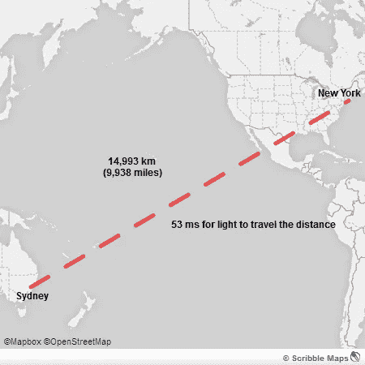

# 迁移到 HTTPS 会如何降低你的站点速度

> 原文：<https://medium.com/hackernoon/why-migrating-your-site-to-https-may-be-a-bad-idea-9d69d8c27fca>

更新:增加了加速 HTTPS 连接的额外方法。

将你的网站迁移到 [HTTPS](https://hackernoon.com/tagged/https) 可以确保你网站的服务器和访问者之间传输的数据是加密的，因此[是安全的](https://hackernoon.com/tagged/secure)。它还允许访问者验证网站的身份，也是谷歌搜索引擎中的一个积极的排名因素。

当你访问一个 HTTPS 网站时，会有一个额外的握手来建立安全连接。握手包括两次完整的往返，因此数据需要在访问者位置和网站服务器位置之间传输 4 倍的距离。

如果访问者的位置靠近站点的服务器，这两个完整的往返是没问题的，但是对于远离站点服务器的访问者来说，这就成了一个问题。

即使光在真空中以最快的速度传播(299，792，458 米/秒)，也需要 **212 毫秒** (53 毫秒 x 4) 才能在澳大利亚悉尼的服务器和纽约的访问者之间建立安全连接。但是这一时间并没有考虑到光通过光缆、路由时速度的降低，以及验证 SSL 证书和计算主密钥所需的时间。通过使用 webpagetest.org，我发现纽约的访问者需要大约 500 毫秒才能与澳大利亚悉尼的服务器建立安全连接。

额外的半秒钟来建立一个安全的连接将会给你的用户带来糟糕的浏览体验，这可能会导致流量和收入的下降。亚马逊表示，每 100 毫秒的延迟会让他们损失 1%的销售额。谷歌还注意到，半秒钟的延迟会导致 20%的流量下降。因此，这额外的 500 ms 延迟会产生重大影响。

## 我们如何减少建立安全连接的时间？

TLS 错误启动和 TLS 会话恢复是 TLS 的扩展，可以帮助减少新访客和回头客的往返行程。但在我们的示例中，这仍然导致了 250 毫秒的显著延迟。您的服务器需要支持 ALPN 和转发保密密码套件，以支持大多数浏览器中的 TLS 错误启动。

有没有办法进一步缩短这个时间？最合理的方法是确保你的服务器靠近你的访问者，因为这将减少往返时间。最简单的方法是使用 CDN edge 终止靠近访问者的 TLS 连接，但这意味着在 CDN edge 和站点服务器之间传输的数据是未加密的，因此不安全。另一种方法是在离你的访问者更近的地方建立网络服务器，但是如果你的站点接收来自世界各地的流量，在每个大洲都建立服务器可能不是一个可行的解决方案。

有没有什么正在进行的工作将有助于加快 HTTPS？TLS 1.3 是 TLS 协议的最新版本，更安全、更快速。TLS 1.3 为新连接引入了单次往返握手。它还允许之前访问过该网站的访问者在第一条消息中发送加密数据，这被称为 0-RTT(零往返)。由于 TLS 1.3 相对较新，它只在浏览器的开发版本中可用，默认情况下不启用。

将您的网站迁移到 HTTPS 有很大的好处，但您需要意识到它可能带来的额外延迟，尤其是对于远离您的服务器的访问者。

> [黑客中午](http://bit.ly/Hackernoon)是黑客如何开始他们的下午。我们是 [@AMI](http://bit.ly/atAMIatAMI) 家庭的一员。我们现在[接受投稿](http://bit.ly/hackernoonsubmission)，并乐意[讨论广告&赞助](mailto:partners@amipublications.com)机会。
> 
> 如果你喜欢这个故事，我们推荐你阅读我们的[最新科技故事](http://bit.ly/hackernoonlatestt)和[趋势科技故事](https://hackernoon.com/trending)。直到下一次，不要把世界的现实想当然！

