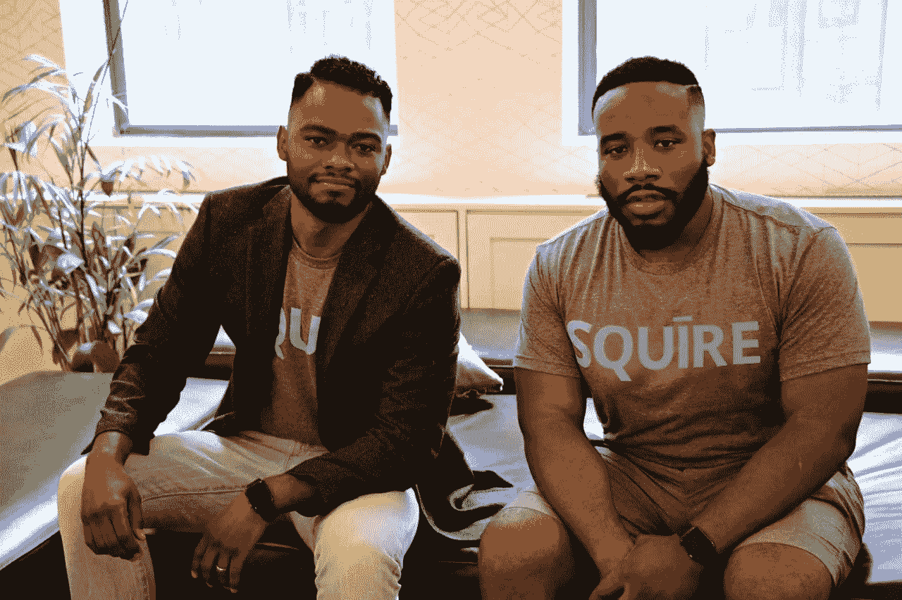
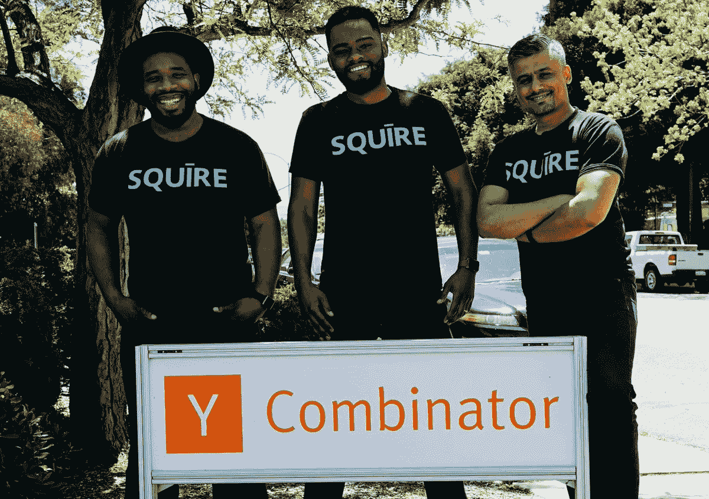

# 为什么更多的少数族裔创始人应该申请 Y Combinator

> 原文：<https://medium.com/hackernoon/why-more-minority-founders-should-apply-to-y-combinator-7e51208ea989>

Y Combinator 正在寻求增加[科技](https://hackernoon.com/tagged/technology)的多样性。这就是我们决定申请的原因。

我是戴夫·萨尔万特，[乡绅](https://www.getsquire.com/)的联合创始人兼总裁。我们公司在 2016 年夏季批次期间通过 Y Combinator。Squire 将人们与伟大的理发师联系起来。

我们生活在一个多样化的世界。我们需要服务于各行各业的产品和解决方案。我们需要多元化的创始人来创建这些公司。在最近的《纽约客》关于 YC 总统山姆·奥特曼的简介中，YC 大学校友塞巴斯蒂安·沃林说，“YC 提供了进入硅谷的即时入口——尽管硅谷有精英主义的言论，但通常需要同事的‘热情介绍’，而这位同事通常是白人。”

Y Combinator 品牌拥有 1，300 多家校友公司，总市值超过 800 亿美元，在硅谷举足轻重。Airbnb、Dropbox 和 Stripe 等公司都经历了这个项目，并表示 YC 对他们的成功至关重要。YC 是一个家庭。他们让你接触到你原本无法接触到的网络、关系和资源——尤其是如果你是一个少数族裔创始人的话。

像许多公司一样，Squire 也是从这里起步的。我的联合创始人 Songe LaRon 和我有同样的问题——每隔几周我们就要去理发，我们要么打电话要么发短信给理发师预约。或者更糟的是，我们不得不冒个险出现。

首先，我们认为这是非洲裔美国人特有的问题，但在和我们所有的朋友交谈后，我们很快意识到每个男人都经历过这个问题。忙碌的男人不想给理发店打电话或发短信，也不想花时间在那里等着。确保你有现金支付是一件痛苦的事。

Songe 和我想，我们可以按下按钮支付食物，为什么我们不能支付理发的费用呢？2015 年 1 月，我们决定实现这一飞跃，并开始开发一款产品来全职解决这一问题。我离开了商学院，桑格辞去了公司律师的工作。

2015 年冬天很难熬。每隔一周，我都感觉自己的牙齿被踢掉了。从外包的技术噩梦，到面临被驱逐，再到身无分文(准确地说，大约两个月内损失了 337 美元)。然后，事情开始发生变化。老实说，我们很幸运。事实上，运气——纯粹偶然发生的好事的概念——是许多成功的创业公司/公司故事的很大一部分。认识正确的人，在正确的时间出现在正确的地方，意味着和做的比你想象的更多。我们在第三位联合创始人兼首席技术官 Yas Tabasam 在纽约的第一次见面会上见到了他，接下来的一个月，我们将 Squire 投给了 [WeWork](http://wework.com) 的创始人/高管，并获得了一轮天使投资，金额仅略高于线框。这对一家由少数人主导的科技公司来说极为罕见。

YC 资助伟大的创始人。我们申请了三次，通过了 YC 奖学金项目，最终被录取了。YC 让你专注于重要的事情。在 YC 期间，我们的销售额和收入平均每周增长 26%。如果你对申请持观望态度，正如 YC 核心公司的新任首席执行官迈克尔·赛贝尔所说，“就申请吧。”

如今，YC 的少数族裔创业者越来越多。我已经建立了一个名为“YCFOC”的内部小组，Y Combinator Color 的创始人。我们希望有更多的人加入我们。

申请截止日期已过，但 YC 接受迟到的[申请人](https://www.ycombinator.com/apply/)。我想给你们留下两句对我和我的团队有特殊意义的话。第一句是韦恩·格雷兹基说的——“你没有出手的时候，你会错过 100%。”第二个是马克·扎克伯格的“最大的风险是不冒险。”

祝你好运。

特别感谢 Songe LaRon，Yas Tabasam，Kevin Hale，Michael Seibel，Sam Altman，合撒儿 Younis，Kat Manalac，Justin Kan，Jesse Middleton，Matt Shampine，Blake Chandlee，Adam Nuemann，Devon Drew，以及一路上支持我的家人和朋友。

> [黑客中午](http://bit.ly/Hackernoon)是黑客如何开始他们的下午。我们是 [@AMI](http://bit.ly/atAMIatAMI) 家庭的一员。我们现在[接受投稿](http://bit.ly/hackernoonsubmission)并乐意[讨论广告&赞助](mailto:partners@amipublications.com)机会。
> 
> 如果你喜欢这个故事，我们推荐你阅读我们的[最新科技故事](http://bit.ly/hackernoonlatestt)和[趋势科技故事](https://hackernoon.com/trending)。直到下一次，不要把世界的现实想当然！

