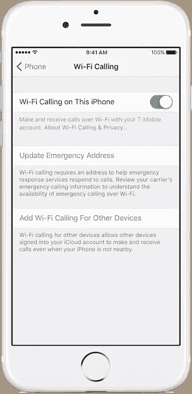

# 为什么大多数 Apple Watch 用户不会在上面获得 LTE 通话(以及为什么有些人会)。

> 原文：<https://medium.com/hackernoon/why-most-apple-watch-users-will-not-get-lte-calls-on-it-and-why-some-will-2e7a39aad379>

## 对于没有手机的用户来说，通信是一个很大的问题，但是苹果自己无法解决这个问题

[所有证据都指向苹果本周宣布 LTE Apple Watch】，以及](https://techcrunch.com/2017/09/09/the-next-apple-watch-will-have-lte-cell-service/)[正如我在之前的帖子](https://hackernoon.com/the-lte-apple-watch-virtuous-cycle-for-a-new-ecosystem-a9211c608f54)中所讨论的，增加独立连接可能是让该设备成为 iPhone 之外的新应用生态系统中心的关键因素。[我还提到过](https://hackernoon.com/the-lte-apple-watch-new-value-and-new-applications-fcbf8cfc77c5)要实现这一点，还应该支持某种类型的通话，这样它就能为人们提供足够的价值，让他们“不用电话”就能使用它，但这最初必须基于 FaceTime audio:

> Apple Watch 的开箱即用体验将仅限于 iMessage 和 FaceTime 音频，但**我们也可以预计一些运营商将扩展其当前的多设备产品，以包括 Apple Watch 通话和文本**。

[新文章反映了这一点](https://www.macrumors.com/2017/08/16/apple-watch-3-no-direct-phone-calls/)，证实了常规通话最初在支持蜂窝功能的[苹果](https://hackernoon.com/tagged/apple)手表上无法工作的预期:

> 不过，这款手表可以支持 FaceTime 和 Skype 等 VoIP 服务，因为目前的 Apple Watch 型号已经支持 FaceTime 音频通话。

鉴于目前的 WatchOS SDKs 和 API 不支持 VoIP 应用程序，我预计发布时将只提供 FaceTime 音频。但也有可能苹果正在与选定的合作伙伴合作，为他们提供一些功能的早期访问，以便更多的应用程序准备推出。[不要指望 WhatsApp 会出现，尽管](https://hackernoon.com/i-s-multidevice-the-achilles-heel-for-whatsapp-1ac91c3edf07)。

但是在“常规通话”方面，[其他一些帖子](http://mashable.com/2017/09/09/apple-watch-lte-new-colors/#TkvYO9Ax9iqV)想知道为什么苹果不解决这个问题，因为这可能是一个相关且有用的功能:

> 很难想象库克测试这款设备超过两年，却没有游说增加一个强大的功能，比如打电话的能力。

答案是，**苹果无法在不与电信运营商合作的情况下解决这个问题，**几乎是一对一的合作。

# 为什么苹果手表不能接电话

对此的主要论点是**LTE 网络不支持常规语音通话。**我不打算在这里赘述细节，因为[我已经在之前的文章](/@jorge.serna/how-volte-makes-whatsapp-calls-better-fcb324a94fd0)中讨论过这个话题，但是部署了 4G (LTE)网络的运营商还必须做额外的工作来支持语音通话。它需要安装和集成特定的系统来支持 VoLTE(LTE 语音)服务，这是大多数运营商还没有做到的。目前只有一小部分 4G 运营商支持 VoLTE，去年的数据显示只有五分之一的运营商支持 VoLTE。

但要在 Apple Watch 中支持正确体验的通话，即使用 iPhone 中已有的相同电话号码，不仅需要 [VoLTE](https://hackernoon.com/tagged/volte) ，还需要运营商的“多设备”支持。

这意味着**您的运营商在其网络中需要一些其他系统，以便使用您的电话或手表(或其他设备)拨打的电话显示在您的同一 id(您的电话号码)下，并根据您的同一计划占用几分钟时间，并且到达您号码的电话可以在这两个设备(或更多设备)中同时振铃。**

为了管理所有这些，苹果公司提供了一个框架，用于在多个苹果设备中进行呼叫，这些设备的“ [Wi-Fi 在支持的 iCloud 连接的设备上进行呼叫](https://9to5mac.com/2017/01/25/ios-10-3-wi-fi-calling-icloud-verizon/)”。这使得拨打现有号码的电话可以通过 Wi-Fi 在你的 iPad、Mac 甚至 Apple Watch 上振铃，即使你的手机关机。但这项服务并不是苹果一家提供的:它需要运营商的支持和整合，运营商反过来以不同的方式营销这项功能，比如 AT & T 使用 [*NumberSync*](https://m.att.com/shopmobile/wireless/features/numbersync-Android.html) 品牌。

请注意，这个功能不同于苹果所谓的“[连续性](https://support.apple.com/en-us/HT204681)”，当你的设备彼此靠近时，它允许通话“*”。如果重点是能够不带手机，这对 LTE 手表就不起作用了，对吗？这就是为什么在 iPhone 设置中会以这种方式显示:*

注意到“*即使你的 iPhone 不在附近*”？

将这一功能扩展到 Apple Watch 的 LTE 上(因为它已经可以在 Wi-Fi 上工作)将非常简单，为了简化设置，我预计苹果将需要支持这一框架，以便在 Apple Watch 上实现 LTE 语音通话。

但是，尽管苹果的多设备在美国的大运营商中可用，但目前很少有其他国家支持它(亚洲的几个运营商在 T2，拉丁美洲的运营商在 T4，在欧洲没有运营商)。这反映出这不是一件容易实现的事情，新运营商不太可能在本周的发布中采用这种方式。

# 为什么一些运营商可能会支持它们，但无论如何也不会这样做

虽然在 LTE 上使用相同的 Wi-Fi 通话解决方案可以在 Apple Watch 上工作，但这不是运营商的“标准”方法。

[Wi-Fi 通话技术解决方案](https://en.wikipedia.org/wiki/Generic_Access_Network)是专门定义的，以便手机可以通过“第三方”连接获得通话服务。这是一种(不一定)由运营商自身提供的连接，正因为如此，它涉及一些系统来保护在使用 LTE 网络时不需要的接入。

这可能听起来像是在 LTE 数据接入中使用 Wi-Fi 呼叫功能会更复杂，但实际上正好相反:Wi-Fi 呼叫解决方案已经在工作，将 LTE 视为“另一个 Wi-Fi 接入”是显而易见的，而“好”的解决方案需要在 VoTLE 中针对多设备网络服务和身份管理方面进行额外的工作。因此，如果运营商的技术团队专注于为 Apple Watch 上的 VoLTE 通话提供“正确”的模式，那么这将比仅仅使用他们现有的 Wi-Fi 通话更加复杂(无论是时间还是资源)。

最重要的是，可能会有人担心掉线，因为 LTE 的覆盖通常([但不总是](http://www.techradar.com/news/phone-and-communications/mobile-phones/three-beats-rivals-to-improved-coverage-with-4g-super-voice-1304245))比 3G/2G 差。手机中的常规 VoLTE 支持允许在 4G 和 3G/2G 信号之间切换电话，但在只有 4G 的 Apple Watch 中，如果用户退出 LTE 信号，这些电话就会掉线(电话可能会继续进入 Wi-Fi，但这是不太可能的情况)。

我个人认为，可能掉线的电话总比没有电话好，但是在电信运营商的一些部门，仍然存在掉线的 KPI，他们不同意我的观点。

所以两个维度加在一起:

*   不是“标准”方法
*   掉线造成的质量问题

可能会阻止某些运营商的服务。

# 苹果能做点别的吗？

当然，为了确保运营商更广泛的支持，苹果可以在 Apple Watch 中添加 3G 和 2G 支持。但我相信他们不会，因为:

*   对于 Apple Watch 的技术堆栈(硬件和软件)来说，这将使解决方案变得更加复杂，基本上只是为了实现电话呼叫(这很重要，但还没有到影响产品发布的地步)。
*   这不会真正简化运营商的解决方案，因为他们仍然需要支持 4G 的 VoLTE，以及其他支持 3G/2G 呼叫的解决方案。[传统的 MultiSIM 服务会做到这一点](http://www.movistar.es/particulares/movil/servicios/ficha/res-multisim)，虽然它们会“工作”,但它们会提供更差的体验(与苹果的框架分离，设备之间的切换和重复通知将更难解决)，并使电信公司自己实施的解决方案更加复杂。即使运营商想走这条路，苹果可能也不想参与讨论。
*   这是在回顾过去，我相信，对于手表来说，苹果更关注未来。

是的，支持 3G 将使他们能够在更多市场推出蜂窝手表，因为 LTE 在许多国家(特别是拉丁美洲或非洲)的覆盖范围仍然相对较小，并且集中在大城市。但对于手表旨在实现的无手机休闲用途来说，这可能并不重要。

事实上，由于我认为手表将不会有物理 SIM 而是 eSIM，供应过程(用户将手表 LTE 线路与他们的主要 iPhone 线路相关联必须遵循的步骤)也将需要与运营商的系统进行额外的集成，这可能与今天苹果 SIM 在 LTE iPads 上的工作方式类似。由于该系列不会是独立的，而是与一款主要的 iPhone 相关联，我还预计它对客户来说是一个相对便宜的额外计划，符合家庭和多设备计划的现有方法。

这限制了合适的运营商数量以及苹果将考虑与之进行整合的运营商数量，这意味着只有少数几家运营商将在发布时支持 LTE Apple Watch。我相信 LTE Apple Watch 将于 2017 年在美国上市，并且只有少数几家运营商。甚至可能只有一个，并将其作为独家发布，就像最初的 iPhone(与 AT & T)或 Wi-Fi 通话功能(与 T Mobile)一样。

鉴于苹果最近在新技术努力中面临的供应问题，[正如他们的 AirPods 限制](https://9to5mac.com/2017/08/01/airpods-production-capacity-increase/)所示，限制目标市场可以帮助他们应对需求(并因稀缺而产生额外的宣传)。这也将为所有运营商赢得时间，继续扩大他们的 4G 覆盖范围，这样 3G 支持就变得越来越不重要。

# 我所期待的

考虑到所有这些因素，让我们冒险做一个小小的预测，看看本周晚些时候我的预测是否正确:

*   是的，**将会有一款 LTE 苹果手表在本周宣布** k【几率:非常高】
*   今年它将只在美国上市【赔率:高】
*   **它不支持大多数运营商的常规电话(或短信)**【几率:非常高】
*   **但他们会有一些选定的运营商提供通话服务**【赔率:中等】
*   如果只有一家运营商，那将是美国电话电报公司，因为将它与 NumberSync 联系起来会使向市场传递的信息更简单，他们是目前提供关于通过 Wi-Fi 使用 Apple Watch 打电话的信息最多的运营商(相比之下，其他运营商没有提供任何信息，或者暗示在设备列表中提到该手表，但没有提供更多细节)，并且因为该活动将追溯到最初的 iPhone 发布 10 周年纪念日(新 iPhone 使用罗马数字 10:[iPhone X](https://www.theverge.com/2017/9/9/16280688/apple-iphone-x-rumor)[)回到他们在最初发布时的合作伙伴那里可能会很好。[赔率:低/纯粹无根据的猜测]](https://www.theverge.com/2017/9/9/16280688/apple-iphone-x-rumor)

**因此，总体而言，只有一小部分 Apple Watch 用户能够获得 LTE 版本，而能够用它打电话的人就更少了。**

然后，运营商将与苹果合作，在他们的网络中实现这些功能(LTE Watch eSIM 支持和通话)，但**除非他们尽快做到这一点，否则这将变得越来越无关紧要，** [**因为其他 VoIP 应用程序(Skype、Telegram、WhatsApp……)将首先提供语音**](https://hackernoon.com/the-lte-apple-watch-new-value-and-new-applications-fcbf8cfc77c5) **，对运营商语音的需求将随着时间的推移而下降。**

**更新:**所以最后苹果确实推出了 LTE Apple Watch，而且确实有通话，而且只有部分运营商提供……但这里面还是有些惊喜的。[看看我的新文章](https://hackernoon.com/so-in-the-end-the-lte-apple-watch-is-about-calls-29dcdf59be0a)，看看它如何影响创造新生态系统的能力。