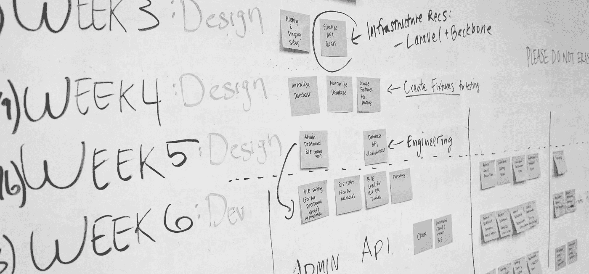
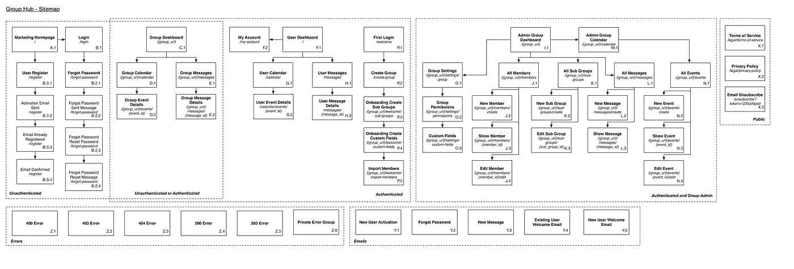

# 为什么我的创业几乎失败…

> 原文：<https://medium.com/hackernoon/why-my-startup-nearly-failed-778b1a04f762>

就在两年前，我创建了一个名为 [Group Hub](https://www.grouphub.co.uk) 的在线空间，为团体、俱乐部和社团提供服务。我认为公平地说，在这段时间里，它经历了起起落落。特别是，在过去的几个月里，增长微乎其微——事实上，我承认没有人真正按照预期使用这个平台。那么，哪里出了问题？我决定写一些我在过去几年里学到的教训，希望它们能帮助别人。

在开始之前，我想澄清一点——Group Hub 并没有死。它肯定不在一个好地方，但我坚信它有一个未来。

# 不关注产品

任何熟悉初创公司的人都会知道创造一个最小可行产品(MVP)的重要性——我知道我确实做到了。因此，我很惭愧地承认，我跳过了这一重要步骤。并不是说我认为我更了解。事实上，我认为我创造了一个 MVP。回过头来看，我不知道许多功能是从哪里来的——它们肯定不是根据用户反馈添加的。我最终创建的是一个功能大杂烩，其中许多功能在技术上很复杂，并且隐藏在视图之外。在一个 MVP 中，曾经有超过 80 个不同的网页！当你需要一台大幅面打印机来打印一张完整的网站地图时，你就知道有些地方出了问题。

MVP Sitemap — at one time it was double this size!

我发现更令人惊讶的是，我曾建议其他创业公司创建一个 MVP，但我却无法给自己建议。我想这表明了让别人挑战你的决定的重要性。

我的背景是技术(我有计算机工程硕士学位)，因此我很清楚不要把重点放在业务的技术方面。我记得在某处读到过，创始人应该把大约 50%的时间放在营销上，而不仅仅是专注于开发产品。我认为我把这个建议看得太重了，我会花几个小时专注于营销，以抵消花在编程上的无数时间。一直以来，完全忽略产品，获取用户反馈。

回想起来，我很慢才意识到这是 Group Hub 的主要问题。我只是认为我的营销努力没有达到标准。例如，我会创建一个演示视频，而不是理解潜在的问题。我也会因为害怕负面反馈而推迟与潜在客户的谈话。

> 在关注开发和营销时，不要忘记产品

# 构建可扩展的平台

同样，如果有启动手册，它肯定会警告不要过早扩展。在很多方面，我认为成为一家自举式创业公司意味着我可以不受这条规则的约束。只要我没烧太多钱，有什么问题？

正如我之前提到的，我的背景是技术。过去，我曾与高增长的初创公司合作，知道如何设计和构建可扩展的平台。我很自然地想到，如果我自己的创业公司因为一个技术问题而下线，那将会非常尴尬。因此，从第一天开始，我就着手创建一个可以扩展到数百万用户的平台。显然，这样的解决方案是昂贵的，但幸运的是，亚马逊网络服务提供了数千美元的免费信贷来拯救我们。因此，我看不出构建一个可扩展的平台有什么问题——毕竟，这是我希望发生的事情。我为什么要对冲免费赌注？事实证明，答案和为什么大公司努力创新是一样的——有很多多余的行李。不要误解我的意思，你可以创建一个大型的敏捷创业公司——你只是不能用一个人来完成。结果是，即使是很小的变化也会变得复杂，这与敏捷创业完全相反。*从好的方面来看，Group Hub 自推出以来从未出现过任何停机时间:)*

> 在拥有付费客户之前，快速迭代总是比规模化更重要

# 没有合适的人

作为一名单枪匹马的创始人，我必须身兼数职。有时候我会写代码，第二天我会拍视频。很明显，我知道没有其他人我无法发展公司，但我同样知道钱是有限的。我的时间变成了一种持续的杂耍行为，优先处理一些事情而损害其他事情。

我认为我有这个问题的完美答案——我会付钱给人们去做琐碎的工作，与昂贵的软件开发相比，这些工作是廉价的。我现在意识到这是错误的方法。

我突然开始管理更多完全依赖我的指示的人。以前，如果我把一项任务推迟几天，我是唯一受影响的人——现在其他人都在等待。我也完全低估了编写说明所需的时间——在某些情况下，自己完成任务可能会更快。

我现在意识到我需要有决策权的人。我应该付钱给他们解决一个问题，而不是为一个特定的任务付钱给某人。

> 付钱给人是为了解决问题，而不是为了特定的任务

# 令人困惑的收入模式

在我看来，首要目标是让人们使用这个平台——收入模式的决定可能会晚一些。虽然我坚信对大多数初创公司进行详细的财务预测是完全没有意义的(除了取悦投资者)，但我需要向最初的用户更清楚地说明未来的计划是什么。

我假设有一个免费的产品会导致人们蜂拥使用它。根据反馈，我发现这实际上会产生相反的效果。消费者不傻，他们知道有些东西不可能永远免费。这导致他们认为我们在出售用户的数据——需要明确的是，这永远不会是我们的收入模式。

我犯的另一个错误是对目标市场不够了解。我一直知道瞄准团体、俱乐部和社团会很困难，但我应该更早地让他们参与定价讨论。

> 消费者知道有些东西不可能永远免费——清楚地阐明你的收入模式，否则你可能会拒绝顾客

# 未来计划

虽然在这一点上，许多创始人会称之为一天，我坚信有一个真正的需要集团枢纽。该公司仍有资金和团队来实现变革。我们已经从头开始，制定了一个计划，将在接下来的几个月里执行。我对我们的未来感到兴奋，希望你能从我犯的一些错误中吸取教训。

> [黑客中午](http://bit.ly/Hackernoon)是黑客如何开始他们的下午。我们是 [@AMI](http://bit.ly/atAMIatAMI) 家庭的一员。我们现在[接受投稿](http://bit.ly/hackernoonsubmission)，并乐意[讨论广告&赞助](mailto:partners@amipublications.com)机会。
> 
> 如果你喜欢这个故事，我们推荐你阅读我们的[最新科技故事](http://bit.ly/hackernoonlatestt)和[趋势科技故事](https://hackernoon.com/trending)。直到下一次，不要把世界的现实想当然！

