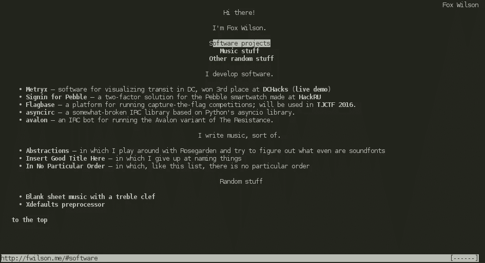
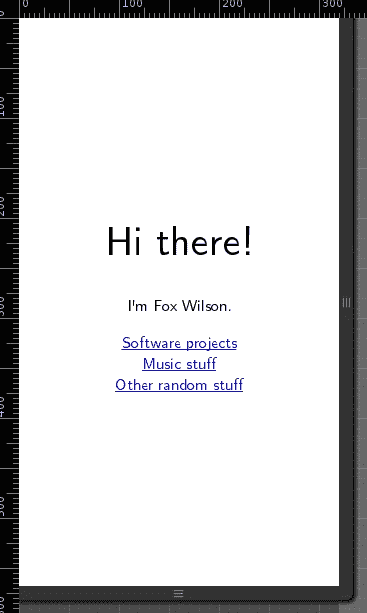
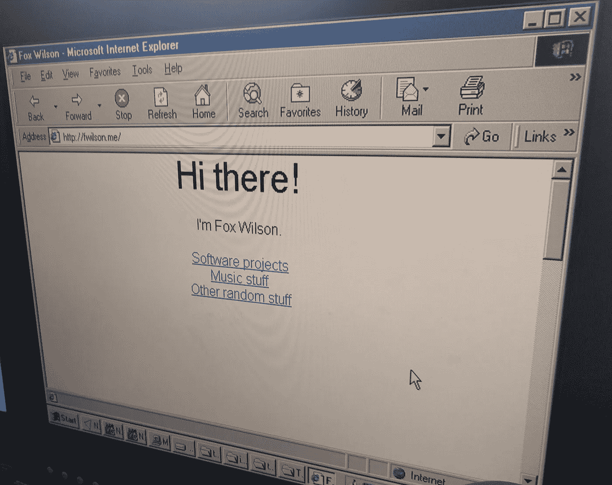

# 为什么我的网站比你的好

> 原文：<https://medium.com/hackernoon/why-my-website-is-better-than-yours-85fc643ccc2f>

我的网站比你的好。

不，真的，它是。[看看吧。](http://fwilson.me/)

它没有花哨的 CSS 动画，只有很少的 JavaScript 代码(甚至不是任何功能都需要的)，而且看起来还不错。

它使用了非常好看的字体，但是如果浏览器不支持的话，*根本不在乎。它只会退回到不太好的字体。所有的内容仍然会在那里。*

当我点击部分链接时，我不需要花哨的滚动。我不想要我的文本从屏幕两侧弹出的花哨动画(让我头疼)。即使我的网站上没有这些东西，我仍然有链接到各个部分，并且做得很好。

我有一个链接，带你回到页面顶部的导航部分。如果你的浏览器支持 position: fixed，那么它会停留在右下角。否则，它只会掉到底部。页面上唯一的 JavaScript 处理隐藏这个链接。如果您已经在导航部分，并且您的浏览器支持 JavaScript，则链接不会显示。如果你不运行脚本，那么链接将会一直存在。

我使用 CSS3 flexbox 的功能是为了清楚地表达我的想法和观点，并保持部分到屏幕的关联。猜猜如果你的浏览器不支持 flexbox 会怎么样？没什么可怕的，你只是一下子看到更多的内容。真的没什么大不了的。

没有任何图像。唯一不是文本的资源是我使用的字体。这意味着我的页面加载和显示*真的很快。整个网站现在有 81.4KB，其中 76.8KB 是字体，这甚至不是正确显示所需要的。只是看起来不错。*

那是什么意思？这意味着我的网站将在*上显示任何内容。我很确定你可以得到一个带屏幕和互联网连接的土豆，它仍然会显示。可能是正确的。*

也是[完全有效的 HTML5](https://validator.w3.org/nu/?doc=http%3A%2F%2Ffwilson.me%2F) 。CSS 也是如此。这个网站在任何支持 HTML5/CSS3 标准的东西上都可以完美显示，在其他任何东西上，它都会优雅地后退。

这是它在 elinks 中的样子。这就是我所说的“优雅地撤退”的意思即使在除了文本什么都没有的环境中，这个东西仍然显示网站的所有内容，并且网站仍然是完全功能性的。

你想要移动支持？我也有。

你想要 Windows NT 支持的 Internet Explorer 5 吗？是的，我也有。

是的，没错。我做了一个网站，很多人称之为“响应式设计”,同时让它在 elinks 中工作。而且速度也很快。

我做到了，没有那些令人头痛的动画。

*你*能说说关于*你的*网站的所有事情吗？

大概不会。

编辑:让我澄清一下:我不是想说设计不重要。设计绝对非常重要。我想说的是，网站需要快速，并为那些仍在使用 IE6 的人提供某种退路。这正是很多网络所缺少的。

> [黑客中午](http://bit.ly/Hackernoon)是黑客如何开始他们的下午。我们是 [@AMI](http://bit.ly/atAMIatAMI) 家庭的一员。我们现在[接受投稿](http://bit.ly/hackernoonsubmission)并乐意[讨论广告&赞助](mailto:partners@amipublications.com)机会。
> 
> 如果你喜欢这个故事，我们推荐你阅读我们的[最新科技故事](http://bit.ly/hackernoonlatestt)和[趋势科技故事](https://hackernoon.com/trending)。直到下一次，不要把世界的现实想当然！

