# 为什么原生应用开发者应该认真看待 Flutter

> 原文：<https://medium.com/hackernoon/why-native-app-developers-should-take-a-serious-look-at-flutter-e97361a1c073>

在我开始之前，如果你还没有听说过， [Flutter](https://flutter.io/) 是一个应用 SDK(由谷歌支持)，用于构建“*现代移动应用*”。它仍然处于 alpha 阶段，但是有很好的文档和工具，一些生产应用已经发布。

我是一个业余爱好的开发者，最近我自己也用 Flutter 推出了一个 app。这是一次如此愉快的经历，以至于我*有*来分享我为什么如此喜欢它。

## 一点背景故事…

我做的这个 app(名为 [Chips of Fury](http://chipsoffury.com) )是一个虚拟扑克筹码 app(现在在 [Play store](https://play.google.com/store/apps/details?id=com.kanily.chipsoffury) 和 [App store](https://itunes.apple.com/WebObjects/MZStore.woa/wa/viewSoftware?id=1292493748&mt=8) 上线)。这是当你想和朋友玩扑克(或任何其他纸牌游戏)，但没有可用的扑克筹码的时候。因此，这是一个不平凡的多玩家应用程序，它需要在玩家玩回合时在所有设备之间实时同步，并具有大量自定义 UI 元素。

我花了大约 1.5 个月的时间来编写端到端的“愤怒的芯片”，包括我学习 Flutter 的时间。在我之前尝试推出这款应用时，我尝试过用 Android/Java 和 iOS/Swift 编写原生应用，但都以不同的完成程度离开了它们。我就是无法让他们达到“足以上市”的阶段。原因主要是无聊，做一个人完成一个项目需要做的单调工作。因此，Flutter 不仅帮助我快速构建，更重要的是，它帮助我实际完成。太有趣了！不用说，我现在是旋舞迷了。

## 那么是不是像 React Native？

我在 5-6 个月前偶然发现了 Flutter，当时我已经将它加入了书签，准备在未来的一个周末进行黑客活动。当时我没有深究太多细节，只是在心里把它归为与 [React Native](https://facebook.github.io/react-native/) 相同的类别。

粗略地看一下，React 本机比较非常明显。但是在思想层面上，与 RN 的相似之处始于并止于反应式编程模型。依我看，Flutter 在它所实现的理念方面实现了跨越式的发展。澄清一下，我只尝试过几次使用 React，主要是为了学习。所以我不打算比较颤振和反应。事实上，我有一种感觉，大多数开发者并没有足够认真地看待 Flutter，因为这种想法与 RN 背道而驰。

我的目标是试图说服本地应用程序开发人员(iOS/Swift/ObjC 或 Android/Java/Kotlin)认真看待旋舞。同样的代码可以在安卓和 iOS 上运行，这可以说是“T0”而不是“T1”的最大原因，这也是为什么颤振会给你留下最深刻的印象。无需赘述，以下是我认为扑动是应用程序开发的未来的原因。听好了哟！

# 1.都是达特干的

[镖](https://www.dartlang.org/)什么？😕。当我向其他开发人员谈论颤振时，这是一个常见的反应。老实说，与斯威夫特或柯特林相比,[飞镖(T5)在句法上没有太大优势。](https://www.dartlang.org/)

然而，我只是想强调这一点，因为我认为谷歌低估了有多少开发人员，当他们认为他们必须学习一种新的语言时，并没有尝试一种新的工具。如此之多，以至于即使它在技术上更优越也没关系。

所以在 Dart 的辩护中**，这是一种简单的学习语言，不太可能对尝试 flippet out 起到威慑作用。看看 Dart 中的这个示例类。**

```
**class** Vehicle {
  **final** int numberOfWheels;
  **final** double mileage;
  **final** double horsePower;

  int speed = 0;

  Vehicle(**this**.numberOfWheels, **this**.mileage, **this**.horsePower);

  **void** accelerate() {
    speed = speed + 1;
  }

  **void** decelerate() {
    speed = speed - 1;
  }

  **void** brake() {
    speed = 0;
  }
}
```

**正如您所看到的，使用类似于大多数流行的面向对象语言的语法阅读是非常简单的。当然，有一些特定语言的语法糖，一旦你学会了语言，你就可以开始编写更简洁的代码，但我的观点是，学习曲线相当小。**

**事实上，如果你没有尝试过斯威夫特/科特林，那么飞镖可能是一个很好的选择。**

****为旋舞辩护**:谷歌/旋舞有[充分的理由选择飞镖](https://flutter.io/faq/#why-did-flutter-choose-to-use-dart)。颤振的工作方式是，它需要非常快速地创建和破坏大量的短命物体。Dart 的“垃圾收集”非常适合这种用例。这也表现在可以使用颤振构建的应用程序的性能上。**

**所以，假设你不会因为 Dart 而取消旋舞，让我继续。**

# **2.这一切都是灾难援助计划——第二部分**

**如果您为安卓或 iOS 开发应用程序，以下集成开发环境工作流是常见的-**

**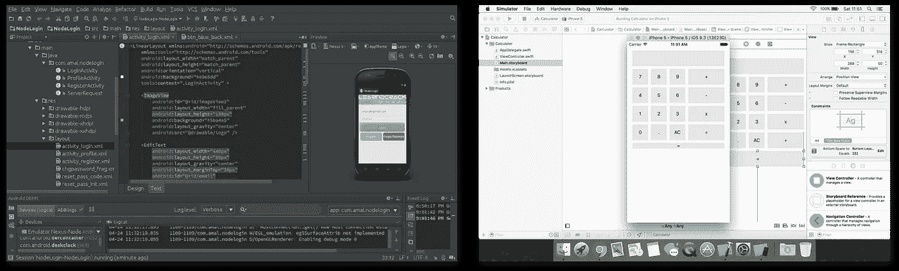**

**Android Studio / XCode development flow when building screen layouts**

**你可能也熟悉标记，比如下面这些-**

**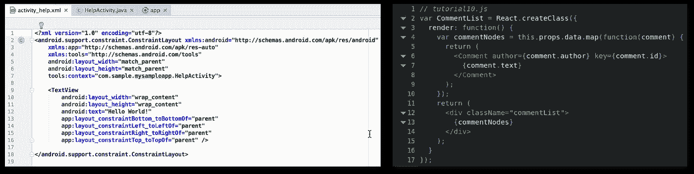**

**Layout XML’s / JSX (React native)**

**在颤振中，布局仅使用 Dart 代码定义。没有 XML /模板语言。也没有视觉设计师/故事板工具。**

**我的直觉是，一听到这个，你们中的一些人甚至会有点畏缩。从表面上看，这也是我的反应。使用可视化工具进行布局不是更容易吗？在代码中编写各种约束逻辑不会使事情变得过于复杂吗？**

**我的答案是**不**。孩子！真是令人大开眼界。让我试着证明一下。**

**首先..遇见先生**热重装**。**

**这是一个并列的应用程序代码和模拟器的例子。这是一个完全自定义的布局，有一个顶部和底部的酒吧和一个内容的中间容器。你看到的代码就是运行 app 所需的 _whole_ code。**

**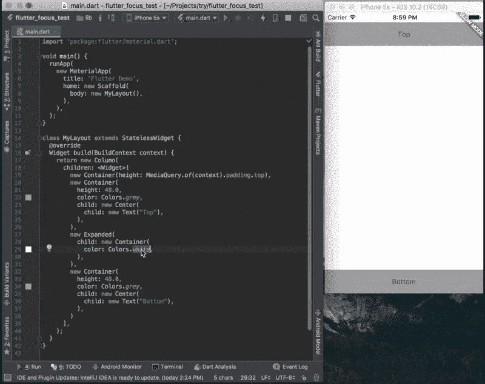**

**没有单独的布局 xml，没有 xib 文件等。你对代码所做的修改可以被**立即热重装**。热重新加载甚至可以保留您的应用程序状态，因此您甚至不必点击并到达您所在的屏幕就可以继续。我怎么强调都不为过，这比 Android 的 Instant Run 或任何类似的解决方案领先了好几光年。它只是工作，甚至在大型非平凡的应用程序。而且是疯狂的快。这就是 Dart 给你的力量。**

**实际上，这使得可视化编辑器界面变得多余。我一点也没有错过 XCode 相当不错的自动布局*。***

***因此，我用 Flutter (Dart)编写布局的效率比 Android/XCode 都高。一旦你掌握了它(对我来说，这意味着几个星期)，因为很少发生上下文切换，所以有一个实质性的开销减少。人们不必切换到设计模式，选择鼠标并开始四处点击。然后想知道某件事是否必须通过编程来完成，如何实现等等。一切都是程序化的。API 设计得非常好。它很快变得直观，并且比 auto layout / layout XMLs 提供的构造强大得多。***

# ***3.颤动是反应性的***

***如果你从未使用过反应式框架，那么这可能是一个学习曲线。API 防止以命令式的风格编码。对我来说，这需要一点时间来适应，但这是一种祝福(变相的？).***

***对于那些知道反应范式的人来说，你可以跳过这一点的其余部分。至于其他，我想用一个小例子来说明反应式风格。看看这个简单的应用程序。它显示“Hello <name>”以及用户输入的名称，并让用户选择消息的颜色。</name>***

***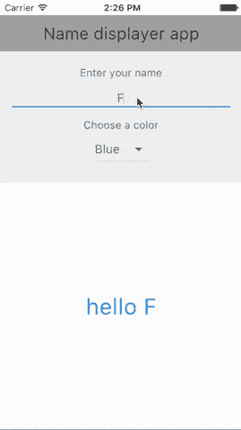***

***让我们想象一下，你将如何在原生 Android(或 iOS)中构建这样一个应用程序。因为这是一个简单的单页应用程序，所以我们将在一个活动(或 ViewController)中编写所有代码。在命令式风格中，结构看起来像这样…***

***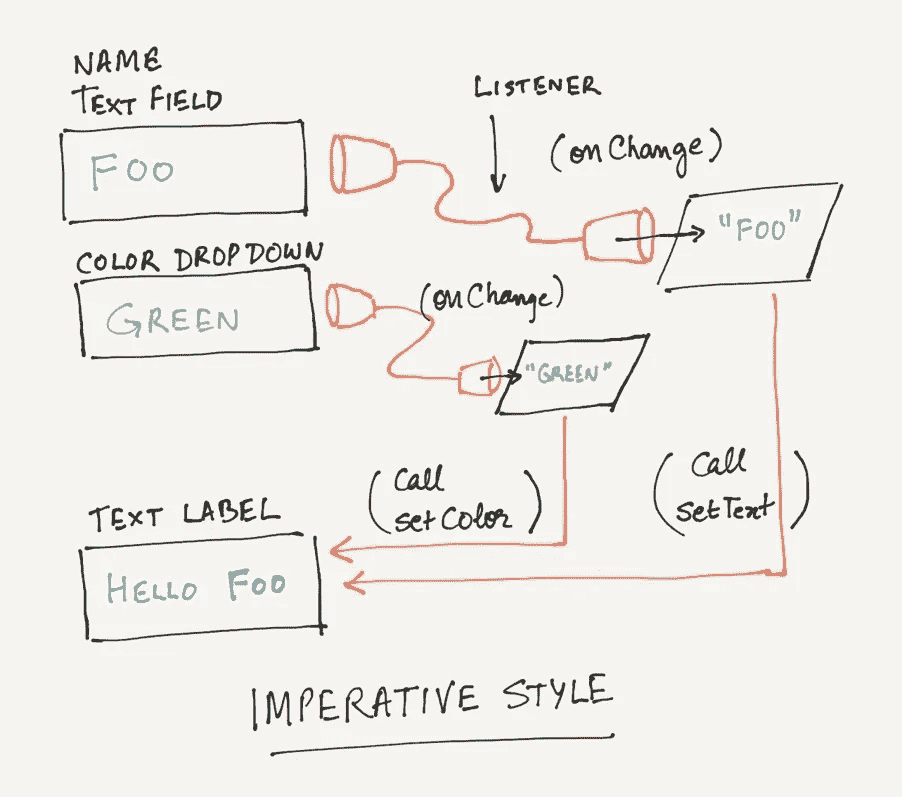***

***Imperative style of code***

*****工作原理:**将有一个监听器来跟踪文本字段和下拉列表值的变化。在更改时，我们将获得文本标签的一个实例，并调用相关的方法来更新它的值。(很可能我们会将这些值保存在一些私有实例变量中，以维护状态)***

***这意味着，在 Android 或 iOS 中一个视图的典型公共 API 中，您会发现许多不同属性的 getters 和 setters。例如，看看 Android 中 TextView 类的公共 API。由于篇幅太长，我无法在此全文转载。它有数百个方法——准确地说是 259 个，外加 4 个构造函数。***

```
*Some methods in the Android TextView.java classgetText
setText
setTextSize
length
getLineHeight
getLayout
setCompoundDrawables
setCompoundDrawablesWithIntrinsicBounds
setPadding
getTextSize
setTextSize
getLetterSpacing
setLetterSpacing
setFontFeatureSettings
setTextColor
getTextColors
getCurrentTextColor
.
.
.
.
200+ more*
```

***所以每个视图都有一些通过这些方法公开的特定属性。任何给定的小部件类型都有数十种或数百种方法，这种方法让您可以根据自己的需要定制其外观和行为。酷吧？😱***

***现在，让我们看看在反应式代码风格中，该结构可能是什么样子…***

***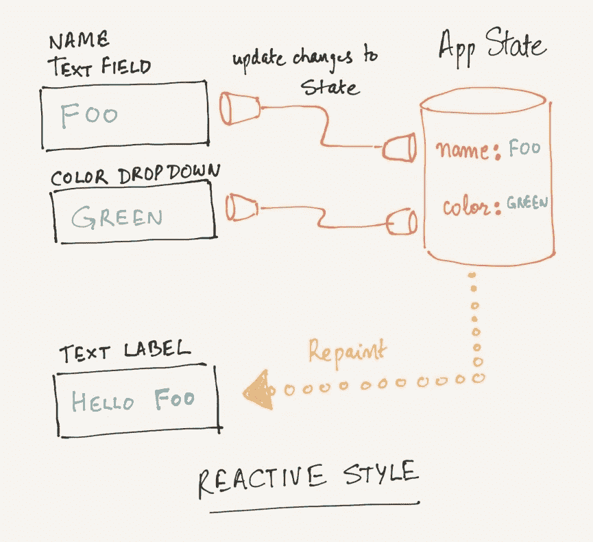***

***Reactive style of code***

*****工作原理:**将有一个监听器来跟踪文本字段和下拉列表值的变化。在改变时，我们将在“全局状态”中更新这些值，并告诉 Flutter 重新绘制。***

***Flutter 会自动计算出文本标签应该是什么样子。***

***这种编码方式有很多优点。例如，假设这个应用程序的下一个版本添加了另一个问候文本小部件，上面写着“再见”。***

> ***你好<name>。
> 拜拜<姓名>。</name>***

***现在，在命令式风格中，还需要更新侦听器来调用新的“Bye”文本小部件(或视图)上的相关 setter 方法。***

***然而，在反应式应用程序中，监听器保持不变。它们将继续更新全局状态(如前所述)。新的小部件将简单地根据状态重新绘制自己。***

***在复杂的应用程序中，这种风格的编码开始大放异彩。维护和推理要简单得多。***

***另一个优势是公共 API 被极大地简化了。虽然这也是因为 Flutter 的 Widget 架构(下一点会解释)。举例来说，看看 Flutter 中文本小部件的代码。***

```
*class Text extends StatelessWidget {const Text(this.data, {
    Key key,
    this.style,
    this.textAlign,
    this.textDirection,
    this.softWrap,
    this.overflow,
    this.textScaleFactor,
    this.maxLines,
  }) : assert(data != null),
       super(key: key);/// The text to display.
  final String data; final TextStyle style;
  final TextAlign textAlign;
  final TextDirection textDirection;
  final bool softWrap;
  final TextOverflow overflow;
  final double textScaleFactor;
  final int maxLines;[@override](http://twitter.com/override)
  Widget build(BuildContext context) {...}[@override](http://twitter.com/override)
  void debugFillProperties(DiagnosticPropertiesBuilder description {...}
}*
```

***它只有一个构造函数。仅此而已。其他两个方法将由框架调用。这是*的全部代码*，移除了注释，并从被覆盖的方法中移除了几行。是不是很优雅？部分原因是因为没有 setters 和 getters。小部件更喜欢使用它们的构造函数参数来重新构建自己，而不是使用 setters 来改变自己。***

*****反应式 vs 命令式，心态转变:*****

***我觉得如果你一直用命令式的风格编码，那么一旦你真正尝试了这种风格，它就会受到赏识💡。开始时，我花了很多时间试图弄清楚如何在一个子部件上调用一个方法来更新它的内部状态(就像我们例子中的问候标签)。我陷入了做事必不可少的心态。***

***我记得在挣扎了几天之后，是什么在我的脑海里点燃了一个灯泡。这是我在 [Flutter gitter 频道](https://gitter.im/flutter/flutter)与一位友好成员的对话。这是他的建议(重点是我的)。***

```
*@rrousselGit
**A widget shouldn't visit it's children**. It becomes messy. But you can access the state of your parents.@animeshjain
hmm ok. perhaps i'm still stuck with an imperative style of programming.@rrousselGit
**Think in immutable**. Don't update the child. Update the parent, and create a new batch of child. Once you get used to it, you realize it has a lot of advantages.*
```

***Reactive 中的架构更倾向于弄清楚如何管理状态。这值得在单独的系列文章中进行适当的讨论，因为有多种方法可以做到这一点。但是不用说，一旦我掌握了这种风格的编码，那就太棒了。仅仅从我现在已经开发了一个全功能应用的经验来说，我意识到我几乎没有花时间在副作用引起的错误上！***

# ***4.一切都是小部件***

***在前一点中，我简单地提到了 Flutter 小部件 API 是多么优雅和简洁。这一点会进一步说明。***

*****什么是 widget？*****

***对于大多数开发人员来说，小部件通常会调用呈现在屏幕上的元素的脑海画面，并封装一些行为。Android 和 iOS 对应的是各种视图类。***

***Flutter 对这一概念采取了不同/更广泛的观点，并在此过程中将其扩展到不仅仅是结构元素。小部件架构更倾向于组合而不是继承，从而使小部件更加强大和可组合(咄！).引用自 [Flutter 的文档](https://flutter.io/technical-overview/) -***

> ***小部件可以定义
> -结构元素(如按钮或菜单)
> -风格元素(如字体或配色方案)
> -布局的一个方面(如填充)
> 等等…***

***甚至一个行为也是一个小部件(像[手势检测器](https://docs.flutter.io/flutter/widgets/GestureDetector-class.html))。有一种小部件有助于状态管理( [InheritedWidget](https://docs.flutter.io/flutter/widgets/InheritedWidget-class.html) )，还有一种有助于构建动画( [AnimatedWidget](https://docs.flutter.io/flutter/widgets/AnimatedWidget-class.html) )。再次引用文献-***

> ***您还可以通过将小部件与其他小部件组合来控制小部件的*布局*。例如，要使一个小部件居中，您可以将其包装在一个居中的小部件中。有用于填充、对齐、行、列和网格的小部件。这些布局小部件没有自己的可视化表示。相反，它们的唯一目的是控制另一个小部件布局的某些方面。为了理解为什么小部件以某种方式呈现，检查相邻的小部件通常是有帮助的。***

***通过遵循“组合>继承”，小部件从原始的开始，到一些真正复杂的。例如，Flutter 提供的[容器部件](https://docs.flutter.io/flutter/widgets/Container-class.html)由许多原语组成***

***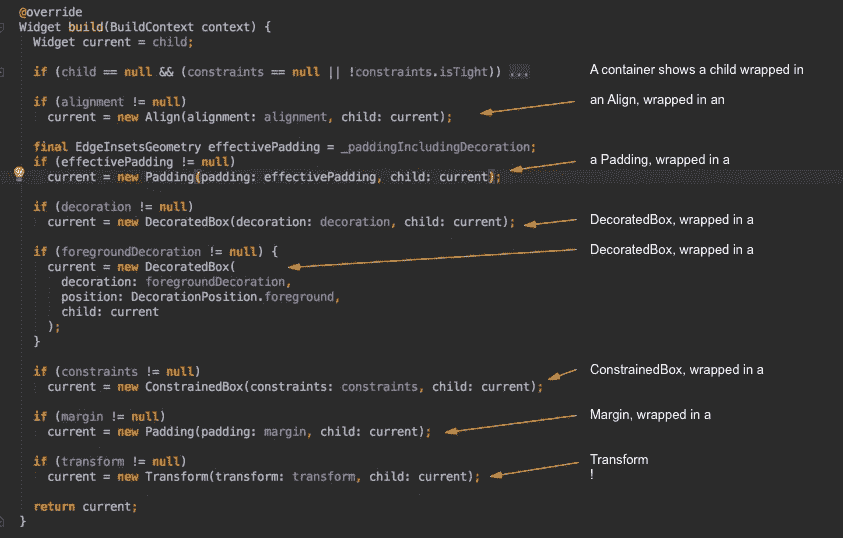***

***Container is made of upto 7 nested widgets!***

***一旦你开始建造，这种设计的独创性就会显现出来。该框架使得定制任何库存部件的外观和感觉变得非常容易，并且如果需要的话可以构建自己的外观和感觉。这使得 API 占用空间非常小。例如，每个文本小部件不需要一个叫做填充的属性。您只需用填充小部件包装文本小部件。***

***重复一遍，要记住的关键是……组成重于继承。它在 Flutter 的 API 中得到了有力的应用，并使它变得非常优雅和简单。***

# ***5.告别活动生命周期管理***

***我不确定我是否遇到过喜欢管理活动(或者片段或者视图控制器)生命周期的人。作为一个没有每天开发应用程序的人，我发现至少可以说它们很烦人，而且总的来说花费了大量的时间。***

***让一个片段在一个活动中工作，带有异步数据加载和本地状态管理，对我来说可能是一种魔法。所以我做了一个普通工程师会做的事..我复制粘贴的代码，辛苦地浏览文档，看猫的视频，试图让所有的工作和生活都变得不连贯。***

***颤动带走了所有的乐趣。***

******

# ***6.一致的 60 FPS(每秒帧数)性能***

***Flutter 应用程序编译成本机代码，因此性能非常好。事实上，我发现它比使用 Java/Swift 更适合构建类似 app 的游戏。由于它的反应性质，编写 UI 代码要干净得多。这与性能特征相结合，可能也使它成为构建游戏的有力竞争者。***

***这篇由 [@wmleler1](http://twitter.com/wmleler1) (开发者倡导者@ Google)撰写的文章很好地解释了为什么 Flutter 的渲染速度如此之快——[https://hacker noon . com/whats-revolution-about-Flutter-946915 b 09514](https://hackernoon.com/whats-revolutionary-about-flutter-946915b09514)。我将借用这篇文章，并张贴一些图表和引文，展示它的 TLDR 版本，比较三种架构——本机与反应本机与颤振。***

*****本地应用(Java/Swift)*****

***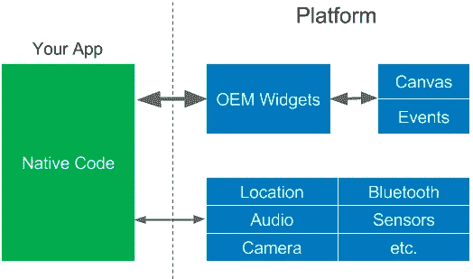***

***How native Android/iOS code interacts with the platform***

> ***你的应用程序与平台对话来创建小部件，或者访问像相机这样的服务。小部件呈现在屏幕画布上，事件传递回小部件。这是一个简单的架构，但是你几乎必须为每个平台创建单独的应用程序，因为小部件是不同的，更不用说本地语言了。***

*****React 原生应用(Javascript)*****

***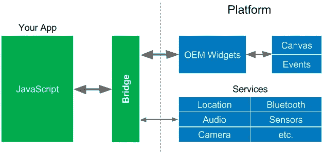***

***How React Native interacts with the platform***

> ***React Native 非常受欢迎(也理应如此)，但是因为 JavaScript 领域访问本机领域中的 OEM 小部件，所以它也必须[通过桥](/@talkol/performance-limitations-of-react-native-and-how-to-overcome-them-947630d7f440)来访问这些小部件。小部件通常被频繁访问(在动画、过渡或用户用手指在屏幕上“滑动”时，每秒钟多达 60 次)，因此这可能会导致性能问题。正如[一篇关于 React Native](/@talkol/performance-limitations-of-react-native-and-how-to-overcome-them-947630d7f440) 的文章所说:***
> 
> ***这是理解 React 本机性能的关键之一。每个领域本身都快得惊人。当我们从一个领域转移到另一个领域时，经常会出现性能瓶颈。为了构建高性能的 React 本机应用程序，我们必须尽量减少过桥次数。***

*****颤振应用程序(飞镖)*****

***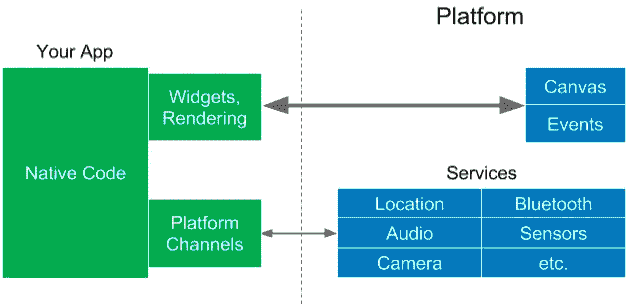***

***How Flutter interacts with the platform***

> ***Flutter 采用了一种不同的方法，通过使用编译的编程语言，即 [Dart](https://www.dartlang.org/) ，来避免由于需要 JavaScript 桥而导致的性能问题。Dart 被“提前”(AOT)编译成多平台的本机代码。这允许 Flutter 与平台进行通信，而不需要通过 JavaScript 桥进行上下文切换。***
> 
> ***Flutter 有一个新的架构，包括外观和感觉都很好、速度很快、可定制和可扩展的小部件。没错， **Flutter 不使用 OEM widgets** (或者 DOM WebViews)，**它提供自己的 widgets** 。***
> 
> ***Flutter 将窗口小部件和渲染器从平台移动到应用程序中，这使得它们可以定制和扩展。Flutter 对平台的所有要求是一个画布，在其中呈现小部件，以便它们可以出现在设备屏幕上，并访问事件(触摸、计时器等)。)和服务(位置、相机等。).***

***如果您想更好地理解 Flutter 的性能，请通读这篇文章。***

***如果你在安卓系统上，你可以试试 Flutter gallery 应用程序，它展示了一些非常酷的动画-[https://play.google.com/store/apps/details?id=io.flutter.gallery](https://play.google.com/store/apps/details?id=io.flutter.gallery) 。这是那个应用程序的 gif 图***

***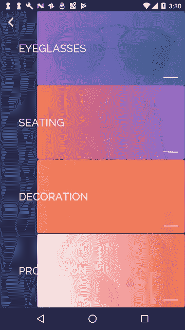***

***(iOS 应用商店没有列出演示应用，所以在 iOS 上你必须自己构建-[https://github . com/flutter/flutter/tree/master/examples/flutter _ gallery](https://github.com/flutter/flutter/tree/master/examples/flutter_gallery))***

***这将我们带到倒数第二，但颤振最大的胜利之一…***

# ***7.像老板一样在 android 和 iOS 上发布。***

***说够了！***

******

***最后但同样重要的是…***

# ***8.颤振社区***

***这是非常重要的一点，因为颤振是新的(和阿尔法)。从这个角度来看，社区支持非常好。[颤振 gitter 频道](https://gitter.im/flutter/flutter)有持续的聊天，新手和有经验的开发人员很好地混合在一起。我的大多数问题在那里几个小时内就得到了回答。对于更长的问题， [stackoverflow](https://stackoverflow.com/questions/tagged/flutter) 也能很快得到回答。***

***挂在聊天上的 Flutter dev 团队非常有帮助。他们非常欢迎新朋友，并回答我们容易陷入的简单问题。总的来说，我发现谈话的语气是谦逊和真实的。我认为这对框架的未来是个好兆头。***

***这是所有的乡亲。我希望我已经说服你和 Flutter 一起玩了。这篇文章主要谈论的是 Flutter 的积极方面，因为在我的开发经历中，这是我最大的经历。这并不意味着没有缺点。***

***需要注意的是，Flutter 是新出现的，所以有*已知的问题/限制，当然还有未知的问题/限制。解决这些限制不在本文的讨论范围之内。此外，许多限制是一个移动的目标，而 Flutter dev 团队正在快速关闭东西。****

***这里列出了一些限制，这些限制似乎是社区中常见的***

*   ***还不支持内嵌地图-[https://github.com/flutter/flutter/issues/73](https://github.com/flutter/flutter/issues/73)***
*   ***缺乏对内嵌视频的支持。但是看起来有一个补丁在里面，应该很快就会到达主分支🎉 🍻——[https://github.com/flutter/flutter/pull/12525](https://github.com/flutter/flutter/pull/12525)***
*   ***实例状态(Android)未保存。因此，如果应用程序在后台被终止，您将失去状态。还没有简单的方法来处理这个问题——https://github.com/flutter/flutter/issues/6827***

***鸣谢:感谢校对和建议- Brian Egan，Ajeet Kushwaha，Sajat Jain，Gaurav Karwa，Arpit***

****如果您喜欢这篇文章，请在您的网络中分享。如果你玩扑克，试着给* [*狂暴筹码*](http://chipsoffury.com) *(我用 Flutter 做的应用)一个旋转。****

***谢谢！***