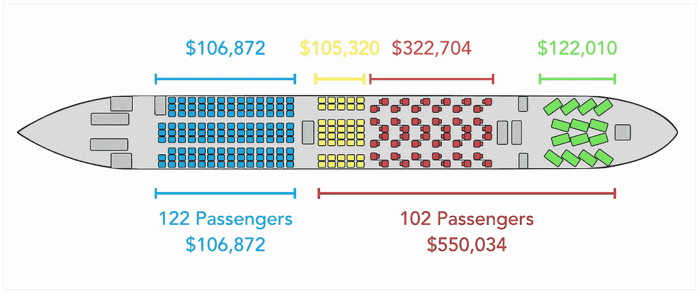
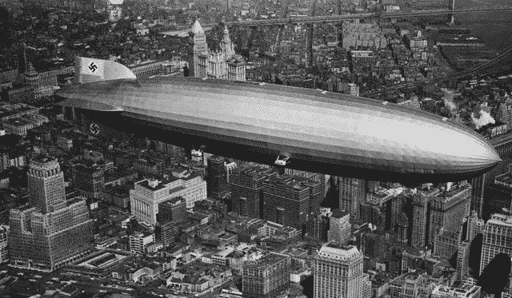
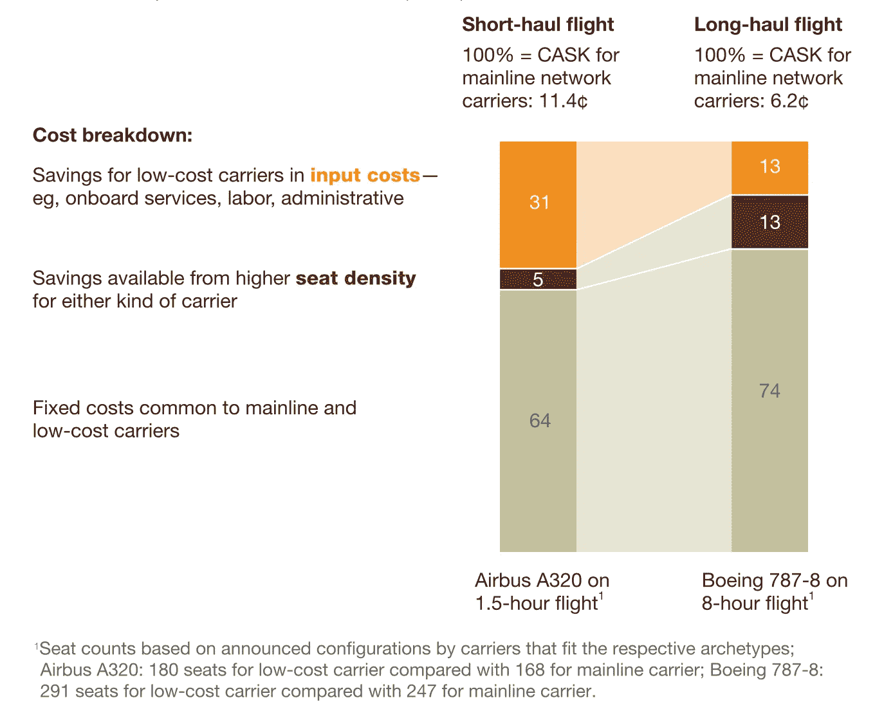
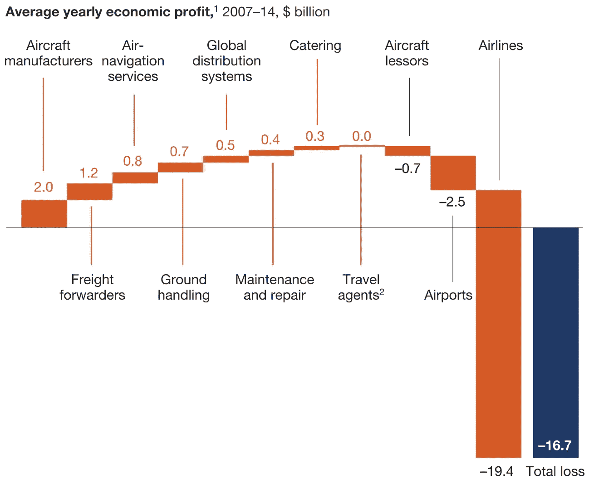

# 为什么没人能阻止埃隆·马斯克让航空业相形见绌

> 原文：<https://medium.com/hackernoon/why-no-one-can-prevent-elon-musk-from-dwarfing-the-airline-industry-now-9fe8a468bebc>

埃隆·马斯克。当他说他将把电动汽车推向大众市场时，一些人嘲笑他。当他说他将把有效载荷送到空间站，甚至任何东西都送到轨道上时，他们笑了。当他说他将使火箭助推器垂直着陆并重复使用时，他们又笑了。

今天，他声称他将在一小时内把乘客带到地球上的任何地方。

## 埃隆·马斯克想要颠覆洲际飞行。

根据马斯克 宣布的 [**计划，乘客将登上一个现在被称为 BFR 的大型火箭和宇宙飞船系统。在第一级助推器返回地球之前，火箭将把乘客送入太空，航天器和第二级继续在目的地着陆。**](https://www.youtube.com/watch?v=tdUX3ypDVwI)

马斯克还表示，大多数长途旅行不到 30 分钟，BFR 上一个座位的价格与飞机经济舱的全价“大致相同”。

我不会在这里争论我是否认为这是可以实现的，任何人都可以形成自己的观点，就像他为自己做的那样。相反，我认为这是理所当然的，假设他会像他说的那样做得很好，并展示这对航空业意味着什么。

## 要了解这将如何影响航空公司，我们必须了解它们从哪里获得利润:

Business Class is the bread and butter of airlines ([Source](https://www.youtube.com/watch?v=BzB5xtGGsTc))

如果我们看一下定期跨大西洋航班的收入结构，就会发现不同舱位之间存在巨大的不平衡。45%的乘客占了 83%的收入。

在长途航班上，公司的利润几乎完全来自高级、商务和头等舱。经济舱是为了填补该公司无法以更高价格出售的飞机座位。

## 价格是推动竞争的第一因素，其次是服务和旅行时间。

由于平均长途旅行时间为 30 分钟，Elon 的新全球运输系统将为乘客在任何目的地节省至少 5 个小时，将旅行时间除以(至少)因子 6。这比 20 世纪 30 年代横跨大西洋的航班上飞机取代齐柏林飞艇要好一倍，旅行时间从 60 小时减少到 20 小时。

The Hindenburg, when it was still twice as fast as ocean liners

但对航空公司来说，事情开始变得糟糕起来:马斯克表示，他将能够为他的航班定价，与普通航空公司相同航班的全价经济舱一样低。随着主要和次要驾驶员都被马斯克赢得，乘坐高级及以上航班的客户(假设大多数人身体状况适合乘坐马斯克的飞机)很可能会转向 BFR，几乎不需要营销。假设安全水平得到满足，即使是许多公司/商务高级旅行者也不会坚持很久来迫使他们的公司给他们在 BFR 上的座位。对于传统航空公司来说，高端洲际市场的超额利润将会消失，并被埃隆·马斯克的 BFR 所吸收。

## 传统航空公司几乎没有利润，但是廉价航空公司可以在他们的利基市场找到容身之地。

考虑两类航空公司很重要。

一方面，在 razorblade 上运营的传统/遗留航空公司在地区范围内利润微薄(或亏损)，目前由于这些即将消失的丰厚的洲际票价而赚钱。要想在未来继续经营下去，同时不得不重新专注于他们今天已经亏损的航线，与低成本公司竞争将变得非常具有挑战性。

另一方面，低成本航空公司的业务性质决定了短途航班更有利可图:

*Low-cost carriers’ input-cost edge is larger for short-haul flights than for long-haul ones. (*[*Source*](https://www.mckinsey.com/industries/travel-transport-and-logistics/our-insights/the-economics-underlying-airline-competition)*)*

对他们来说幸运的是，这是一个埃隆马斯克(还)不能立即瞄准他们的细分市场。他们最大的收入来源，也是最后的利基，将是高速列车或超级高铁无法提供服务的区域交通。这将是让他们实现储蓄利润的最后一个市场空间，至少在马斯克可能带来的下一次颠覆之前是如此(这不是 Hyperloop，稍后会有更多相关内容)。

## 这不仅仅关系到航空公司，整个行业都依赖于它们。

如果航空公司多年来一直处于亏损状态，那不是它们的供应商的问题，因为它们依赖供应商来获取航空业的利润。纵向和横向关联的行业目前利润丰厚，尤其是飞机制造商。

# 空客和波音被迫寻找全新的技术来继续销售飞机

根据年份和单个合同价值的不同，估计会有所不同，但是大约两个飞机制造商的收入的一半来自于他们销售额的 20%:远程，双通道。这个市场的高额利润推动了空客与波音竞争，并开发了其著名的 A380 双层飞机。

他们对这个市场的依赖是巨大的，但离揭示他们对马斯克创新的全面接触还很远。传统航空公司将慢慢崩溃，取消所有可能的订单，甚至淹没单通道二手飞机市场，通常用于短途市场。为了继续销售新飞机，制造商将不得不在运营效率上做出数量级的改进。

如果埃隆要成功构建他对 BFR 的愿景，而且没有人能与他竞争，航空公司应该开始做些什么来防止马斯克毁掉他们的整个业务？这是否会引发新的航空商业模式和技术，比如支线电动飞机？

感谢 James Shen、Joy Zhang、Varad Kishore 和 Nicolas Dinh 阅读本文的草稿。

如果你愿意， [**订阅我的博客，在这里我写下我每周学到的关于 3 项技术和 3 个主题**](http://eepurl.com/cY4zHX) **📖**

或者查看我的页面:[http://www.airportworker.com/](http://www.airportworker.com/)