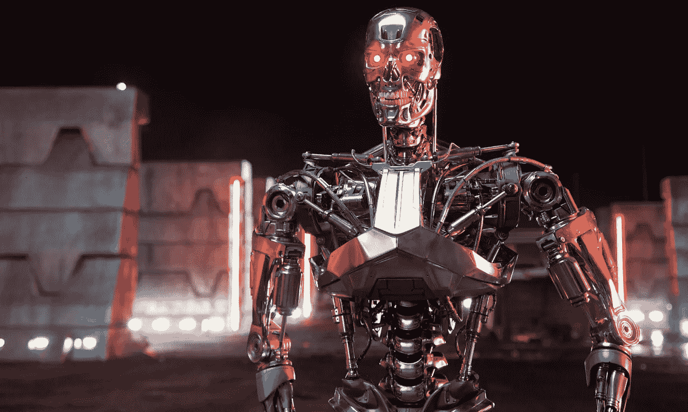
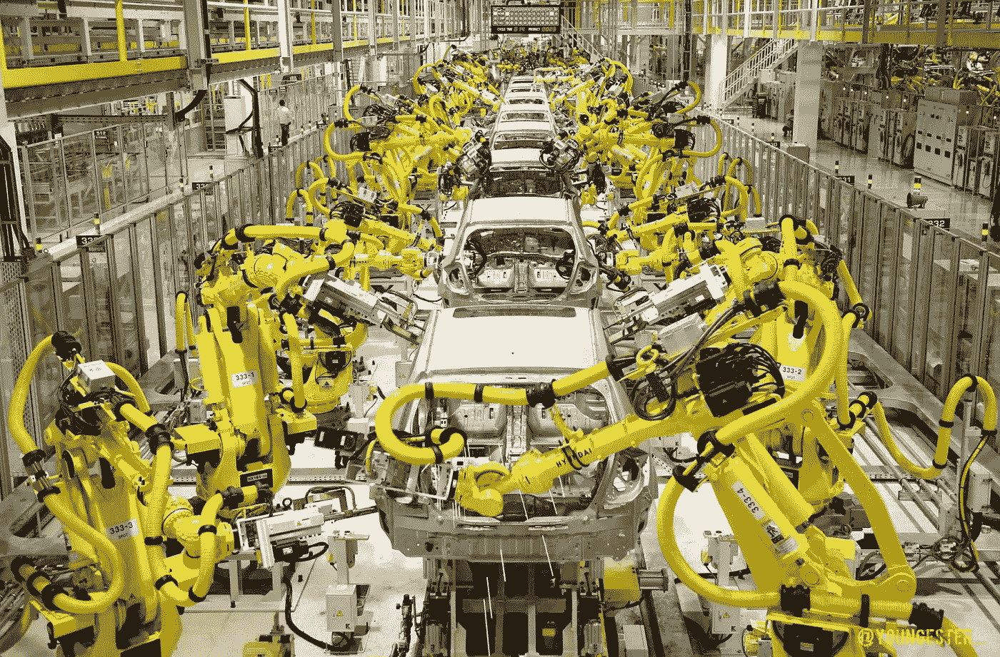

# 为什么我们的灰质会把我们带入灰色地带:伦理、机器人和人工智能

> 原文：<https://medium.com/hackernoon/why-our-grey-matter-will-bring-us-into-grey-areas-ethics-robotics-ai-f815660990>

[Still](http://projectcede.org/digital-empathy/the-voight-kampff-machine/) From **Blade Runner** (1982)

> * **免责声明:此片包含《银翼杀手》、《银翼杀手 2049》等科幻相关媒体的剧透。为什么你们两个都没看过，我就想不通了，尤其是第一部《银翼杀手》。去吧，现在就看。说真的！当你大吃一惊回来时，这篇文章还会在这里，当然，除非世界因某种原因而终结** *

“*机器人来了！机器人来了！撇开陈词滥调的科幻电影台词不谈，人工智能的伦理是一个值得辩论的话题。虽然我之前已经说过人工智能将极大地造福人类，但许多人仍然存在挥之不去的疑问和恐惧，甚至是那些主张更大程度上发展人工智能的人:他们会进化成某种*天网*式的实体，并发射各种核武器，毁灭全人类吗？当谈到开发人工智能和其他机器人、计算或机器实体时，我们应该在哪里划线？那些机器人会喜欢《银翼杀手》系列的复制品吗——那部续集有多好，我说得对吗？——或者《辐射 4》*的合成器成为现实？如果是这样，就像《银翼杀手 2049》*中的剧透*相当坏的女性复制人对瑞恩·高斯林说的那样，如果我们创造的机器变得“*比人类*更像人类”，那么这对人类意味着什么？*

# **武器化潜能——AI&武器装备**

Taken From [An Article](https://www.theguardian.com/technology/2015/jul/27/musk-wozniak-hawking-ban-ai-autonomous-weapons) in **The Guardian**

这一直是人工智能发展的主要恐惧:我们开发了一台如此先进、如此智能的机器，它智胜了我们，而世界最终因它发射核弹或制造消灭人类的病毒而毁灭。当你谈论人工智能的武器化时，大多数人通常会想到这一点，但事实上，我们已经这样做了多年，而且可以说是以一种更邪恶的方式。

在科学杂志《自然》*的一篇评论文章中，加州大学伯克利分校的 Stuart Russell 教授呼吁科学家和技术开发人员考虑本地自主武器系统的风险，也就是所谓的“T20 法则”。拉塞尔非常正确地指出，每一场战斗都必须符合日内瓦公约和一般“战争规则”。只有在下列情况下才应寻求战争:( a)在用尽所有其他选择之后，战争是必要的；(b)可以区分战斗人员和平民；(c)就战斗可能获得的利益和可能造成的损害而言，比例几乎相等(换句话说，利益大于风险)。目前，基于人工智能的系统几乎不可能确定上述任何一项。*

*但是事情是这样的——开发这种武器系统的技术已经投入使用，并且正在不断发展到更先进的水平。想想在利比亚使用无人驾驶飞机，或者使用热寻的导弹摧毁敌机和基地。他们都是机器，特别是最后一个知道如何找到它的目标 ***，而没有*** 太多的人类控制(跟随它锁定的热源，嗯，嘣)。虽然我们还没有技术让机器根据自己的智能来确定目标，但在未来，我们很可能会这样做。拉塞尔担心人工智能的这种潜在用途是正确的。虽然现在大多数国家都同意所有的机器战士都应该有一个“*有意义的*(度)*”人类对他们的控制，但我们所说的“*有意义的*”到底是什么意思还有待确定，并且很可能随着岁月的流逝和技术发展的继续而改变。**

**事实上，围绕这个问题的伦理关注是如此之大，以至于埃隆·马斯克和其他 100 名机器人和人工智能专家向联合国写了一封公开信，呼吁禁止人工智能武器，而物理学家斯蒂芬·霍金和苹果联合创始人史蒂夫·沃兹尼亚克也发出了类似的呼吁。写这封信是有原因的:虽然没有人因为无限回归的想法而看不到*终结者*式的场景发生，但我们都知道机器，即使是智能机器，也容易出现故障——当原本打算袭击 ISIS 军事基地的导弹因故障而最终击中医院或学校等民用目标时会发生什么？**

# **这些内在的感觉——机器情感&人类道德的极限**

****

**From **Channel 4’s** TV Series, “[**Humans**](http://www.channel4.com/programmes/humans)”**

**在《银翼杀手》及其续集中，短语“*快感模型*”通常被用来描述复制人，他们会以一定的价格实现你可能或可能没有锁在脑海深处的任何病态扭曲的性幻想。不要争论卖淫本身是否合法，这些“*快感模型*的存在所带来的伦理难题是:创造某种本质上是性奴隶的东西在道德上正确吗？这一主题不仅出现在像*银翼杀手*这样的大银幕科幻电影中，也出现在辉煌的*第四频道*系列*人类*中。再说一次，似乎不管出于什么原因，人类(似乎主要是男性)最想对机器人做的事情之一就是制造一个如此逼真和人性化的机器人，以便他们可以与之发生性关系。在《人类》*中，一个这样的“性爱机器人”的台词真的让我印象深刻:“*你对我们做的让我想知道你对真正的女人做了什么*”。***

**如果我们创造的机器人足够聪明和有感情，能够发展他们自己的道德和价值感，那么他们肯定会被当作人类对待，或者至少会被给予和我们一样的尊严？我们反对在马戏团或实验室中残酷使用动物——难道不应该对我们设计的任何类型的复制人或机器人给予同样的关注吗？这个问题是 Nick Bostrom 和 Eliezer Yudkowsky 在他们的论文《 [*人工智能的伦理*](http://faculty.smcm.edu/acjamieson/s13/artificialintelligence.pdf) 》中思考的。正如他们所指出的，目前的人工智能程序和机器人技术目前不具备感觉能力，但这在未来可能会改变。**

**如果我们创造了一个系统或机器，它能感觉到疼痛，有自我意识，有一定程度的智能(甚至比我们自己的智能更高)，那么在道德上，我们会把它放在与马戏团的大象或老虎相同的水平上。我们会——或者更确切地说， ***应该***——认为它的奴役在道德上应该受到谴责。我们都厌恶地回顾人类奴隶制，但你必须记住一个可悲的事实，它曾经被认为是一件可以接受的事情，受到当时伟大的思想和领导人的捍卫和鼓励。我们是否会以同样的方式看到 AI 的潜在奴役，还有待观察。**

# **他们抢走了我们的工作！—在工作场所使用机器人和人工智能技术**

****

**From [**Magoda**](http://www.magoda.com/technology/are-other-industries-robotics-ready-like-manufacturing-and-construction/)**

**要考虑的最后一个问题是，人工智能和其他形式的机器人和计算技术确实在工作场所取代了人类。那些快速的自助通道，因为某种原因无法扫描你想要的那罐香蒜酱？嗯，虽然他们可能比柜台后面的人更快，但他们很可能从一个需要工资来生活的人那里抢了一份工作。**

**虽然有些人可能会质疑这个问题是否属于道德和伦理的主题——这远不像设计合成人那样复杂——但从人类就业和尊严的角度来看，我们对人工智能技术的持续发展仍然有明确的伦理影响。在一个几乎不可能找到好的、稳定的工作的世界里，工作场所的计算机化引起了关于人类能动性和生命价值的重大问题。当我说价值时，我指的是雇佣一个人的字面上的，财务上的价值。**

**特朗普赢得了 2016 年美国总统大选，这不是因为自由贸易或开放边境导致工作岗位减少，而是因为几乎所有的制造业工作现在都实现了自动化，这一趋势必将对其他就业领域产生连锁反应，无论是蓝领还是白领——特朗普获胜是因为他(错误地)为那些已经或有可能因机器人叛乱分子而失去工作的人提供了希望。自动化当然有好处，例如降低制造商的成本，这意味着他们的产品价格可以降低，从而使普通消费者更容易购买。但是，如果普通消费者因为这样的自动化而失业，那么这样的产品，不管它们可能变得多么便宜，都是可望而不可及的。**

**这使人类尊严的问题成为焦点:如果我们被机器取代，我们还有什么价值？自我价值是一个非常脆弱的东西，必须采取一些措施——主要是由政府采取措施——以确保那些因自动化而失业的人在保持金融稳定的同时保持某种形式的自我价值。这种[可以通过引入某种形式的基本收入来实现](https://politicsmeanspolitics.com/why-market-liberals-should-embrace-the-idea-of-a-basic-income-f39c0753a2c5)，但在这个问题上的共识远未达成。**

# **好奇害死猫——总结思考**

**在《银翼杀手》*的结尾*——如果你不能说我 ***真的*** 喜欢那部电影的话——名为“罗伊”的复制人发表了被广泛认为是科幻小说中*最好的结尾独白之一，事实上，也是电影史上最著名的结尾独白之一。在书中，他讲述了他所经历的一切，并指出当他死时，记忆会“像雨中的泪水一样”消失。除了整个场景击中了你的感觉，这个场景标志着观众意识到哈里森·福特一直在寻找的“流氓”复制人实际上和他一样是人(或者可能不是)。***

****

**From [**GIPHY**](https://giphy.com/gifs/blade-runner-roy-batty-moJhRvtzW6QKY)**

**正如我以前说过的，人工智能和机器人学和计算机科学领域的其他技术进步总的来说将有益于人类。然而，随之而来的伦理问题和难题，无论是对我们还是对人工智能本身，都值得深思。对人类意味着什么一直是哲学家、人类学家和神学家争论的话题。即将到来的机器人革命有可能让这个问题变得更加难以回答。**