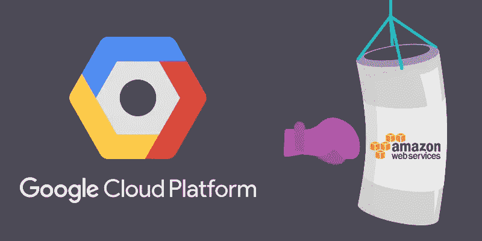
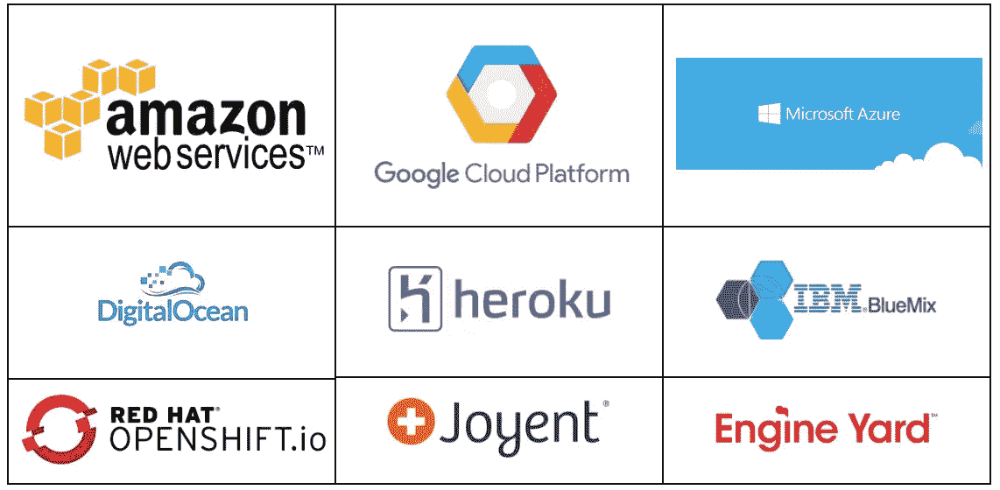
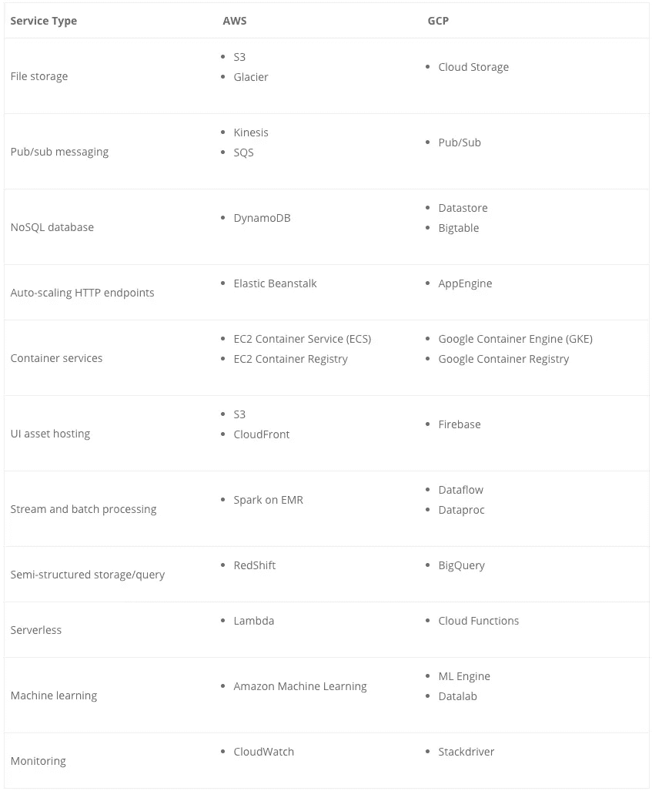
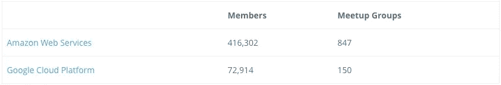

# 为什么我们的科技创业公司选择谷歌云平台(GCP)而不是 AWS

> 原文：<https://medium.com/hackernoon/why-our-tech-startup-chose-google-cloud-platform-gcp-over-aws-dc7c8080fb89>

> 披露: [mabl](https://goo.gl/7ZKSvU) **，**ML 驱动的测试自动化服务，之前赞助过黑客 Noon。

由于产品开发于 2017 年初在 [mabl](https://goo.gl/7ZKSvU) 开始，我们必须决定使用哪家云提供商。虽然我们最熟悉亚马逊网络服务(AWS ),但我们决定花些时间探索所有可用的选项。基于最初的一组需求，我们能够将候选人名单缩小到 AWS 和谷歌云平台(GCP)。我们花了几周时间研究这两者，并构建原型来熟悉我们以前没有使用过的功能。在对两家供应商进行了全面客观的评估后，我们一致决定在 GCP 的基础上继续发展。在这篇博文中，我将描述做出这个决定的一些因素。

本博客详细比较了特定的 GCP 和 AWS 产品，包括无服务器计算、数据库、分析引擎以及机器学习服务。

# 一点点观点

作为一家新的软件公司，我们在熟悉问题领域和开发产品概念时面临许多问题:

1.  高层架构应该是什么样子？
2.  我们应该使用什么语言、过程和开发工具？
3.  我们的软件将在哪里运行？

前两个话题是改天的博文。在这三个问题中，第三个问题可能是过去十年中变化最快的。我上一次参加这个演习是在 2008 年。客观地说，2008 年是 AWS EC2 正式上市的同一年。那时 AWS 还不是今天这样的 70+服务巨头，*云*还没有进入普通词汇，在基于云的基础设施上运行你的软件绝不是显而易见的选择。当时的主要选择是:

1.  建立自己的数据中心(或从搭配设施中租赁空间)，并购买自己的硬件
2.  每月或每年租赁裸机服务器
3.  租用虚拟专用服务器
4.  在 AWS EC2 上运行虚拟机

在仅仅 10 年的时间里，我们已经看到云平台的角色从一个有趣的利基服务转变为一大部分软件公司的主导部署模式。随着这一变化，我们也看到了可用的云选项的大幅增加。我们今天的选择看起来像这样:

我肯定错过了几个！如今有如此多的平台可供使用，以至于我们觉得有义务抛开我们的先入之见，忘记其他人都在做什么，并客观地决定哪一个平台最适合我们的需求。

# 决策过程

我们流程的第一步是定义我们的云需求。根据我们的产品需求和高级架构，这些是我们最有可能需要的服务和功能:

*   文件存储器
*   发布/订阅消息
*   可伸缩 NoSQL 数据库
*   HTTP REST APIs 的自动扩展平台
*   执行测试的平台，最好是基于容器的
*   静态 UI 资产托管:JavaScript、CSS、图像
*   ETL 和基于流的事件处理框架
*   用于存储和查询大量半结构化数据的平台
*   无服务器事件处理
*   生产级监控和记录

考虑到我们认为需要的所有服务，我们能够迅速将候选人名单缩小到 AWS 和 GCP。这些是我们可能在每个云中用来构建 mabl 的服务:

很明显，AWS 和 GCP 都有我们需要的全套服务，我们觉得我们可以将我们的软件部署到任何一个平台上，而不需要诉诸任何丑陋的变通办法。接下来，我们决定看看是什么使这些服务与众不同，以及一些我们不能忽视的非技术因素。

# 先前的经验

团队中的大多数人都有丰富的 AWS 使用经验。团队中的一些人对 GCP 有不同程度的体验。

**优势:AWS**

# 开发者社区

虽然 GCP 有一些像 SnapChat 和 Pokemon Go 这样的大客户，但 AWS 显然有一个更大的开发者社区。我们查看了 meetup.com 两个平台的群组成员和预定聚会数量，以快速了解相对社区参与度:

关于堆栈溢出的活动问题的数量显示了类似的差距:

**优势:AWS**

# AWS kine sis vs GCP 酒吧/Sub

发布/订阅消息是许多分布式、松散耦合系统的关键需求。它可以用于从数据接收到事件处理和子组件之间的同步的任何事情。它必须能够扩展，而且必须能够正常工作。

Kinesis 和 Pub/Sub 的特点非常相似。它们本质上是分布式队列，具有至少一次传递语义，支持多个发布者和多个订阅者。它们都有许多与其他服务的集成，比如允许无服务器功能成为订阅者，并对发布到队列的消息进行操作。然而，这些服务至少有两个显著的不同之处:

1.  Kinesis 允许新订户开始阅读过去的消息，直到 trim horizon(流保留的最早的消息)。发布/订阅只允许新的订阅开始读取在订阅创建后创建的*消息。在这一点上，这不是我们的主要问题，但它确实对服务的使用方式施加了一些限制。运动的次要优势。*
2.  发布/订阅具有非常优越的可扩展性和成本模型。酒吧/订阅的巨大优势。

GCP 的 Pub/Sub 的定价和扩展模式就是按量付费。就是这样。您不需要估计您的请求率或监控使用情况和扩展服务。您不需要为您没有使用的容量付费。您只需根据需要发出尽可能多的请求，服务就会自动扩展以满足您的需求。如果你是 Kinesis 用户，想想如果你不用担心可怕的*provisionedthroughputexceed*错误，当你的使用量增加或遇到突发流量时，它会如何简化你的工作。Kinesis 的替代方案是提供比你大多数时候需要的更多的容量，但这需要为你没有使用的容量付费。

直到最近，缩放 Kinesis 意味着手动分割或合并碎片。在我之前的公司，我从事一项服务，每天通过 Kinesis 在数百个碎片上推送超过 100TB 的记录。扩展流是一个需要花费一天大部分时间来完成的过程，如果我们对吞吐量的意外增长毫无准备，这意味着*我们的某些记录会被丢弃*，直到流扩展到足以处理吞吐量。当然，有缓冲和重放策略可以缓解这类问题，但这不是 Kinesis 客户端库提供的现成功能，所以您必须自己构建这一功能。对于非常高吞吐量的流，将消息缓冲到磁盘并重试几个小时甚至是不切实际的。

有了 GCP 发布/订阅服务，我们不必担心服务如何扩展，也不必担心我们是否会因为过度调配容量而浪费资金。我们可以专注于产品功能，而不是运营问题。

**优势:GCP**

# AWS DynamoDB 与 GCP 数据存储

就像 Kinesis 与 Pub/Sub 的比较一样，DynamoDB 和 Datastore 有许多共同的特性，但谷歌似乎消除了 DynamoDB 用户经历的一些共同的痛点。这两个数据库都可以用作键值存储或文档存储。它们都是高度可扩展的。两者都支持主索引和辅助索引。

在我看来，Datastore 区别于 DynamoDB 的主要特征还是可伸缩性和定价模型。数据存储是按请求付费的读取、写入和删除。与 DynamoDB 不同，无需预先配置读写吞吐量。像发布/订阅一样，对于数据存储，您永远不会看到*provisionedthroughputexceed*错误，因为可伸缩性是由 GCP 自动管理的。Datastore 的另一个很好的特性是它对某些类型的事务的本机支持，这些事务支持诸如条件更新之类的模式。

但是，数据存储中有几个限制值得一提。首先，数据存储中的大多数操作都是[最终一致的](https://cloud.google.com/datastore/docs/articles/balancing-strong-and-eventual-consistency-with-google-cloud-datastore/)。DynamoDB 允许最终一致和强一致读取(尽管价格不同)，但 Datastore 目前不提供该选项。也就是说，有一些设计模式(包括事务的使用)可以最小化数据存储中这种一致性约束的影响。

数据存储区的另一个限制是其每个实体组每秒一次写入的写入限制。在大多数情况下，这意味着你不能每秒更新*相同的键/实体*超过一次。通常，将数据模型设计为频繁更新相同的键并不是一个好主意，因为这将导致性能瓶颈，但在一些罕见的情况下，我们不得不为达到这一限制的热键实现变通方法。

在考虑了两个 NoSQL 数据库的所有特征和特性之后，我们认为 Datastore 是比 DynamoDB 更好的整体服务。注意，在 GCP 还有另外一个选项: [Bigtable](https://cloud.google.com/bigtable/) 。Bigtable 是一个大规模可扩展的 NosQL 数据库，与 HBase and 兼容，并支持许多谷歌自己的核心产品，如搜索、地图和 Gmail。我们在这一点上没有使用它，因为我们还没有利用 Bigtable 优势的用例，并且 Bigtable 的定价模型在低容量时不是非常经济高效。尽管我们现在不使用 Bigtable，但知道我们将来需要它时可以选择它还是很好的。

**优势:GCP**

# AWS EC2 容器服务(ECS)对 GCP 谷歌容器引擎(GKE)

AWS 和 GCP 都为运行基于容器的工作负载和存储容器本身提供了可伸缩的服务。ECS 将自己标榜为 Docker 兼容的容器服务，它利用了专有的 AWS 容器编排技术。相比之下，GKE 是由库伯内特公司管理的。因为 GKE 是典型的 Kubernetes，所以我们的软件可以在任何 Kubernetes 集群上运行，甚至可以在 AWS 上运行，如果我们要在那里启动一个 Kubernetes 集群的话。这种灵活性很有吸引力，我们觉得我们不会被自己选择的一家供应商所束缚

有关我们如何在 mabl 使用 GKE 的更多信息，请查看我们在[上的博客帖子，使用 Kubernetes](https://www.mabl.com/validating-100-million-pages-kubernetes/) 每月验证 1 亿个页面。

**优势:GCP**

# AWS EMR + Spark 与 GCP 数据流

我们知道我们会有几个不同的数据处理用例。主要用例是分析来自一个流的测试执行事件(Kinesis 或 Pub/Sub)。分析阶段将包括特征提取、对数据进行转换以及评估机器学习模型。我们预期的第二个用例是重新处理我们之前捕获的事件。重新处理旧事件可能是必要的，以纠正来自初始分析的无效结论(例如，由于 bug)，或者可能是我们添加了一种新的分析类型，并希望用这种新信息更新以前生成的见解。我们知道我们需要一个既能进行流式处理又能进行批处理的系统。

AWS Elastic Map Reduce (EMR)允许用户启动托管的 Hadoop 集群，包括运行在 Hadoop 之上的服务，如 Map Reduce、Hive、Pig 和 Spark。当我们调查 GCP 上的类似服务时，我们发现了两个与 EMR 相似的服务:Dataproc 和 Dataflow。Dataproc 最接近 EMR，因为它是一个托管的 Hadoop 集群，可以运行 Spark 之类的服务。接下来，我们看了数据流。

数据流是一个 GCP 管理的服务，实现了 [Apache Beam](https://beam.apache.org/) 。Beam 将自己描述为一个用于数据处理的统一编程模型，其中包括特定于语言的 SDK。换句话说，它不是一个执行数据管道的独立服务，而是一个接口和类的集合，开发者可以用它来指定*管道应该如何运行*以及*应该做什么*。为了执行光束管道，你需要使用一个*流道*。幸运的是有很多跑步者可以选择，包括 Dataflow、 [Apache Flink](https://flink.apache.org/) ，甚至还有 Spark！各种可用的运行器对我们很有吸引力，因为这意味着我们可以出于任何原因从数据流中迁移出来，并且我们不需要将我们的代码移植到另一个系统，因为 EMR 支持 Spark 和 Flink。

在这一点上，我们看到了几个选项:EMR 或 Dataproc 上的 Spark，EMR 或 Dataflow 上的 Beam。第一个问题是我们对火花还是光束有偏好。这两个框架的详细比较超出了这篇博客的范围，但是我们打算发布关于这个主题的后续博客或技术演讲幻灯片。

Beam 从一开始就有一点优势，因为它是在 Spark 和 Storm 等类似框架之后几年出现的。Beam 开发人员有机会解决其他框架的缺点，而不必处理遗留的 API。Beam 的一个显著改进是它有一个统一的批处理和流处理 API，这意味着一旦定义了管道，就可以将同一管道用于批处理作业或流作业。相比之下，Spark 从根本上来说是一个批处理系统，在它的顶层有一些流式 API。开发人员必须提前选择是构建批处理作业还是流式作业。流 API 的工作方式是*离散化*流，将其累积并分块成小批，然后交给标准的 Spark 批处理 API。我们更喜欢 Beam 的统一模型，因为我们知道我们需要在流模式和批处理模式下运行相同的作业。

当我们评估 AWS 和 GCP 的数据处理能力时，另一个考虑因素是使用数据流是否比使用 EMR 有任何优势。我们喜欢数据流更像是托管服务，而不是托管集群。部署数据流作业很简单:只需使用数据流运行器执行作业。Dataflow 的另一个很好的特性是，在许多情况下，它会将您现有的管道无缝地迁移到新代码。没有必要建立一个新的集群并拆除旧的集群。如果您的更改没有显著改变管道的结构，Dataflow 将为您透明地换入新代码。我们认为该功能可以节省时间，并有利于提高运营可靠性。在考虑了我们所有的选择后，我们觉得 Beam on Dataflow 是我们的最佳选择。

**优势:GCP**

# AWS 机器学习 vs GCP ML 引擎

mabl 的主要产品需求之一是给我们的客户*关于他们的应用程序如何运行的可操作的*洞察力。我们使用机器学习(ML)来过滤测试执行中的噪音，并从这些数据点中提取关于应用程序行为如何随时间变化的信息。这个过程包括使用不同的 ML 技术和几个不同类别的模型。

当将 AWS 机器学习服务与 GCP 的 ML 引擎进行比较时，我们立即注意到 AWS 产品中的一些重大限制。首先，对我们来说最重要的是，AWS ML 只支持单一类型的 ML 模型:逻辑回归。虽然逻辑回归模型对于某些应用是有用的，但我们知道我们还需要使用其他技术。AWS ML 的第二个限制因素是，在模型被训练之后，没有办法将它们导出服务，所以对于可移植性来说，它不是理想的。

GCP 的 ML 引擎更像是一个通用计算平台，可用于训练和评估任何类型的 ML 模型。ML 引擎服务旨在帮助在数据科学家熟悉的 Python 环境中进行 TensorFlow 模型训练和评估。也可以通过 API 和其他语言的客户端库访问它，因此可以用 Python 训练模型，用 Java 评估它们。Datalab 本质上是 Jupyter 的一个变种，可以很容易地与 ML Engine、BigQuery 和其他 GCP 服务集成。我们的结论是，GCP 的 ML 服务套件将使我们能够构建强大的 ML 工具，为我们的客户提供有价值的见解。

**优势:GCP**

# 自动气象站 Lambda 与 GCP 云函数

虽然提供了类似的功能，Lambda 在这一点上是比云功能更成熟的产品。Lambda 支持多种语言，而 Cloud Functions 仅支持 Node.js。在评估(和编写)时，Cloud Functions 仍处于测试阶段。

**优势:AWS**

# 测试支持

当我在 AWS 上开发特性时，我最大的抱怨之一是，如果不将代码实际部署到 AWS 上并看到它在那里运行，测试代码几乎是不可能的。你能做的最好的事情就是试着模仿一些 AWS 客户端接口，但是这并没有给我太多的信心，让我相信我的代码在 AWS 中会有相同的行为。单元测试能力最好的 AWS 服务大概就是 DynamoDB 了。有一个本地模拟器可以与单元测试一起运行，虽然模拟器和真实服务之间有一些差异，但模拟器足够好，至少可以让您对 DynamoDB 客户端在 AWS 中运行时的工作有一些信心。

根据合同，GCP 的大多数产品都有更好的测试支持。Datastore、AppEngine、Dataflow 甚至云函数都有一些实用程序，允许在本地测试中使用它们，以便在部署到 GCP 之前验证它们的行为。其中一些模拟器比其他模拟器更容易集成到自动化测试中，但是能够在本地测试一些最关键的云服务是一个很大的优势。这些测试能力允许我们在开发过程中更早地捕捉错误，这对于一个围绕自动化软件测试概念建立的公司来说尤其重要！

**优势:GCP**

# 基础设施和软件部署自动化

使用 CloudFormation 或 Terraform 等第三方工具在 AWS 中构建完整的环境相当容易。GCP 相当于 CloudFormation，是 Cloud Deployment Manager。不幸的是，GCP 的部署管理器只支持 GCP 服务的一个子集，似乎没有 CloudFormation 那么成熟。AWS 在这方面绝对有优势。

关于部署软件(相对于基础设施)，这两个平台有非常不同的方法。AWS 提供了一些用于部署代码的工具(比如 CodeDeploy for EC2)，但是并不是所有的 AWS 服务都有用于部署代码的内置功能。相比之下，GCP 有一个名为 gcloud 的命令行工具，能够管理大多数 GCP 服务以及部署代码更改。然而，AWS 从其更大的开发社区中受益匪浅，像 Ansible 这样的开源工具有一个用于管理 AWS 部署的大型模块库。

**优势:AWS**

# 决策时间

选择云平台是我们在 [mabl](https://www.mabl.com/) 做出的最困难的产品开发决策之一。即使在几年前，也不会有太多的讨论。很高兴看到云平台领域有如此多的创新和竞争！

当我们讨论选择哪个平台时，我们敏锐地意识到 AWS 和 GCP 都没有在我们认为重要的每个类别中胜出。那太容易了！对于我们将使用的一些核心 GCP 服务，如发布/订阅、数据存储、数据流和 ML 引擎，我们当然有自己的偏好。在我们看来，选择 GCP 的最大风险是:

*   许多 GCP 服务没有相应的 AWS 服务成熟，在某些情况下，GCP 服务仍处于测试阶段
*   GCP 有一个较小的开发者社区
*   AWS 是众所周知的*魔鬼。当谈到 AWS 时，我们都知道尸体埋在哪里，以及如何*而不是*使用某些服务和功能，这些知识只能通过艰苦的方式获得。毫无疑问，GCP 也有一些同样的问题，但我们不知道它们是什么，也不知道它们会有多严重。*

回想一下最终让天平向 GCP 倾斜的因素，可以归结为几个主题。首先，我们认为，作为我们产品核心的 GCP 服务在可伸缩性方面设计得更好，并且在我们的业务增长时，需要工程师更少的手动干预来保持它们平稳运行。在 mabl，我们都努力成为可以在产品的所有领域做出贡献的全栈工程师，但作为软件开发人员，我们都对开发比对运营更感兴趣。第二个因素是 GCP 更强大的机器学习能力，我们认为他们在 ML 服务方面比 AWS 走得更远，也更投入。第三，我们不太担心 GCP 的供应商锁定，因为它的更多服务是围绕开源框架和 API(如 Kubernetes 和 Apache Beam)构建的。最后，我们觉得 GCP 有几个方面可以加速我们的开发并方便调试:更好的单元测试支持、Stackdriver 监控和日志记录，以及托管我们 UI 资产的 Firebase。

老话“没有人因为购买 IBM 而被解雇”的现代版本应该是“没有人因为选择 AWS 而被解雇。”AWS 是一个成熟的云平台，拥有许多优秀的服务和庞大的支持社区。我毫不怀疑 AWS 是许多组织的最佳选择，但当我们在 [mabl](https://www.mabl.com/) 开始产品开发时，我们有义务为*我们的公司*和*我们的用户*围绕最佳平台构建我们的软件。我们必须选择我们认为能够最大化我们的开发速度、实现差异化功能集并最小化运营开销的云提供商。老实说，我认为整个团队都期望评估这两个平台并选择 AWS(尽管我们的创始人来自 Google！)，但在对这两个平台进行客观评估后，一致认为 GCP 的服务更适合我们的需求。

> 最初发表于 2017 年 10 月 30 日[www.mabl.com](https://www.mabl.com/why-we-chose-google-cloud-platform-over-aws-at-mabl/)。