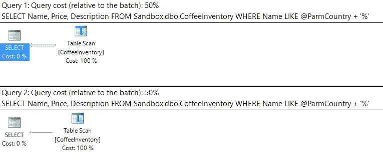
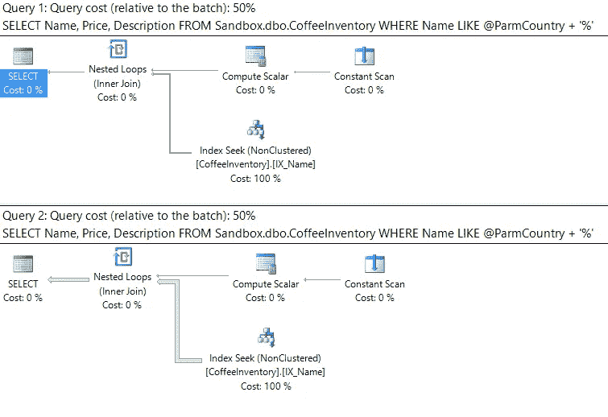
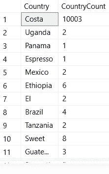

# 为什么参数嗅探会损害 SQL 查询性能

> 原文：<https://medium.com/hackernoon/why-parameter-sniffing-hurts-your-sql-query-performance-d73c0da71fbc>

意外的 SQL Server 性能杀手#2


Photo by [Jakob Owens](https://unsplash.com/photos/h8T1Wa4u7oU?utm_source=unsplash&utm_medium=referral&utm_content=creditCopyText) on [Unsplash](https://unsplash.com/?utm_source=unsplash&utm_medium=referral&utm_content=creditCopyText)

在本系列中，我将探索损害[*SQL Server*](https://hackernoon.com/tagged/sql-server)*性能的场景，并向您展示如何避免它们。从我收集的“多年来我不知道自己做错的事情”中抽出来的。*

*更喜欢视频？* [*在 YouTube 上看这个帖子。*](https://www.youtube.com/watch?v=qo9iWKYqJDA&feature=youtu.be)

上周我们讨论了[隐式转换如何成为你精心设计的索引没有被使用的一个原因](https://blog.bertwagner.com/are-your-indexes-being-thwarted-by-mismatched-datatypes-d3985375e528)。

今天我们来看另一个原因:[参数](https://hackernoon.com/tagged/parameter)嗅探。

关键在于:**参数嗅探并不总是一件坏事。**

大多数情况下这是好的:这意味着 SQL Server 正在缓存和重用查询计划，以使您的查询运行得更快。

只有当缓存的计划与给定输入参数的最优计划相差甚远时，参数嗅探才会成为一个问题。

# 那么什么是参数嗅探呢？

让我们从我们的表 dbo 开始。你可以从 Github 获得咖啡库存。


关于此表，需要了解的关键事项是:

1.  我们在名称列上有一个非聚集索引。
2.  数据分布不均匀(我们马上会看到这一点)

现在，让我们编写一个存储过程，根据国家返回表中经过过滤的咖啡列表。由于没有特定的国家列，我们将编写它，以便它在名称列上过滤:

```
DROP PROCEDURE IF EXISTS dbo.FilterCoffee
GO
CREATE PROCEDURE dbo.FilterCoffee
 [@ParmCountry](http://twitter.com/ParmCountry) varchar(30)
AS
BEGIN
 SELECT Name, Price, Description 
 FROM Sandbox.dbo.CoffeeInventory
 WHERE Name LIKE [@ParmCountry](http://twitter.com/ParmCountry) + '%'
END
GO
```

让我们来看看参数嗅探的实际应用，然后我们来看看它为什么会发生以及如何解决。

```
EXEC dbo.FilterCoffee @ParmCountry = 'Costa Rica'
EXEC dbo.FilterCoffee @ParmCountry = 'Ethiopia'
```

运行上面的语句，我们可以使用表扫描得到相同的执行计划:



In this case we explicitly specified the parameter @ParmCountry. Sometimes SQL will parameterize simple queries on its own.

*真是奇怪*。我们有两个查询执行，它们使用相同的计划，并且没有一个计划在名称上使用我们的非聚集索引！

让我们退后一步，再试一次。首先，清除此存储过程的查询计划缓存:

```
DECLARE [@cache_plan_handle](http://twitter.com/cache_plan_handle) varbinary(44)
SELECT [@cache_plan_handle](http://twitter.com/cache_plan_handle) = c.plan_handle
FROM 
 sys.dm_exec_cached_plans c
 CROSS APPLY sys.dm_exec_sql_text(c.plan_handle) t
WHERE 
 text like 'CREATE%CoffeeInventory%' 
-- Never run DBCC FREEPROCCACHE without a parameter in production unless you want to lose all of your cached plans...
DBCC FREEPROCCACHE([@cache_plan_handle](http://twitter.com/cache_plan_handle))
```

接下来，使用相同的参数值执行相同的存储过程，但这次首先使用“埃塞俄比亚”参数值。查看执行计划:

```
EXEC dbo.FilterCoffee @ParmCountry = 'Ethiopia'
EXEC dbo.FilterCoffee @ParmCountry = 'Costa Rica'
```



现在，我们的 Name 非聚集索引正在被使用。两个查询仍然接收相同(尽管不同)的计划。

我们没有对存储过程代码做任何修改，只是改变了使用不同参数执行查询的顺序。

# 这到底是怎么回事！？

这是一个参数嗅探的例子。第一次在 SQL server 上运行存储过程(或查询)时，SQL 将为其生成一个执行计划，并将该计划存储在查询计划缓存中:

```
SELECT
 c.usecounts,
 c.cacheobjtype,
 c.objtype,
 c.plan_handle,
 c.size_in_bytes,
 d.name,
 t.text,
 p.query_plan
FROM 
 sys.dm_exec_cached_plans c
 CROSS APPLY sys.dm_exec_sql_text(c.plan_handle) t
 CROSS APPLY sys.dm_exec_query_plan(c.plan_handle) p
 INNER JOIN sys.databases d
 ON t.dbid = d.database_id
WHERE 
 text like 'CREATE%CoffeeInventory%'
```


同一查询的所有后续执行都将进入查询缓存，以重用同一初始查询计划，这样可以节省 SQL Server 重新生成新查询计划的时间。

*注意:在 SQL Server 看来，不同值作为参数传递的查询仍然算作“相同的查询”。*

在上面的例子中，第一次执行查询时使用的参数是“哥斯达黎加”。还记得我说过这个数据集严重倾斜吗？让我们来看看一些计数:

```
SELECT 
  LEFT(Name,CHARINDEX(' ',Name)) AS Country, 
  COUNT(*) AS CountryCount 
FROM dbo.CoffeeInventory 
GROUP BY 
  LEFT(Name,CHARINDEX(' ',Name))
```



“哥斯达黎加”在这个表中有 10，000 多行，而所有其他国家的名称都是个位数。

这意味着，当我们第一次执行存储过程时，SQL Server 生成了一个使用表扫描的执行计划，因为它认为这是检索 10，052 行中的 10，003 行的最有效方法。

这个表扫描查询计划只适合哥斯达黎加。将任何其他国家的名称传入存储过程将只返回少量记录，这使得 SQL Server 使用我们的非聚集索引更加有效。

**然而**，由于 Costa Rica 计划是第一个运行的计划，因此被添加到查询计划缓存中，所有其他的执行都使用相同的表扫描执行计划。

使用`DBCC FREEPROCCACHE`清除缓存的执行计划后，我们再次执行存储过程，但是使用‘Ethiopia’作为参数。SQL Server 确定带有索引查找的计划对于仅检索表中 10，052 行中的 6 行是最佳的。然后，它缓存该索引查找计划，这就是为什么第二次“哥斯达黎加”参数接收到带有索引查找的执行计划。

# 好的，那么我如何防止参数嗅探呢？

这个问题实际上应该重新表述为“如何防止 SQL Server 使用查询计划缓存中的次优计划？”

让我们来看看其中的一些技巧。

## 1.与 RECOMPILE 或 OPTION (RECOMPILE)一起使用

我们可以简单地将这些查询提示添加到我们的 EXEC 语句中:

```
EXEC dbo.FilterCoffee @ParmCountry = 'Ethiopia' WITH RECOMPILE
EXEC dbo.FilterCoffee @ParmCountry = 'Costa Rica' WITH RECOMPILE
```

或者我们的存储过程本身:

```
DROP PROCEDURE IF EXISTS dbo.FilterCoffee
GO
CREATE PROCEDURE dbo.FilterCoffee
 [@ParmCountry](http://twitter.com/ParmCountry) varchar(30)
AS
BEGIN
 SELECT Name, Price, Description 
 FROM Sandbox.dbo.CoffeeInventory 
 WHERE Name LIKE [@ParmCountry](http://twitter.com/ParmCountry) + '%'

 OPTION (RECOMPILE)END
GO
```

RECOMPILE 提示的作用是强制 SQL Server 在每次运行这些查询时生成一个新的执行计划。

使用 RECOMPILE 消除了我们的参数嗅探问题，因为 SQL Server 将在我们每次执行查询时重新生成查询计划。

这里的缺点是，我们失去了 SQL Server 通过缓存执行计划来节省 CPU 周期的所有好处。

如果您的参数嗅探查询经常运行，RECOMPILE 可能是一个坏主意，因为您将会遇到许多定期生成查询计划的情况。

如果您的参数嗅探查询不经常运行，或者如果查询不经常运行以至于留在查询计划缓存中，那么 RECOMPILE 是一个好的解决方案。

## 2.使用 OPTIMIZE FOR 查询提示

我们的另一个选择是在我们的查询中添加以下提示之一。其中一个将被添加到与上述存储过程中的 OPTION (RECOMPILE)相同的位置:

```
OPTION (OPTIMIZE FOR (@ParmCountry UNKNOWN))
```

或者

```
OPTION (OPTIMIZE FOR (@ParmCountry = 'Ethiopia'))
```

OPTIMIZE FOR UNKNOWN 将使用根据该列/索引的平均分布统计信息生成的查询计划。通常它会导致一个普通的或者糟糕的执行计划，所以我不喜欢使用它。

优化值使用指定的任何参数值创建计划。如果您知道您的查询将检索针对您大部分时间指定的值而优化的数据，这是非常好的。

在上面的例子中，如果我们知道值“哥斯达黎加”很少被查询，我们可能会优化索引搜索。然后，大多数查询将运行最佳缓存查询计划，我们将只在查询“哥斯达黎加”时进行点击。

## 3.IF/ELSE

这种解决方案提供了极大的灵活性。基本上，您可以创建针对不同值进行优化的不同存储过程。这些存储过程将它们的计划缓存起来，然后由 IF/ELSE 语句确定为传入的参数运行哪个过程:

```
DROP PROCEDURE IF EXISTS dbo.FilterCoffee
GO
CREATE PROCEDURE dbo.FilterCoffee
 [@ParmCountry](http://twitter.com/ParmCountry) varchar(30)
AS
BEGIN
 IF [@ParmCountry](http://twitter.com/ParmCoutnry) = 'Costa Rica'
 BEGIN
  EXEC dbo.ScanningStoredProcedure @ParmCountry
 END
 ELSE
 BEGIN
  EXEC dbo.SeekingStoredProcedure @ParmCountry
 END
END
GO
```

这个选项需要做更多的工作(如何确定 IF 条件应该是什么？随着时间的推移，越来越多的数据被添加到表中，并且数据的分布发生了变化，会发生什么情况？)但是，如果您希望缓存您的计划，并且希望计划对于传入的数据来说是最佳的，那么它将为您提供最佳性能。

# 结论

1.  只有当数据值分布不均匀，并且缓存的查询计划不是对所有值都最佳时，参数嗅探才是糟糕的。
2.  SQL Server 缓存第一次运行查询/存储过程时生成的查询计划，并使用第一次运行时使用的任何参数值。
3.  当您的查询不经常运行或者大部分时间都不在查询缓存中时，使用 RECOMPILE 提示是一个好的解决方案。
4.  当您可以指定一个值来生成对大多数参数值都有效的查询计划，并且可以在不经常查询的值上使用次优计划时，可以使用 OPTIMIZE FOR 提示。
5.  使用复杂的逻辑(比如 IF/ELSE)将会给你带来极大的灵活性和性能，但是对于长期维护来说也是最糟糕的。

*还在读书？你可能会喜欢在推特上关注我的*[](https://twitter.com/bertwagner)**r**