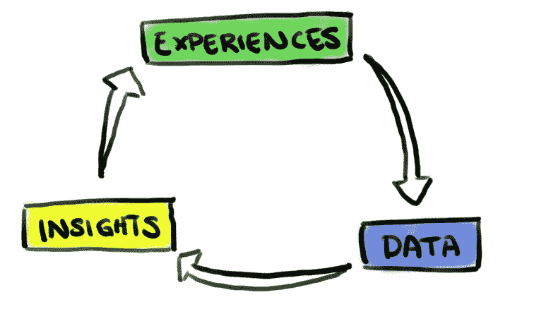
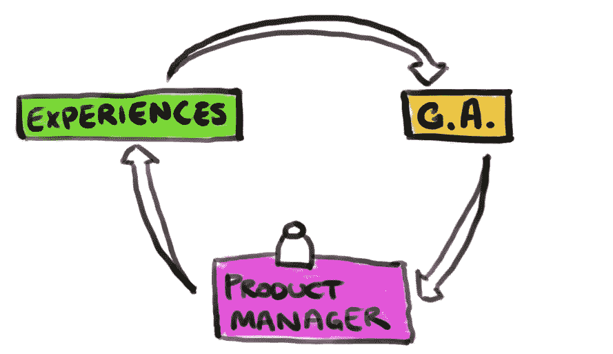
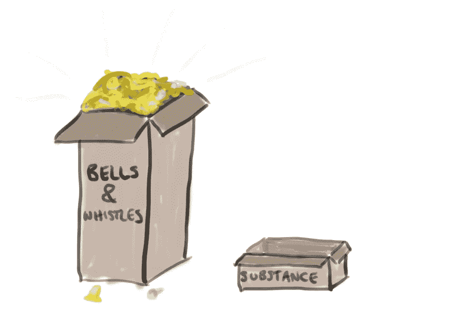
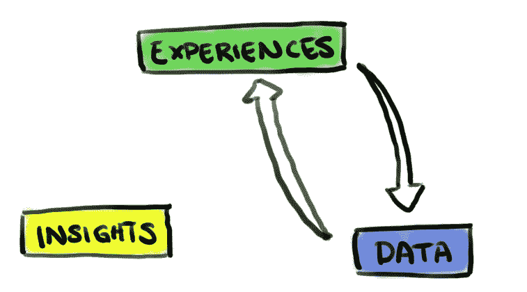
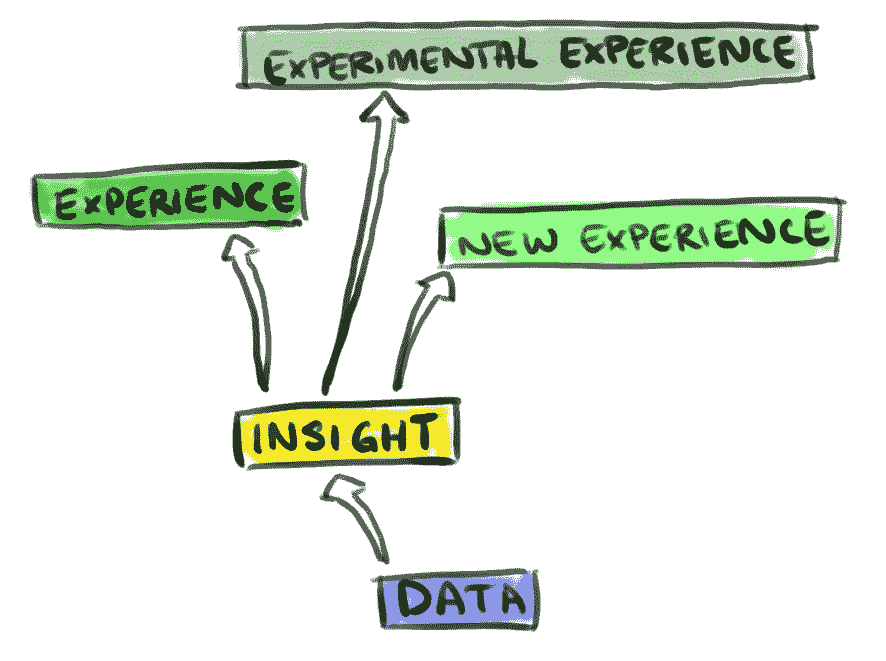

# 个性化项目失败的原因

> 原文：<https://medium.com/hackernoon/why-personalization-projects-fail-5af7d9623fb0>

这种情况经常发生，令人担忧；旨在个性化网站体验的大型项目，要么[失败](https://hackernoon.com/tagged/fail),要么在对问题取得微小进展后停止。

这些失败的核心是一些常见的错误，这些错误的核心是没有理解[个性化](https://hackernoon.com/tagged/personalization)循环。

如果你对用户没有有意义的了解，你就无法创造出精彩的个性化体验。

没有丰富的、可识别的数据，你就无法对人类建立有意义的见解。

除非你从自己的经历中获取数据，否则你无法获得丰富的、可识别的数据。

然而，一旦这个循环启动，它会变得非常良性。一次普通的体验可以产生数据，从而产生见解；一次稍微好一点的体验可以产生稍微好一点的数据，从而产生稍微好一点的见解，从而产生更好的体验…

当然，挑战在于启动这些循环。这就是大量早期个性化解决方案失败的地方。

# 错误 1:追逐最大的细分市场

大多数网络和移动业务都是从单一的通用体验开始的。

这些一般的体验不需要个性化，不需要个性化也能带来实质性的价值。这是一个可靠的商业模式。

然而，开发具有这种商业模式的系统仍然需要数据，在通用体验中收集数据的最流行的方法之一是使用通用跟踪工具，如谷歌分析(Google Analytics)。代替真正的个性化循环，业务将有一个更像这样的循环:

这种解决方案是有局限性的，因为它只服务于占主导地位的受众。

假设你已经对你的体验进行了原型化，80%的用户发现它更有帮助，而剩下的 20%的用户发现它没那么有帮助。产品经理将看到这些结果，并决定所有用户都应该看到这种新的体验，净收益为 60%。

不幸的是，那 20%的人失望而归。

然而，在个性化系统中，80%喜欢新体验的人得到了新体验，20%不喜欢新体验的人没有得到新体验。也许他们得到的是未经修改的原始体验，或者他们只是不经常看到新的体验。关键是记住谁喜欢或不喜欢这种体验，并将他们最有效的体验反馈给他们。

你不能只使用通用数据来构建这种类型的系统。该数据需要增加或替换为可单独识别的数据。

您的系统必须在会话之间记住您的用户。鼓励用户加入是最常见的方法之一，但从根本上说，所有用户都需要唯一的、可复制的标识符。你的系统的每一部分都需要熟练掌握这些标识符。

然后，系统的所有这些部分都需要根据这些标识符生成和存储使用数据。这样，当你产生见解并创造惊人的体验时，你可以让这些体验适应你为之创造的每一个人。如果你非常幸运，你可能还会发现，你的观众中最初占 20%的那一部分最终会成为你最大的细分市场之一——如果你只是追逐最大的细分市场，你可能会完全失去这一部分。

# 错误 2:设计没有洞察力或数据的体验

好的用户界面是很容易构建或复制的，因为它们是可见的，易于理解。当面对完成另外三分之二的个性化循环所需的工作量时，这种诱惑变得加倍强烈。

不幸的是，即使是拥有强大的设计和用户焦点的团队也很容易陷入复制网飞风格的用户体验，或者投资良好的 UX 在他们的网站上分享与个人相关的内容，当通过这些体验分享的内容产生了平均、平庸的结果时，只会令人可怕地失望。实际上，如果没有物质支持，世界上所有的花里胡哨都站不住脚。

个性化的最大价值不在于它的外观或操作，而在于这种洞察力如何取悦用户。当设计任何新的个性化体验时，也必须设计(或至少考虑)推动它的洞察力。

洞察力可以是大型复杂的机器学习野兽，也可以是简单的“如果-这个-那么-那个”逻辑。光谱的两端都是完全正确的。重要的是，你有办法将个人用户的数据转化为有意义的洞察力，并将这种洞察力应用到你设计的美好体验中。

# 错误 3:将洞察力视为二等公民

一旦你的系统开始积累数据，你会有一种强烈的本能想要立即将这些数据带入新的体验。虽然这对于原型设计来说很好，但它很快会导致个性化的死胡同。

这种情况经常发生在设计了一个体验，但是还没有清晰地理解其中的见解的时候。因此，洞察力是在经验本身中*计算出来的。*

当体验处于积极开发阶段时，这很好，但是一旦它被发布，团队转移到生态系统的其他部分，这种洞察力就停滞了。当新的数据变得可用时，现有的经验就枯萎了，不被喜欢了。这些算法停留在原始状态，没有利用可以使其更有价值的新技术或数据源。

原来的顿悟也被困住了。因为它内置于特定的体验中，所以不能在其他新项目中轻松重用。这减缓了新功能的开发，也使得从以前的见解中学习变得更加困难。每一次一切都是从零开始。

在你的设计和工程过程中，洞察需要被视为一等公民。它们应该作为独立的系统存在和维护，这样就可以在它们的基础上构建多种体验。

随着洞察力的发展和增长，默认情况下，基于这些洞察力的经验会变得更加丰富。这是已经开发的每一个个性化体验的倍增因素。

# 个性化解决方案

个性化循环只有在它的所有部分都得到尊重和考虑的情况下才是真正有效的。

平衡您的数据组合、洞察力和体验创造，以确保您从系统的每个部分中获得最大(和最好)的收益。

随着时间的推移，个性化循环将会回报您，用越来越少的开发工作获得越来越多的回报。

