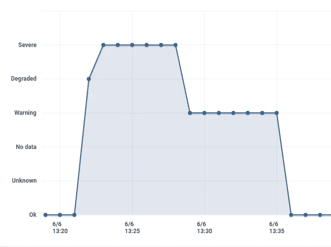
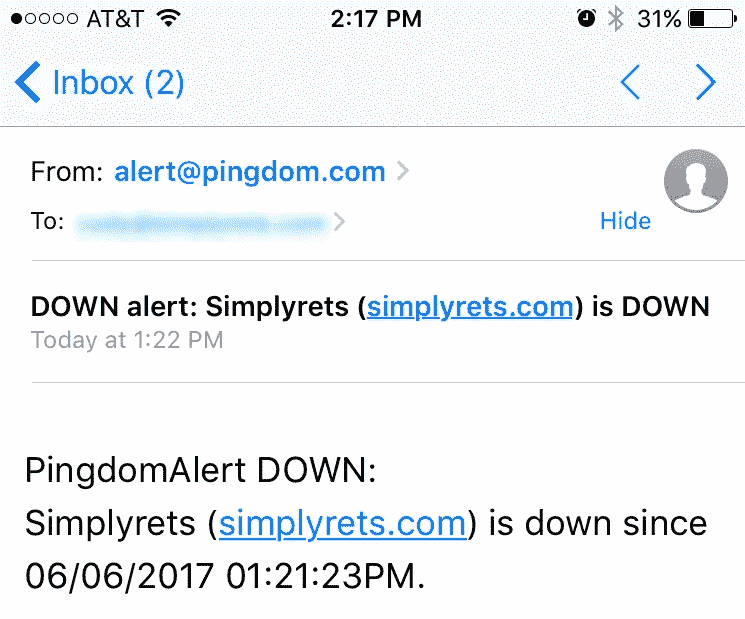
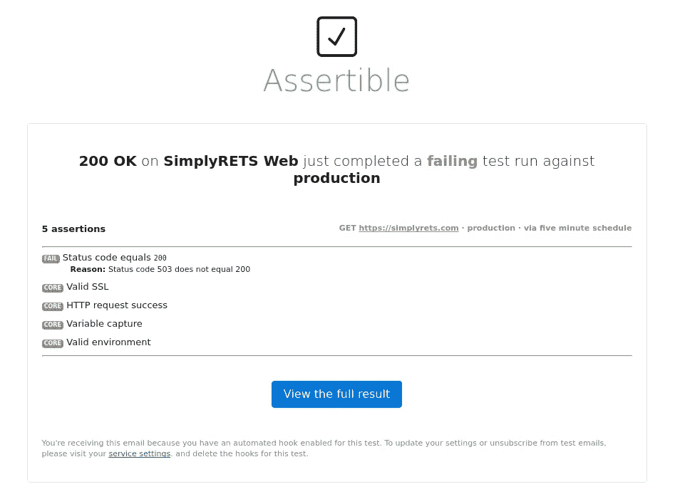
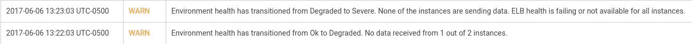

# 为什么平度今天对我来说不够

> 原文：<https://medium.com/hackernoon/why-pingdom-wasnt-enough-for-me-today-6153e1780c05>

> 免责声明:我是[assert able](https://assertible.com)的联合创始人。这是一个成功的故事，关于建造和饲养一个[产品](https://hackernoon.com/tagged/product)来解决我自己的问题。

今天，我的一个 API 出现了短暂的中断。导致我[确定](https://hackernoon.com/tagged/identify)问题的一系列事件让我意识到**在 API 监控工具**中有效通知的重要性。我想概述发生了什么，以及[assert able](https://assertible.com)如何比 [Pingdom](https://www.pingdom.com/) 更快地帮助我发现问题。

这个特殊的 web 服务是我认为至关重要的；用户**依靠本服务**的可用性进行*他们的*服务。正常运行时间监控通过 [Pingdom](https://www.pingdom.com/) 设置，更深入的验证正在[assert able](https://assertible.com)上运行。这两项服务都是**每隔几分钟持续检查一次 API** ，并且被设置为在任何检查失败时提醒团队。

# 事情是这样的

一个请求被合并了，CircleCI 开始构建应用程序并准备部署。这是一个每天发生几次的常规过程。我走出办公室，但随身带着手机以接收提醒(幸运的是)。

下午 1:22，我收到了 Pingdom 的通知**服务停止。**Pingdom 发送的默认警报没有提供任何*有意义的停电信息，显然不足以采取行动:*

**

*Thanks, Pingdom.*

*搞什么鬼。这是我第一次知道**我的 API** 有问题。慌乱中，我调出了手机上的 [AWS 控制台应用程序](https://aws.amazon.com/console/mobile/)，但在加载之前，我收到了 Assertible 的*秒*停机提醒:*

**

*Assertible’s failure alert — within 1 minute of Pingdom’s*

*答对了。从可断言的故障警报中，我**立即知道问题出在 AWS 部署**的某个地方。在部署过程中，我们已经多次看到`503`状态代码。尽管极其不便，但这并不罕见。*

*当 AWS 自行修复和重新部署失败的实例时，我监视了 AWS 事件。仅仅几分钟后，**API 恢复，一切正常**。我能呼吸了。*

*当我回到办公室时，我能够通过查看 AWS 事件日志来证实我从可断言警报中得出的结论。AWS**未能部署新应用**。*

**

*到这个时候，一切都运行正常，所以我不必采取任何行动。*

*这个故事的寓意是，有时候，**一个简单的 ping 是不够的。Web 服务是复杂的动物，每一种都有自己独特的行为方式。它们应该不断地被验证它们所提供的业务逻辑。***

*可断言的事实是:*

*   *[按计划运行运行状况检查](https://assertible.com/docs/guide/automation#schedules)*
*   *设置为[发送 API 故障警报](https://assertible.com/docs/guide/automation#slack)*
*   *并且使用了 [HTTP 断言来验证预期的状态代码。](https://assertible.com/docs/guide/assertions)*

*…是在 3 分钟内找到问题根本原因的关键因素。上下文是关键，而默认的 Pingdom 警报没有提供这一点。*

*不要误解我——我将继续使用 Pingdom。但是 Assertible 将一直伴随着对我的 web 服务进行更多的**深入检查和验证**。*

*我很高兴我构建了一个工具**来解决我自己的问题**，我希望其他人会发现这对于确定 web 服务监控中什么是重要的很有用。*

*::@CodyReichert*

******

> *[黑客中午](http://bit.ly/Hackernoon)是黑客如何开始他们的下午。我们是 AMI 家庭的一员。我们现在[接受投稿](http://bit.ly/hackernoonsubmission)并乐意[讨论广告&赞助](mailto:partners@amipublications.com)机会。*
> 
> *如果你喜欢这个故事，我们推荐你阅读我们的[最新科技故事](http://bit.ly/hackernoonlatestt)和[趋势科技故事](https://hackernoon.com/trending)。直到下一次，不要把世界的现实想当然！*

**