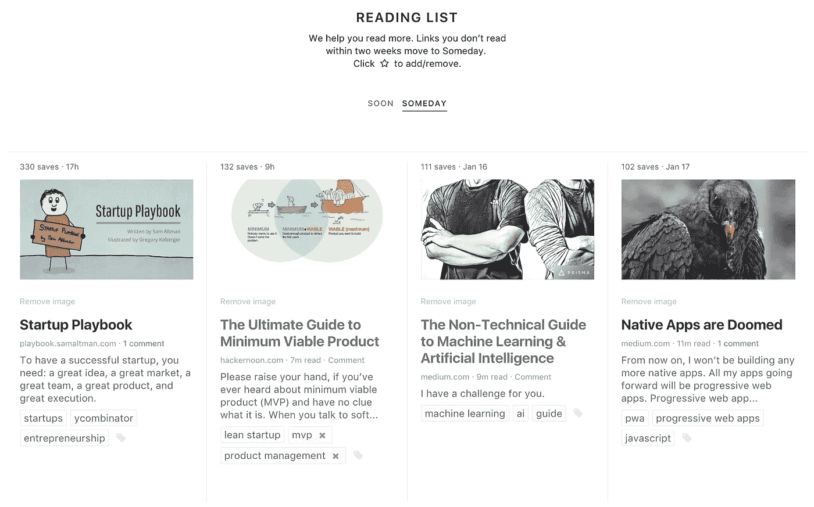
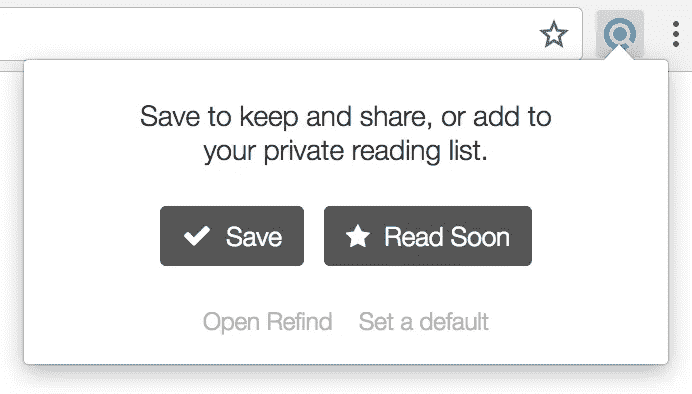

# 为什么稍后读取会失败

> 原文：<https://medium.com/hackernoon/why-read-later-fails-74af48625a0c>

## 以及如何阅读更多真正值得你关注的内容

我们生活在一个推动的时代，但我们缺乏有效应对的方法。每天都有更多的链接被推送到我们的面前，以至于我们没有时间去检查。稍后阅读不是正确的比喻，因为它只是*时移*问题*。*是*延期*。推迟在信息时代失败了，因为总是有更多的信息要在后面阅读，我们的阅读清单堆积起来，后面阅读变成了从不阅读。

我们的**智能阅读清单**将帮助你阅读更多。两周内没有阅读的链接会被移至你的未来列表中，按相关性排序。你的阅读清单总是小而易管理的，如果你有时间赶上，你会在你的未来清单上找到最相关的链接。

 [## Refind

### Refind 是网络上最好的链接之家。发现、保存和阅读真正值得你关注的内容。

refind.com](https://refind.com) 

这个流程对我们非常有用，我们显著提高了我们在网上阅读的数量和质量。请告诉我们这是如何为你工作的——通过电子邮件(hello@refind.com)或 Twitter [@refindcom](https://twitter.com/refindcom) 。谢谢！

> 黑客中午是黑客如何开始他们的下午。我们是这个家庭的一员。我们现在[接受投稿](http://bit.ly/hackernoonsubmission)并乐意[讨论广告&赞助](mailto:partners@amipublications.com)机会。
> 
> 如果你喜欢这个故事，我们推荐你阅读我们的[最新科技故事](http://bit.ly/hackernoonlatestt)和[趋势科技故事](https://hackernoon.com/trending)。直到下一次，不要把世界的现实想当然！

