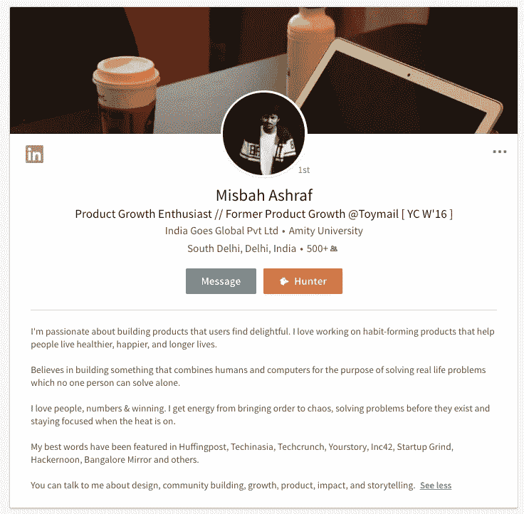
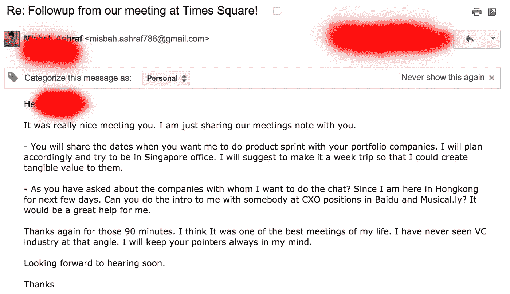
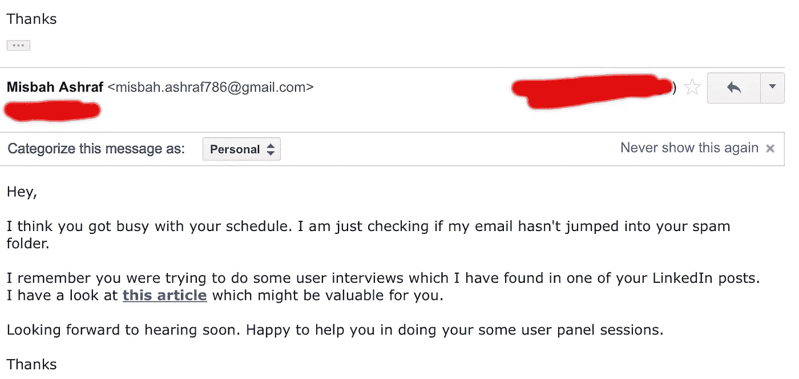
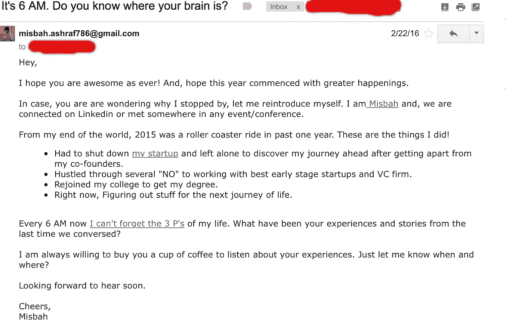

# 为什么关系比人脉好 110%？

> 原文：<https://medium.com/hackernoon/why-relationships-are-110-better-than-networking-2801aa031202>

## 这个信念如何帮助我与世界上最好的人一起工作

[https://unsplash.com/](https://unsplash.com/)

当我回顾过去几年的生活时，我发现每天只有一件事对我的成长有重大的贡献——与全球最优秀的人一起工作的机会——T2。

当我们和聪明人一起工作时，我们会成长。当我们面对迫使我们走出舒适区的挑战性问题时，我们就会成长。当我们想到突破性的解决方案时，我们就成长了。

这就是我过去几年的成长。

每个人都想要这些机会。每个人都想和了不起的人联系，和他们一起工作，然后利用获得的经验获得下一个了不起的机会。

但是很少有人理解建立长期关系的重要性。就我个人而言，我觉得这是最重要的。

因为，社交网络不仅仅是收集电子邮件 id 或将人添加到你的社交媒体网络中。也许它是从那开始的，但绝对不止于此。

我注意到我周围的人对网络缺乏了解。因此，我开始与他们分享我用来与全球各地的人们建立关系的各种框架。看到这些朋友通过尝试这些框架在令人兴奋的新方向上取得进展真是太棒了。

所以，我想把它写下来，和你一起分享。

在你考虑这可能有多难或有多有挑战性之前，或者如果你是一个能够勇往直前建立全球网络的人，让我告诉你一件事——我来自印度比哈尔的一个小镇，我在商界没有网络或家庭背景。

所以，我有两个选择。

完成大学学业，然后在某个地方工作，建立一个人际网络。或者打破现状，开始全新的生活。除了我自己，我对任何人都没有义务，所以我选择了后者。

今天，我已经和来自三大洲的一些最好的公司一起工作过，并且和一些我今天仍然尊敬的最优秀的人建立了长期的有价值的关系。

所有这些都需要坚持，创造影响和价值的强烈意愿，最重要的是承担风险的愿望。如果你拥有这些，没有什么能阻止你建立你引以为豪的关系。

> 久而久之，你能冒的最大风险就是完全不冒任何风险。你不需要许可来领导、建设、创造或以不同的方式思考。

[My linkedin profile](http://in.linkedin.com/in/misbahashraf)

你需要勇气离开大多数，你需要坚持到底的奉献精神。你不仅仅是一个乘坐现实的乘客，让事情保持原样——不动。你是参与者，你的工作就是挑战它，开拓自己的道路。

以下是我学到的一些关于建立永无止境的关系，而不仅仅是在社交媒体上建立关系网的事情:

# 1.做家庭作业

如果你想从任何谈话中获益，你应该非常了解对方。这将有助于你建立合适的环境，与对方进行有意义的对话。

**记住，你不会有 100 次机会见到你钦佩的人。尽量充分利用第一次会议！**

总是试着亲自去见人。在这些时候，当我们的收件箱里塞满了来自人们的邮件时，我们并不理解你面对面时可以建立的人际关系的价值。

这个我懂。因此，我从来没有兴趣收集电子邮件地址。我想和像我一样疯狂的人进行精彩的对话。人数可能不多，但我想被我崇拜并想向其学习的疯狂的人包围。

根据心理学家称之为[的“皮格马利翁效应”，](http://psycnet.apa.org/psycinfo/1985-29525-001) **别人对你的期望会严重影响你的表现。**

我过去常常花很多时间研究我想联系的人。我试图通过社交媒体(如 LinkedIn、Google 和 Twitter)来查找它们。事先更多地了解这个人有助于我获得所有的知识，以此作为对话的基础。

我总是对来自与世界其他地方真实互动的经验和深刻知识感兴趣。我试图在我想联系的人之间找到共同的兴趣，然后在第一次谈话中思考如何为他创造价值。

正是这种想了解我所钦佩的人并以任何可能的方式帮助他们的好奇心，导致了我一生中最激动人心的一些对话。

# **2。将你的动机从获取转变为给予**

> "世界给予给予者，也向索取者索取."— *乔·波兰*

这里有三种基本的人:给予者、索取者和撮合者。组织心理学家亚当·格兰特(Adam Grant)对这些性格进行了分解，并提供了一些简单的策略来促进一种慷慨的文化，并防止自私的员工拿走超过他们份额的东西。

Adam Grant ( TED Talk )

当你被给予所驱使时，你已经知道你会得到丰厚的回报。世界给予给予者，也向索取者索取。

这里有一个有趣的总结来自海军，天使名单。

每当我与某人进行 30 分钟的谈话时，我确保我在前 20 分钟创造价值，然后在剩下的 10 分钟专注于学习。我的大多数谈话都很顺利，因为我从来没有抱太大的期望。它帮助我坚持“我是谁”的立场？

发展不合理的强大关系的关键是做真实的自己。

> 正如莱恩·哈乐黛在他的书里解释的那样， [*自我是敌人，*](https://www.amazon.com/Ego-Enemy-Ryan-Holiday/dp/1591847818) *，*永远是学生。保持谦逊。不要让自我占据主导，否则它会导致你不可避免的灭亡。

你不会在一周或一个月内建立关系。强大的关系永远不会结束。所以，永远不要忘记在拿出任何价值之前先回馈。

我最近在我的上一次香港之行中遇到了一位风险投资家，他管理着一只资产超过 500 亿美元的基金。经过 3 个小时的会议，我问他一个非常简单的问题；“为什么你花了他 3 个小时的宝贵时间和我在一起”。他回应道“你在会议前创造的价值比我一个月的工作量还要多”。我又问了一遍，为什么？

他说，如果没有一个如此了解市场心理的人，你在我们寻找的特定领域为我们做的高质量介绍是不可能的。

如果你不断为他人创造价值，最终当你从他们身上寻找价值时，对你来说会非常容易。

我认为这是人们大部分时间出错的地方，他们试图将关系视为快速交易价值。

你不会突然开始社交，然后神奇地拥有一个强大的人际关系网。它不会有任何结果。

我最近和一位了不起的连续创业者一起工作，我和他谈了一年多。建立持续一生的强大关系需要很长时间。

# **3。定义你的目标**

即使在接触任何人之前，确保你已经明确了你到底想从那个人那里得到什么。这有助于你进行有语境的对话。如果你没有正确设定你的期望，它不会给你增加任何价值。

我们很害羞。我们犹豫着问。这正是阻碍我们前进的原因。

如果有人真的能帮到你，不要犹豫去问。它可以是导师，金钱或其他任何东西。但是，如果你不问，你永远不会知道那个人是否能以任何方式帮助你。

而且，只有当你非常清楚你想从互动中得到什么时，这才有可能。也可能只是交流知识。但是，要明确一点。

> 不要害怕寻求帮助。这就是成功和失败的区别。—史蒂夫·乔布斯

Conversation with one of those VCs whom I admire

在见到他之前，我知道他与中国和东南亚的企业有联系。他曾是该地区活跃的风险投资家，能帮我联系到我想与之对话的公司中合适的人。这封后续邮件起到了提醒的作用，它帮助我很快与我想要的人取得了联系。

如果我没有做好调查，没有从这次会面中知道我的目标，这一切都不会发生。

# 4.跟进。跟进。追踪

这是建立任何关系背后的强大原则。

**永远不忘跟进。**

人们通常会开一两次会，然后就再也不跟进了。他们迷失在日历事件之间，永远无法建立牢固的关系。

在任何一次很棒的会面之后，简单地让对方知道你有多感激他们的时间和想法。试着通过分享会议记录来提醒他们你们讨论过的事情。

当你说你要做某事时，确保你真的做了。永远不要承诺太多。这实际上会帮助你建立相互尊重和钦佩的关系。

Followup. Followup

在这个快速发展的世界里，每个人都超级忙碌。所以，你的邮件有可能在他们的邮箱里丢失了。跟进可以帮助你轻声提醒他们你正在和他们进行的对话。

跟进是我建议每个人都要做的事情之一。你不知道这会如何为你丢失的对话带来魔力。如果你必须建立永无止境的关系，跟进和交换笔记的习惯总是会有帮助的。

# 5.坚持不懈

坚持你的目标并为他人创造价值将永远帮助你。如果你坚持为他人创造价值，从长远来看，这一切都会积累起来。

你可以定期与他们分享一些有价值见解的相关文章。这也是对他们的一种软性提醒，显示了你为他们创造价值的能力。

以上是我的小网络中的一个小邮件更新，我一年发两次来分享我的故事，并询问是否有什么我可以帮忙的。它帮助我与那些经常在我的持续对话中迷失的人建立了牢固的关系。

Steve Jobs

*“你周围的一切你称之为生活的东西都是由不比你聪明的人创造的。你可以改变它，你可以影响它。一旦你明白了这一点，你就再也不会和以前一样了。”—史蒂夫·乔布斯*

在你人生的任何时候，建立强大的人际关系都需要在面对困难和可能性时坚持不懈的努力。

坚持不懈是我给每个想要建立强大关系的人的最重要的建议之一。

我学到的另一件重要的事情是快速反应。你不会想错过人们聚在一起交谈的时刻。

很高兴你坚持到了这里。如果你喜欢阅读它，请帮助这篇文章到达它的读者，不要忘记点击下面的❤️按钮。

如果你想谈论**建立强大的关系**、**产品和成长**。随时欢迎联系我。