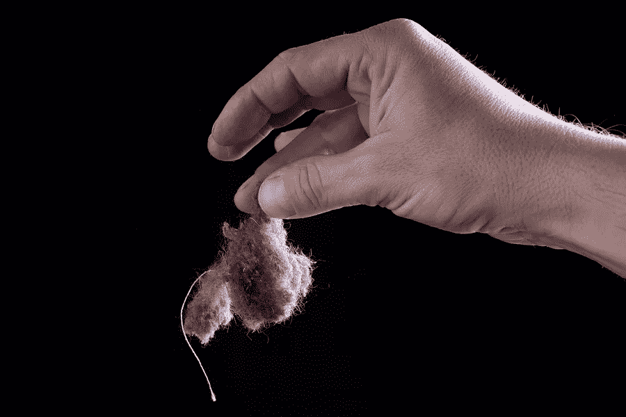
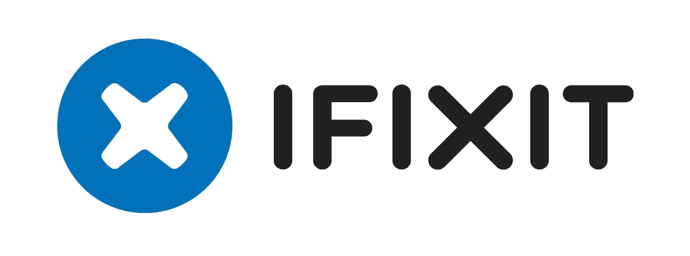
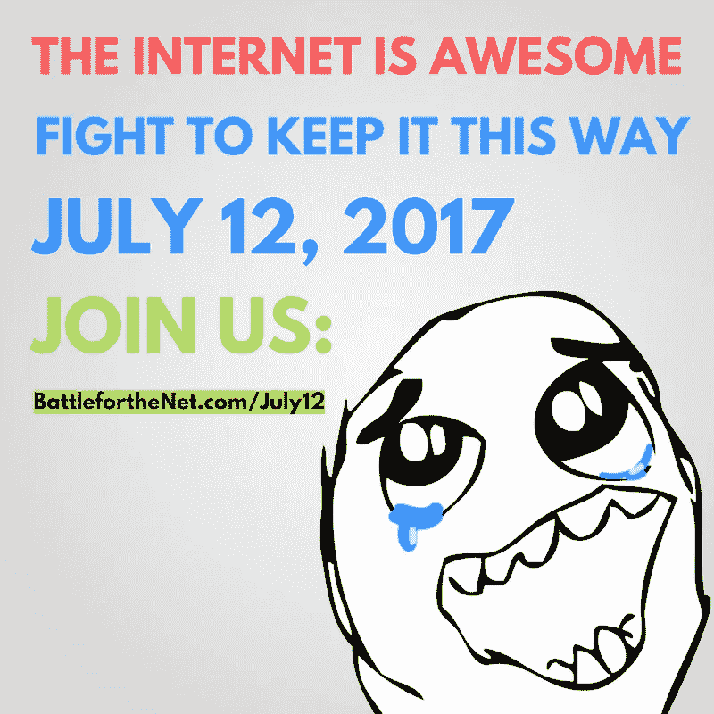
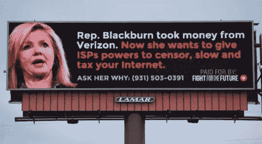

# 为什么网络中立的回滚很糟糕，如果你的吸尘器没有。说真的。

> 原文：<https://medium.com/hackernoon/why-rolling-back-net-neutrality-sucks-if-your-vacuum-cleaner-doesnt-seriously-943cb798ad65>

T **他的真实故事**多亏了网络中立，我即将分享的故事有了一个美好的结局。

但是如果新的联邦通信委员会主席 Ajit Pai 如愿以偿的话，T4 未来的故事可能不会有这么好的结局。你看，Pai 想要撤销第二条网络中立规则，就像互联网第一修正案一样，确保所有人的平等访问和平等机会。

# 亲戚要来了。亲戚来了！

眼光敏锐的亲戚临时来访让我抓狂，因为打扫房子在我的优先考虑列表中排在很低的位置。我更喜欢追踪公司的诡计和揭露隐私陷阱。所以灰尘兔子在我的房子里不间断地繁殖，除非有令人信服的理由帮助它们离开。

把打扫工作推迟到最后一刻的好处是，我别无选择，只能把几天的辛苦工作压缩成几个小时令人喘不过气来的劳动。然后，这就变成了一个战术挑战，而不是一项旷日持久的苦差事。

真空吸尘器是我的武器库中的关键设备。如果它坏了，我的清洁运动可能会很快失败，因为我经历了一个假期，只有几个小时的门铃时间。

我不是整洁的尼克，但我足智多谋。当我的吸尘器停止吸的时候，我走向网络，在那里我统治着研究。

只需点击几下，我就找到了一位吸尘器天使，她受到启发，预测了我的困境，并在网上发布了补救措施。

通过一点小小的拆卸，一个烤肉叉和采摘，我移走了一个我从来不知道要看的障碍物，按下重置按钮，又开始吸尘了。

Uncle Larry enjoying the chicken kebabs from a recipe I found online

# 在后网络中立的世界里，结果可能会大不相同。

在互联网服务提供商和大公司统治的世界里，一个充斥着 DIY 手册的修复网站可能会被认为是底线的敌人。毕竟，比起帮我去自助天堂冲浪，麦迪逊大道给我发新吸尘器或女佣服务的广告不是更有利可图吗？

“如果没有网络中立性，帮助人们修理诸如吸尘器、电脑、汽车和其他消费品的网站在未来可能很难找到,”凯-凯·克拉普(Kay-Kay Clapp)指出，他是“iFixit.com”的通讯主管，我曾咨询过该网站的维修服务，涉及从笔记本电脑到割草机的各种产品。

Kay-Kay 告诉我，2016 年 iFixit 帮助近 1 亿人修理他们的东西，而不是更换它们。她补充说，“如果没有网络中立，这 1 亿人可能会更难找到他们需要的信息。”

如果我们赋予互联网服务提供商决定人们可以看到什么内容以及网站加载速度的权力，她担心“财力雄厚的公司有能力支付特殊的快速通道优先化——这有利于他们。像 iFixit 这样的免费信息分享网站可能会被远远甩在身后。

当然，在那种情况下，我也可能被甩在身后。我们不要让这种事情发生！

# 7 月 12 日，互联网重整旗鼓，拯救网络中立。

像[网飞](https://www.netflix.com)、[中](/)、[StartPage.com](https://www.startpage.com)、[勇者](https://brave.com/)、[维瓦尔第](https://vivaldi.com/)、 [BestVPN](https://www.bestvpn.com/) 、 [iFixit](https://www.ifixit.com/) 以及[为未来而战](https://www.fightforthefuture.org/)、[要求进步](https://demandprogress.org/)、[自由新闻](https://www.freepress.net)、[现在访问](https://www.accessnow.org/)、[priv](https://privacytoolsio.github.io/privacytools.io/)

我们一起揭露了窃取我们目前享受的互联网自由和多样性的企图，这样它才能保持世界上最大的开放市场和世界上最大的城市广场。

我们需要一个公平的互联网竞争环境，像 iFixit 这样的网站和我们喜欢并依赖的其他网站有机会与财富 500 强公司和其他权力掮客竞争。我们支持互联网，让我们所有人决定我们在网上看到什么，而不是让有线电视公司的首席执行官为我们决定。

# 人民运动取得了巨大的成功:

*   超过 500 万封电子邮件被发送到国会
*   超过 1000 万人在参与网站上看到了抗议信息
*   #网络中立标签在脸书和推特上都很流行
*   超过 125，000 个网站、个人、艺术家、网络创作者和组织报名参加了最初的抗议号召

知名度被带到了一个新的水平，名人纷纷支持这一努力，包括珍珠果酱，威尔·惠顿，蒂姆·罗宾斯，苏珊·萨拉登，布鲁斯旅行家，史蒂文弗莱，马克·鲁弗洛，劳拉简格雷斯，肯德里克·桑普森，阿曼达·帕尔默，特德利奥，萨曼莎·比，等等。

从网络游戏社区到图书管理员、房地产网站、草根组织到独立音乐人，互联网的每个角落都有广泛的参与。

“为未来而战”指出，参与的数量如此之多，以至于联邦通信委员会不得不将评论“限制”到他们的备审目录中，将它们排队等待在最初的 7 月 17 日截止日期之前提交。对国会议员的评论也是如此，因为数量太多，不得不在几天内完成。

组织者对最初的估计感到兴奋，超过 200 万条评论被发送到 FCC(几乎是 2014 年 9 月“互联网减速”记录的三倍)。但在 8 月 16 日结束的“回复意见期”期间，这一数字急剧上升。迫于公众压力，联邦通信委员会被迫将评论期延长至 8 月 30 日。在我写这篇文章的时候，还有几天时间，已经有 2000 万条*评论被贴了出来。*

# 激进分子加大赌注。

公民们已经明确表示，他们不会将互联网拱手让给企业利益，但 FCC 主席阿吉特·帕伊(Agit Pai)似乎决心无视公众的抗议。作为回应，活动人士已经开始向美国国会议员施加压力，他们在网上张贴[记分卡](https://www.battleforthenet.com/)，让公民了解他们的代表对网络中立的立场，组织[与代表的面对面会议](https://events.battleforthenet.com/)，甚至竖立广告牌羞辱那些支持 Pai 计划撤销网络中立保护的人。

# 接下来是这样的。

FCC 的下一次公开会议定于 9 月 28 日，活动人士认为，该委员会将宣布，他们对网络中立废除的最终投票将在 10 月份的下一次公开会议上进行。

我将和其他消费者一起密切关注 Ajit Pai 是否尊重绝大多数人的意愿。让我们希望他保留第二条网络中立规则，这样世界各地的真空吸尘器和其他电器就能继续使用——这样互联网就能保持令人敬畏。

___________________________________________________________

图片鸣谢:Parilov/BigStock.com、Taborsky/BigStock.com、Radist/BigStock.com、Eileen Holl/Elnur/BigStock.com、iFixit、为未来而战