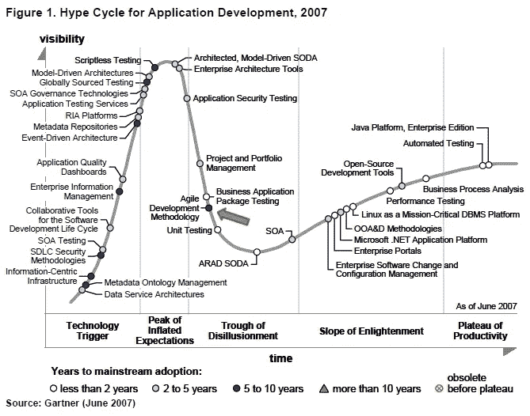

# 为什么您应该评估软件开发中的“炒作”？

> 原文：<https://medium.com/hackernoon/why-should-you-assess-the-hype-in-software-development-43c157673c01>


[http://extraextratime.com/](http://extraextratime.com/)

正如一个聪明的投资者不应该跟随正在股票市场上进行的炒作，因为他的金融投资可能是徒劳的，作为一个聪明的软件工程师，你应该足够聪明，不要跟随最新技术的炒作，这将为客户带来很多错过的截止日期和预算(或者更糟的是，让你研究新炒作的时间白白浪费)！

就像作为投资者，你不会被股票市场的涨跌套牢，而只关注通货膨胀率一样(哦，可再生能源将是下一个大炒作！让我们现在就投资吧！)，沉浸在引领技术的海洋中(这些技术自然会以令人难以置信的速度来来去去！)对你的职业生涯和团队来说弊大于利。知道控制你的冲动，让你的理性思考来做决定可以为你和你的团队节省很多时间，特别是当你的团队中没有人知道如何设置你试图在下一个大项目中实现的堆栈时，由于一些较新的堆栈不能很好地运行，这可能会破坏它。

我的第一份工作是作为一名内部开发人员开发 winforms，那时我有使用 C#等 MS 技术的后台背景。那时我有点怀念后端工作的简单。我只需要知道 C#如何连接一切，事件处理程序如何工作，以及我只需要担心使用实体框架来处理我的持久层，基本上我准备好了。

现在不同了。在 web 应用程序中设置所有东西需要花费很多时间。一些 javascript 框架版本引入了许多突破性的变化。在所有这些繁琐的设置下，几乎不可能按照预定的交货时间运送产品！

不管你追随软件开发的最新趋势和炒作的原因是什么，我非常肯定 99%的原因是因为它“很酷”！

尽管警告说不要简单地从一个技术栈跳到另一个，尤其是当你对它还一无所知的时候。我敢肯定，你还是会跳出来看看这个新的“炒作”是怎么回事。

因此，我在这篇文章中所做的是，在您的新项目中尝试这些技术的任何情况下，为投入这种宣传(或您计划探索和投入的新的/酷的技术堆栈)中的每个问题提供适当的解决方案。

不管怎样，事不宜迟，以下是为什么你不应该简单地跟随并更好地评估软件开发中的 ***【炒作】*** 第一的原因:

# **跟风炒作可能比提高效率更容易招致灾难**



Some “hype” cycle application development

跟随炒作可能会导致你的团队在项目交付中不必要的灾难和延迟，而不是提高他们的效率。因此，让最新的趋势和炒作来驱动你的团队做出重要和关键的决定，这并不是一个好主意，除非你的团队是由充满激情的开发人员组成的，他们可以在尝试这些堆栈时快速适应。

仅仅因为它引入了许多“酷”的特性，并不意味着你可以简单地将你的团队投入到不确定性的海洋中，甚至不去尝试那些特性。请记住，您没有证据表明目前您是否首先需要这些特性。

## *解决方案:选择你喜欢的特定堆栈，忘记其余的。坚持很久*

作为首席开发人员，研究和破解一些你想首先使用的技术栈可能是你能做的最聪明的举动。甚至从长远来看，在未来的灾难中拯救你的屁股。

如果你想作为 Web 开发人员跟踪最新的趋势和 T2 技术的宣传，仔细选择你要使用的栈。并且长期坚持下去。几乎没有一个现有的开发者会利用我们所说的几乎所有的技术栈。你只有有限的时间，每天只有短短的 24 小时。明智地利用你的时间。

[](https://github.com/collections/front-end-javascript-frameworks) [## 前端 JavaScript 框架- GitHub 集合

### 虽然组织 JavaScript 的方法几乎是无限的，但这里有一些工具可以帮助你构建单页面…

github.com](https://github.com/collections/front-end-javascript-frameworks) 

在当今的 web 开发中，我们有大量的框架，我们不知道它们是如何在短时间内得到这么多的。或者是否真的有必要重新发明做同样事情的轮子(感谢 web 开发中的许多麻烦，javascript！).

最终重要的是，如果它能帮助你找到你想要的理想工作，或者帮助你在你的创业公司或你自己的公司为你的下一个 MVP 建立更好的软件产品，那么你最好选择最新的炒作。例如，如果您的理想工作是将 ASP.net 核心与 Angular 4 一起使用，那么请将您的注意力和时间集中在该堆栈上。永远不要依赖其他栈，直到你达到一定程度的精通，并围绕那个栈构建产品。

从一个技术栈跳到另一个技术栈，而没有实际产生公司或初创公司作为开发者所渴望的产出，这总是一个错误。如果你只是为了爱好而尝试那些技术，我建议你另找一份稳定的职业，把做[编程](https://hackernoon.com/tagged/programming)作为业余爱好。

# **跟风炒作可能会带来潜在的问题，成本过高且耗时**


[http://www.ihaveapc.com/](http://www.ihaveapc.com/)

由于您的团队刚刚开始探索您计划使用的技术堆栈(比如，像 ***这样的新酷框架使用 Redux 和 Node.js*** 进行反应)，并且您的团队的技术堆栈更倾向于 ASP.net 一方，您可以引入一些您的团队都无法解决的问题，因为他们的堆栈与他们过去所做的不同。

我并不否认你的团队对使用这些新的酷东西的热情和渴望，他们可以自己动手。但是你也必须考虑你正在做的项目和它的限制。

## *解决方案:使用这个堆栈提前研究一些你将要实现的关键特性。或者继续使用您团队的当前筹码*

试着知道它是否会对你想要构建的功能造成一些障碍。或者，您可以做出的最明智的决定是坚持使用您的团队感到舒适的当前技术堆栈。

我是变革的忠实信徒和倡导者。相信我。但是在寻求改变的过程中，你还必须有一个充满激情的团队，他们渴望你正在努力实现的改变。 ***“探戈需要团队”(虽然也可能是‘二人探戈’)***。

在做出这样的决定之前，试着先和团队商量一下，或者他们是否愿意与你强加给他们的技术合作。

# **学习曲线可能根本不值得**


Wrong frameworks? Exactly! Credits to [http://www.flubu.com/](http://www.flubu.com/)

当我开始学习 Angular 4 时，我非常自信地认为它很容易学习并应用到我的个人项目中，只需要很少或根本不需要努力编写代码，就像我轻而易举地学会了它们的 AngularJS 一样。

当我试图向组件添加一个全局事件并从为 Angular 4 构建的 ***bootstrap-ng*** 访问另一个模板的文本框时，问题开始了。我不知道操纵所有这些东西是一场斗争，它需要你学习一些东西，如 ***ViewComponent、ViewChild、TemplateRef*** 。我只想要一个简单的 DOM 操作，并将一个全局事件附加到我的一个控件上，就像我如何使用普通的旧 javascript 附加全局事件一样:

```
document.addEventListener('click', function(e) {
 alert(`I'm done here!`);
});
```

比如最近 Angular 到底怎么了？我对他们使用 TypeScript 没有问题，但是我学习这个框架所需要的时间实在是太多了。他们真的变得更严格了，当我试图使用 Angular 4 时，感觉好像没有 javascript 的痕迹了。

***更新*** :虽然是我的错。这不是 Angular 的错。我只是不明白 Angular 背后的设计哲学，因为我来自 jQuery 的背景，DOM 操作是轻而易举的事情。一旦我掌握了完整的 MVC 框架，我就尽可能地理解并继续我的学习进度。最终，框架标准化了你必须在项目中使用的结构。从长远来看，这可以节省时间，而不是浪费。完全结构化框架的好处是，你不需要自己重新发明轮子，重新构建一切。如果你想自己构建 javascript，有很多设计考虑，比如: ***依赖注入、坚实的原则、领域驱动设计、设计模式、微服务、函数式编程、RESTful 服务架构考虑……诸如此类。****叹息*

所以当我们试图学习“新的，酷的”东西时，这就是问题所在。在一些框架上花费的学习曲线和时间可能不值得。

## *解决方案:首先使用技术堆栈。看他们怎么玩，怎么互相配合得很好。而你需要多少时间来掌握新炒作的基本基本面*

虽然我回到了我以前的建议:尽职调查研究您将用于项目的技术堆栈，但也很重要的是，与团队一起尝试您将使用的技术堆栈，以便您能够发现每个技术堆栈的优点和缺点。没有什么比简单地学习和研究他人的发现更好的了。

这是发现一些可能妨碍你的团队的突发问题的重要而有效的方法。这将为您节省额外的时间来实现您计划在下一个版本中使用的框架，并防止您在团队中做出最坏的决定。

当然，你不可能在 24 小时内通过简单地摆弄它们来找出每一个堆栈的优点和缺点。在您将它们应用到现实世界的项目中并观察它们如何发挥作用之前，您永远没有足够的时间去发现它们。但至少你能感觉到是否值得冒险或毫无意义。毕竟，这就是我们今天在 web 上如何结束数以亿计的框架。越来越复杂了。

最后，尝试估计掌握堆栈所需的平均时间。如果这个堆栈比你必须掌握的应用于项目的基本知识所需要的时间要长，那么我认为尝试适合项目和你的团队的其他新的堆栈是明智的。

每当你想从一个堆栈跳到另一个堆栈时，你只是觉得你没有在你所做的事情上取得任何进展，因为你不断地跟随 ***【炒作】*** ，试着注意这些事情:

# 你通过技术技能学习编码来解决现实世界的问题

明明是为了解决人单枪匹马解决不了的问题。

那么现在，技术如何在解决这个问题上发挥重要作用呢？在沟通方面？娱乐方面？通过照片储存我们的记忆？技术的主要作用是什么？技术在哪里？

有时我们会对作为开发人员所做的事情产生一点误解。有时我们学习新的编程语言是因为 ***【很酷】*** 而没有强调它带来的价值。我也是无休止的技术进步螺旋中的受害者，我想学习市场上*的新编程语言。*

*最后，我累了，这成了我为什么每天学习编程语言的转折点。我为什么要这么做？*

*有时候，我会通过解决现实世界的问题来补偿我对学习编程新技能的热爱。能给人们带来价值的东西。它可能是一个可以改善他们工作流程或增强他们思维的应用程序，或者是一些可以增强他们做生意体验的应用程序。无论哪种方式，它都应该解决一些现存的世界问题。*

*有时你必须对你选择的编程语言的一些新的怪癖或特性持怀疑态度。比如 ***异步*** 在解决现实问题中的作用是什么？ ***多线程*** 或非阻塞操作解决什么？在哪里实现？*

# *你学习它们是为了在经济上满足自己和家人的需求；以及产生影响*

*你还需要看看你试图学习的技术是否有投资回报，因为你基本上是在用你的时间来学习所有这些东西。在你试图投资的事情上，你必须得到相应的补偿。例如，学习这些新的技术能让你找到你喜欢的工作和项目吗？从长远来看，学习这些会给你一种财务稳定的感觉吗？学习这些新技术，你能做多少工作？在学习它们的过程中你会产生多大的影响？*

*现实地说，你学习它们是为了生存。填写你的基本需求。这是你需要考虑的最基本的事情。*

# *你学习它们不仅仅是为了尝试新的炒作，而是为了看到更大的图景*

*虽然我知道我们学习如何编码有不同的原因。对于那些为了他们的职业而学习的人，请注意，我们对我们建造的东西和我们写的东西负责。*

*虽然把你的职业作为一种爱好看起来一点也不坏，让它更令人兴奋和有趣，但有时我们需要限制和反思你是否解决了任何事情或什么都没有。*

*我们甚至需要放眼全局，看看我们做的每一款应用都适用哪些商业模式，或者哪些功能对人们有用。我们需要审视它，并在我们做出的每个关键决策中带来价值。*

*如果你喜欢我的故事，请在 Twitter 上关注我，让我知道你的想法！*

*[](https://twitter.com/YellowFlashDev?lang=en) [## 桑尼·雷西奥(@YellowFlashDev) |推特

### 桑尼·r·雷西奥的最新推文(@YellowFlashDev)。10%的企业家/健身爱好者/软件工程师/全职…

twitter.com](https://twitter.com/YellowFlashDev?lang=en) 

***P.S .下面是一些参考链接，防止你总是搭乘“炒作”列车:***

[](https://blog.daftcode.pl/hype-driven-development-3469fc2e9b22) [## 炒作驱动的发展

### 软件开发团队经常基于不准确的…

blog.daftcode.pl](https://blog.daftcode.pl/hype-driven-development-3469fc2e9b22)  [## 我希望有人在我学习如何编码时告诉我的事情

### 我从教别人中学到的是

medium.freecodecamp.org](https://medium.freecodecamp.org/things-i-wish-someone-had-told-me-when-i-was-learning-how-to-code-565fc9dcb329) [](https://techcrunch.com/2016/05/10/please-dont-learn-to-code/) [## 请不要学习编码

### 最近有一个想法在技术社区越来越流行:每个人都应该学会编码。但是这是…

techcrunch.com](https://techcrunch.com/2016/05/10/please-dont-learn-to-code/) [](http://mikecavaliere.com/dont-get-attached-programming-languages/) [## 不要迷恋编程语言| Mike Cavaliere

### 关于编程语言和框架，热爱你最常用的框架或语言是可以的。如果 Python 是你的…

mikecavaliere.com](http://mikecavaliere.com/dont-get-attached-programming-languages/)*